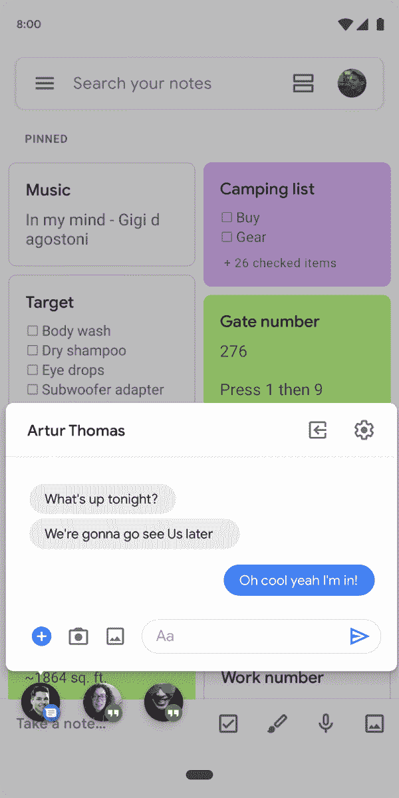

# Android Q Beta 2 为谷歌 Pixel 设备提供了通知气泡和更多功能

> 原文：<https://www.xda-developers.com/android-q-beta-2-notification-bubbles/>

大约几周前，谷歌发布了 Android Q 的第一个正式测试版，让我们第一次看到了谷歌即将推出的 Android 版本。我们之前说过，它对于 Android Pie 就像 Android Marshmallow 对于 Android Lollipop 一样:它不太关注 UI 更新，而是更多地关注 UX 的改进和新的、实际上有用的功能。这是再真实不过的了:Android Q 在现有 Android Pie 公式的基础上进行了彻底的改进，同时没有添加任何不必要的麻烦、噱头或 UI 调整，拥有真正的[全系统黑暗模式](https://www.xda-developers.com/android-q-navigation-dark-mode-clock-widget/)、新的主题化功能、正在开发的[桌面模式、](https://www.xda-developers.com/android-q-desktop-mode/)等等。

现在，第二个 Android Q 测试版刚刚针对谷歌 Pixel 设备推出，距离第一个测试版仅 3 周。也许 Beta 2 引入的最显著的特性是通知气泡。与 Facebook Messenger 的浮动气泡类似，Android Q 正式将这些浮动气泡作为 Android 的官方功能。Facebook Messenger 的浮动气泡可以方便地显示正在进行的对话，允许你在使用其他应用程序的同时发送消息并与人互动，只要你想回复某人，就可以点击气泡。消息和 Hangouts 只是谷歌列出的一些例子，这些气泡也可以应用于非消息应用程序，提供对笔记和翻译等便携式用户界面的快速访问。

 <picture></picture> 

Bubbles

其他 Android Q Beta 2 的改进包括进一步改进的共享菜单，Android Studio 的可折叠仿真器，对音频捕获的更多控制，等等。你可以查看谷歌的[博客文章](https://android-developers.googleblog.com/2019/04/android-q-beta-2-update.html)和[发布说明](https://developer.android.com/preview/release-notes)以获得完整的变更列表。

Android Q Beta 2 系统图像现已正式面向所有 Pixel 设备，包括谷歌 Pixel、Pixel XL、Pixel 2、Pixel 2 XL、Pixel 3 和 Pixel 3 XL。这个测试版还包括最新的[4 月安全补丁](https://www.xda-developers.com/april-2019-android-security-google-pixel-essential-phone/)以及稳定性改进，并将成为谷歌 2019 年 I/O 之前的最后一个测试版，定于 5 月 7 日至 9 日举行。Android 模拟器图像——包括我们之前提到的可折叠支持——也是可用的。

你对第二个 Android Q 测试版感到兴奋吗？请在评论中告诉我们。

* * *

[**来源:谷歌**](https://android-developers.googleblog.com/2019/04/android-q-beta-2-update.html)