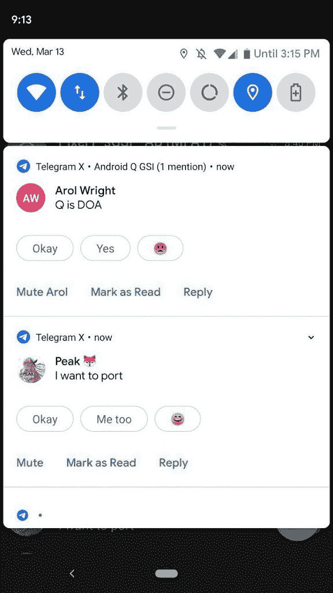

# Android Q Beta:谷歌 Pixel 智能手机有什么新功能

> 原文：<https://www.xda-developers.com/android-q-beta-changes-google-pixel/>

又是一年，又是新的安卓发布。智能手机行业在不断发展，尤其是今年，它将成为最激动人心的一年。Android 作为这个不断变化的行业的核心元素，也必须适应新的趋势。对于 Android 平台的最新版本 Android Q 来说，这再真实不过了。谷歌终于扣动了扳机，[发布了第一个 Android Q beta 版本](https://www.xda-developers.com/android-q-dp1-google-pixel-2-google-pixel-3/)用于*整个* Pixel 系列智能手机——Pixel 3、Pixel 3 XL、Pixel 2、Pixel 2 XL、Pixel 和 Pixel XL。

乍看之下，Android Q 可能看起来大同小异。毕竟，在用户界面方面，它和 Android Pie 几乎是一样的。但它也带来了如此多的变化，我们不禁对此感到兴奋。你可以说安卓 Q 对于安卓派就像安卓棉花糖对于安卓棒棒糖一样。一个专注于改进的更新，它不会带来不必要的 UI 和 UX 变化，而是带来新的特性、改进和基于用户反馈的变化。相信我:Android Q 上有很多令人兴奋的东西。

今天，我们对 Android Q 的第一个公开测试版进行了深入研究，以揭示谷歌最新操作系统将包括的所有小东西和功能。这个列表不包括[谷歌在他们的博客文章](https://www.xda-developers.com/android-q-new-features/)中正式分享的功能，我们也不会谈论任何影响开发者的新 API 和平台变化。这个帖子讲的都是谷歌没讲的；您必须刷新测试版才能亲眼看到的变化。我们还有一个 17 分钟的视频概述，涵盖了我们下面提到的大部分(但不是全部)变化。

* * *

## 全系统黑暗模式

Android Q 最大、最令人期待的功能可能是一个[全系统黑暗模式](https://www.xda-developers.com/android-q-dark-mode-overview/)。自从 Android Lollipop 在 2014 年推出材料设计和令人眼花缭乱的白色 UI 元素以来，我们一直期待这项功能能够在 Android 上实现。早在 2015 年的第一个 Android M betas 测试中，我们就已经先睹为快了，后来它被毫无解释地移除了。第二年，它又推出了 Android N betas，但又一次没能赶上 Android 牛轧糖的发布版。

快进到一年后，我们(在某种程度上)在 Android 8.1 Oreo 上得到了它:如果你设置了深色壁纸，通知阴影、启动器和其他 UI 元素也会变成深色。有了 Android Pie，这个选项就变成了用户可切换的，无论壁纸是什么颜色，用户都可以根据需要打开或关闭这个部分黑暗模式。当然，这与真正的黑暗模式相去甚远，因为启动器和通知阴影之外的 99%的 UI 元素仍然是白色的，但是，嘿，总比什么都没有好。

随着 Android Q，一个真正的黑暗模式似乎终于发生了。Android Q beta 包括一个系统范围的黑暗模式，该模式可以对通知阴影、实际通知、设置应用程序和整个 SystemUI 进行主题化，并将大多数 UI 元素从白色变为深灰色和 AMOLED 黑色。不仅如此，它还可以在整个操作系统中强制使用这种黑暗模式，包括用户下载的应用程序，无论它们是否有黑暗模式。有些应用看起来很棒，有些看起来很糟糕:你的里程数可能会有所不同。

虽然在我们几个月前发现的泄露的 Android Q alpha 版本中存在启用这个黑暗主题的设置，但它已经被删除了。原因不明，但我们猜测它仍在开发中，他们正在隐藏它，直到它更加完善。但是，这种黑暗模式肯定还在。它可以通过打开电池保护模式来启用，但如果你不想让电池保护一直开着，并且你可以使用电脑(并且在使用电脑时有最低限度的 ADB 技能)，你可以通过跟随本教程来打开和关闭它。

* * *

## 主题

Android 和主题引擎有一个有趣的故事。以前，系统主题的概念是留给 EMUI 和 TouchWiz 这样的 OEM 皮肤和 CyanogenMod 这样的自定义 rom 的。储备 Android 用户仍然是一件陌生的事情。然后，随着 Layers 及其继任者 Substratum 的出现，主题化 Android 股票成为了一种真正的可能性:通过利用内置的主题化平台，如 OMS 和 RRO，root 用户能够以他们想要的方式对他们的 UI/UX 的许多方面进行主题化。随着 Android Oreo 将 OMS 带入 AOSP，底层开发者[发布了 Andromeda](https://www.xda-developers.com/andromeda-substratum-sale-2017/) ，这变得更加容易实现，这是一个允许非 root 用户对他们的股票系统进行主题化的插件。

随着 2018 年 3 月安全补丁的发布，Andromeda 的势头很快被切断，限制了系统应用程序的覆盖安装，从而结束了无根主题化。然后找到了一个变通方法，底层主题化目前是可能的，但是它肯定不是对每个人都实用。到目前为止，AOSP 安卓系统还没有内置任何种类的成熟的主题化解决方案。Android Q 没有改变这一点，但至少他们打开了更多定制的大门。

与 OxygenOS 类似，Android Q 现在允许用户自定义他们的强调颜色和字体。当然，它没有 OxygenOS 带来那么多选择。虽然一加的定制皮肤拥有完整的调色板，但我们在 Android Q 上只有黑色、绿色和紫色。尽管这是朝着正确方向迈出的一大步，但我们很有可能很快就会看到其他颜色。此外，自适应图标功能正在扩展到其他 UI 元素:它曾经是启动器图标的专属，现在也将改变快速设置图标和谷歌搜索栏等东西的形状。

最后，他们为 Noto Serif/Source Sans Pro 提供了单一字体选择。

关于这个[你可以在这里](https://www.xda-developers.com/android-q-font-icon-shape-accent-color-overlays/)看到更多。

* * *

## 系统功能标志

Android Pie 在开发者选项中增加了一个新的“功能标志”页面。Android Q 保留了那个页面，但是在上面扩展了更多的标志。下面总结了一些禁用标志在启用时的作用(或者至少是我们认为它们的作用):

*   settings _ aod _ image wallpaper _ enabled:允许壁纸在[常亮显示](https://www.xda-developers.com/google-pixel-2-always-on-display-wallpaper-android-p/)上短暂显示。谷歌 Pixel 3 在 Android Pie 上有这一点，但 Pixel 2 没有。
*   settings_audio_switcher:给媒体播放通知添加一个新图标，让你快速切换音频输出。更多信息如下。
*   settings_bluetooth_hearing_aid:可让您配对 bluetooth 助听器。
*   settings _ global _ actions _ grid _ enabled:更改电源菜单的布局。
*   settings_mobile_network_v2:据报道在 Pixel 3 上启用[双 SIM，双待。](https://www.xda-developers.com/android-q-dual-sim-dual-standby-support-pixel-3/)
*   settings _ screen record _ long _ press:启用 SystemUI 中内置的屏幕录制器，长按电源菜单中的截图选项即可进入。更多信息如下。

* * *

早期最有趣的功能标志是音频切换器，它为媒体播放通知添加了一个按钮(左)，当按下该按钮时，会弹出一个设置片，让您切换音频输出(右)。

* * *

## 桌面模式

桌面上的 Android 是一个已经存在多年的概念。有了像 [Android-x86](https://www.xda-developers.com/android-x86-stable-android-8-1-oreo/) 和 [Remix OS](https://www.xda-developers.com/jide-pulling-the-plug-on-remix-os-as-it-focuses-on-enterprise-markets/) 这样的项目，你已经能够在桌面环境中使用 Android 一段时间了。然而，最近，这种趋势越来越明显。前段时间，Chrome OS 增加了 Android 应用支持，使 Chromebooks 能够访问谷歌 Play 商店，并利用 Android 应用生态系统。此外，三星的旗舰智能手机和平板电脑都配备了[三星 DeX 功能](https://www.xda-developers.com/samsung-galaxy-s9-dockless-dex-android-pie-beta/)——用户可以将手机插到显示屏上，展示基于 Android 的桌面环境。

随着 Android Q 的推出，看起来类似 DeX 的桌面模式也将出现在 AOSP Android 上。现在，它并没有真正处于一个舒适的可用状态，但它肯定会实现的。有一个带 app 抽屉的桌面界面，可以把快捷方式拖到桌面。应用程序在自由形式的窗口中启动，这是 Android Nougat 首次引入的功能。

*Android Q 的原生桌面模式。*

我们希望在接下来的几个测试版中看到这种桌面模式得到进一步的改进。我们已经在这里更详细地介绍了这种桌面模式[。](https://www.xda-developers.com/android-q-desktop-mode/)

* * *

## 易接近

添加了新的可访问性选项，以延长您可以阅读 toast 消息的时间以及您必须对其采取操作的时间。

如果您启用了助听器功能标志，您会在“辅助功能设置”中找到一个新的助听器选项。

* * *

## 电池

### 根据您的使用习惯节省电池

电池节电器非常有用。通过打开它，后台进程受到限制，CPU 的使用也受到限制，以尽可能地节省电池。这个功能在几个 Android 版本中都存在，但是在 Android Q 中，它变得更加有用。众所周知，黑色和较暗的色调比白色主题消耗的电池更少，为了节省更多的电池，前面提到的黑暗模式现在启用了电池节电功能。

不仅如此，它的功能实际上也越来越智能。以前，在 Android Pie 上，你可以根据你的剩余电池百分比自动启用电池节省功能——如果你达到 20%或 15%，那么该功能会立即打开。现在，由于人工智能的恶作剧，Android Q 将能够分析你的充电/使用习惯，以确定启用电池节电的最佳时间:如果它可能在你的下一个典型充电周期之前用完，那么它将被启用。

理论上听起来很不错，但是我们还没有看到它在实际应用中的效果。

### 电池电量显示在快速设置中

如果您的设备被拔出，您将看到预计的时间，直到您的设备耗尽电力(左)，如果你拉下状态栏。如果您的设备已接通电源，您将看到当前的电池电量(右)。

* * *

## 设计变更

### 截图中显示的凹口和圆角

智能手机在过去几年发生了根本性的变化，这对于任何人来说都不是秘密，随着边框的减少，凹口、切口和圆角等东西被提到了桌面上。如今，90%的智能手机都有某种形式的屏幕凹口或圆角——即使是廉价设备。这些切口和圆角被系统支持为覆盖层，允许应用程序适当缩放，即使有这些切口也能以最佳方式工作，但这些不会在截图中显示出来，因为它们看起来很奇怪。我想，直到现在。

当你在 Android Q 中截图时，你的设备的凹口和圆角会显示为黑色空间。我们不确定这是否是有意的行为，我个人也不确定对此作何感想。像 Pixel 3 XL 这样的巨大缺口是视觉干扰，当你收到某人的截图时，你可能不想看。但是他们还是会在那里。至少在这个测试版本中。

找例子？向上滚动。

### 应用信息页面重新设计

应用程序信息页面已经过重组和重新设计。有一个新按钮可以直接打开应用程序。通知显示应用程序推送通知的估计数量。

### 设置获得更多的物质主题的影响

Settings app 更多的是 Android Q 中的新材质主题设计影响。

### 最近的应用程序窗口有圆角

说到圆角，最近的应用程序窗口现在都有圆角，以匹配 Pixel 3 的圆形显示角。这可能是像素设备独有的特征。

* * *

## 小 UX 微调

### 通过二维码共享 Wi-Fi 网络

如今，Wi-Fi 网络是我们认为理所当然的东西，但除非你不关心你的隐私，否则你可能有一个安全的家庭网络和一个相当安全的密码。问题是，把你的密码交给每个人会很烦人(也可能不安全)。Android Q 为此推出了一个便捷的解决方案:现在你保存的 Wi-Fi 网络上有一个“共享”选项，它会显示一个二维码。

这些代码很容易被其他 Android Q 用户扫描到，然后他们会立即连接到那个网络。唯一的缺点是，目前这是 Android Q 独有的功能，并且将取决于操作系统的采用是否成功。但是尽管如此，它还是非常简洁，并且对于很多用例都非常有用。

### 内置屏幕录制

以前，记录手机屏幕的唯一方法是下载 AZ Screen Recorder 等第三方应用程序，它利用 Android 的截屏功能来记录你的屏幕。虽然这些应用程序在大多数情况下都足够好，但它肯定不是内置在系统中的东西，而且还会出现很多倒退，比如你不能用这些应用程序录制内部音频。与此同时，iOS 等其他移动操作系统也提供了屏幕录制功能。

有了 Android Q，系统级的录屏终于要来 Android 了。从现在开始，在继续之前必须启用一个功能标志(见上),但是一旦你完成了这一步，你可以通过长按屏幕截图按钮来访问它。在目前的状态下，它看起来非常简单，还有一个额外的障碍，那就是它也相当容易出错，以至于它可能会在许多设备上崩溃。像其他 Android Q 功能一样，这可能需要一点时间才能达到稳定可用的状态(毕竟，这是我们谈论的第一个测试版)，但可能不会太久。遗憾的是，它仍然使用您的麦克风录制音频。

### 来自通知的自动回复和应用程序操作

自从 Allo ( [RIP](https://www.xda-developers.com/google-allo-shutting-down/) )首次发布以来，谷歌一直在玩弄自动回复的概念。谷歌对信息内容进行分析，然后生成上下文相关的答案，点击这些答案就可以快速发送出去。这一功能已经进入了其他应用程序，如[消息](https://www.xda-developers.com/smart-reply-android-messages-non-project-fi/)和 [Gmail](https://www.xda-developers.com/smart-compose-gmail-android-more-users/) ，去年，他们甚至推出了[一款实验性应用程序](https://www.xda-developers.com/google-reply-experiment-smart-replies/)，为你的通知带来智能回复。

这一功能将内置于 Android Q:消息通知现在将在任何适用的时候显示这些智能回复，无需第三方应用程序。

 <picture></picture> 

Android Q's auto reply feature.

根据邮件的内容，您可能不仅会收到自动回复。在某些情况下，这个功能可能会拉 URL 来显示应用程序的操作按钮:来自 *ArsTechnica* 的 Ron Amadeo 在 Twitter 上展示了几个例子，其中用于打开谷歌 Chrome 和 Twitter 上的链接的上下文按钮就显示在通知中。

请记住，您的里程可能会因某些应用程序而异，因为它毕竟还是测试版软件。但是一旦它在黄金时间准备好了，它将被证明是非常非常有用的。

### 在安装旧应用程序期间撤销权限

在这个时代，在线隐私应该是我们的主要优先事项之一，如果不是我们最大的优先事项的话。这就是为什么 Android Q 还提供了许多以隐私为中心的功能，让你可以保护自己。例如，如果一个应用程序由于某种原因还没有实现粒度权限(通过针对比 Android Marshmallow 更老的 API 级别)，那么你可以在安装应用程序之前手动关闭那些你不喜欢的权限。

你还可以将位置收集等功能限制在应用程序运行时进行。这样，你可以确保应用程序不会在你背后做可疑的事情。此外，应用程序将无法随机启动一项活动并跳转到前台，谷歌也对应用程序检索敏感信息施加限制，如 IMEI 和手机序列号。

我们相当肯定[更多的东西最终会在以后的测试版中出现](https://www.xda-developers.com/android-q-privacy-permission-controls/)，但目前来看，显然 Android Q 将更多地关注隐私。

### 文件应用程序重新设计

你可能会使用手机预装的文件管理器，或者，如果你有安卓系统，你可能会使用第三方的替代产品，如 Solid Explorer、MiXplorer 或 FX File Explorer。问题是，Android 实际上有自己的文件管理器，但它并没有得到太多的推广。事实上，在 Android Oreo 之前，它被隐藏在设置中。它也非常简单，缺少很多功能和一个像样的用户界面，虽然它在过去几年中得到了改进，但实际上这些改进非常少。

有了 Android Q，这个文件管理器似乎得到了一些爱。它接受了一次实质性的主题改造，与谷歌的新设计语言保持一致。在这些实质性的主题变化中，一个成熟的搜索栏取代了顶部的动作栏。此外，它还获得了过滤功能，允许用户通过图像、视频、音频文件过滤他们的文件。

这距离 Play Store 上的其他替代产品还有很长的路要走，但它变得越来越有用，重新设计表明谷歌承诺迟早会让它成为可行的替代产品。

### 应用程序和通知的搜索过滤

谷歌在应用和通知子菜单中添加了一个搜索按钮，让你更快地找到你正在寻找的应用。

### 新通知的钟形图标

你通常可以通过查看时间戳来了解哪个通知刚刚到达，但 Android Q 通过一个小铃铛图标让这一点更加明显。该图标仅显示 30 秒，但它将帮助用户知道哪个通知刚刚进入他们的口袋。

### 新的通知行为和操作

这是一个可能会在用户中引起分歧的变化。在 Android Pie 中，你可以通过向左或向右缓慢滑动来暂停任何通知。这将显示暂停图标和通知设置的快捷方式。你也可以通过向左或向右滑动来删除通知，就像我们多年来一直做的那样。Android Q 改变了这一切。向左滑动将显示暂停图标和阻止通知的选项。您只能通过向右滑动来删除通知。

Android Q 还增加了新的长按通知选项。在 Android Pie 中，它显示“停止通知”和“保持通知”Android Q 显示了“屏蔽、无声显示”和“保持警惕”的按钮。App Info 的快捷方式还在。

### 对应用通知进行排序，以查看哪些已被阻止

Android Pie [移除了](https://www.xda-developers.com/android-update-fix-blocked-notifications-settings/)通过“关闭”来分类应用通知的功能。这个功能在 Android Q 中回归了。

### 像素启动器的“撤销”操作

如果你不小心从 Pixel Launcher 主屏幕上删除了一个应用程序图标或小部件，会有一个新的提示，其中有一个“撤销”按钮。

### 请勿打扰重新排列

“请勿打扰”设置页面已被简化。过去有三个主要部分，但现在组织成两个。“请勿打扰”的例外情况在它们自己的页面上分组。如果用户愿意，计划现在可以覆盖默认的“请勿打扰”规则。

* * *

## 杂项更改和错误修复

Android Q 还带来了一些其他的东西，虽然它们本身可能不是一个值得注意的部分，但它们仍然非常重要。这些是:

*   当选择文本和插入手机充电时，有一个新的微妙的振动。
*   安卓光束没了，如[所料](https://www.xda-developers.com/google-deprecate-android-beam-api-nfc-share-files/)。
*   通知
    *   一个新的“隐藏无声通知状态图标”会自动隐藏没有自定义声音的正在进行的通知。
    *   SystemUI Tuner 现在有一个新的“显示低优先级通知图标”选项。
*   拨号器
    *   电源菜单现在有了紧急拨号的快捷方式。
    *   当你结束一个电话时，结束通话的音调现在柔和多了。
    *   我们认为会在 Android P 中出现的一个功能现在出现在 Android Q 中:更多的呼叫阻止选项。如果你给谷歌手机应用程序拨号器的角色，你应该会看到新的选项来阻止来自未知的，私人的，付费电话号码的来电
*   开发者选项
    *   你现在可以从开发者设置>游戏驱动首选项中切换游戏驱动。
    *   增加了对每个应用程序启用角度的支持。阅读更多关于[角度](https://www.xda-developers.com/android-q-support-vulkan-backend-angle-game-development/)的内容。
    *   [自由形式多窗口](https://www.xda-developers.com/android-nougats-freeform-window-mode-what-it-is-and-how-developers-can-utilize-it/)可以在开发者选项中启用，无需使用 ADB 命令。
    *   “信任代理仅扩展解锁”选项，无论您设置了什么智能解锁选项，都可以让您的设备保持更长时间的可访问性。然而，如果你的手机被锁定，那么智能解锁选项不会自动解锁你的手机。
    *   “失去信任时锁定屏幕”选项，该选项通过自动锁定屏幕来防止已撤销的智能解锁选项解锁您的设备。
*   隐私
    *   新的隐私子菜单让您可以快速更改 Google Play 应用程序和服务的隐私设置。自动填充服务、谷歌位置历史、广告、使用和诊断等设置都可以在这里找到。
    *   在设置中调节音量不再发出噪音。
*   航行
    *   向右滑动改变应用程序现在可以在整个导航栏上工作，而不仅仅是在 home pill 上。
*   锁屏改变总是显示现在显示你正在播放的歌曲。
    *   “始终显示”现在位于“设置>显示>锁屏显示”下。
    *   锁屏上的“正在播放”功能被重新设计。
    *   某些应用程序动作现在也可以出现在锁定屏幕上。
    *   双击唤醒解锁直接锁定屏幕，而不是环境显示。

*从左到右:一目了然的锁屏动作，锁屏上显示“正在播放”，歌曲播放显示在上。*

谷歌还修复了 Android Pie 的几个 bug，包括:

*   在 Android Pie 上，如果你按下音量键，然后立即点击软件键盘，音量控制会随着每次输入而重新出现。更多信息[点击这里](https://issuetracker.google.com/issues/110914092)。
*   自动勿扰规则现在适用于自定义日历。更多信息[点击这里](https://issuetracker.google.com/issues/113219922)。

我们错过了什么吗？请在评论中告诉我们。

[**像素论坛**](https://forum.xda-developers.com/pixel) [**像素论坛**](https://forum.xda-developers.com/pixel-xl)

[**像素 2 论坛**](https://forum.xda-developers.com/pixel-2) [**像素 2 XL 论坛**](https://forum.xda-developers.com/pixel-2-xl)

[**像素 3 论坛**](https://forum.xda-developers.com/pixel-3) [**像素 3 XL 论坛**](https://forum.xda-developers.com/pixel-3-xl)

## 额外收获:隐藏功能

最后，这里有一些 Android Q 中隐藏的功能，需要你摆弄一些 ADB 命令。