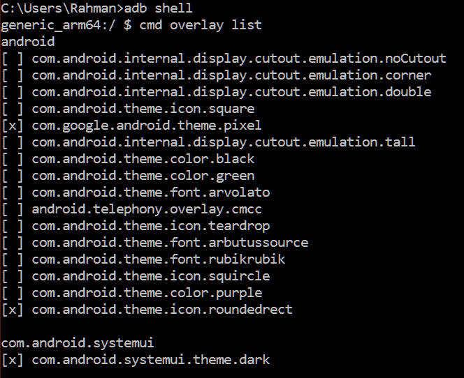

# Android Q 可能会提供新的字体、图标形状和强调色覆盖

> 原文：<https://www.xda-developers.com/android-q-font-icon-shape-accent-color-overlays/>

比起 iOS，我更喜欢 Android 操作系统的原因之一是定制。我可以对运行在我的华为 Mate 20 X 上的 EMUI 9 软件进行大量定制。EMUI 的内置主题引擎使得[定制 SystemUI 组件、框架和其他系统应用程序的背景色和强调色](https://www.xda-developers.com/deep-black-dark-theme-emui-9-huawei-honor/)以及系统字体成为可能。三星还在[三星体验](https://www.xda-developers.com/samsung-experience-10-theme-samsung-galaxy-s9-samsung-galaxy-s8/)和 [One UI](https://www.xda-developers.com/custom-themes-samsung-experience-10-before-android-pie-beta/) 中提供了全面的主题引擎。谷歌没有在 Pixel 软件中向用户展示主题引擎，尽管 Pixel 的安卓系统支持主题化。Stock Android 首先通过 Android 8.0 Oreo 获得了对主题化的支持，现在看起来 Android Q 进一步扩展了这一支持，支持更多的主题化元素，并可能为所有用户提供更多的内置定制选项。

Google [在 Android 8.0 Oreo 版本中完全采用了索尼最新的主题化框架。索尼的主题框架以一个叫做 OverlayManagerService (OMS)的类为中心。OMS 使用“idmap”将“覆盖”应用中定义的资源与目标应用中定义的资源链接起来。这允许目标应用被主题化，而不需要以任何方式直接修改目标应用。索尼最近向 AOSP 提交了 idmap2](https://www.xda-developers.com/android-oreo-command-line-themes/) [上游](https://android-review.googlesource.com/q/owner:marten.kongstad%2540sony.com)，而谷歌似乎已经在内部合并了这些变化。idmap2 最显著的变化是引入了[叠加类别](https://android-review.googlesource.com/c/platform/frameworks/base/+/740259)。通过根据覆盖图的目标将覆盖图分成不同的类别，当启用新的覆盖图时，系统将更容易自动禁用针对同一应用程序的其他覆盖图。(目前，覆盖是按优先级顺序启用的。)随着 idmap2 中类别的引入，我们发现谷歌正在测试 3 个覆盖类别:字体、图标形状和强调颜色。

在我在谷歌 Pixel 3 XL 上闪现的[泄露的 Android Q build](https://www.xda-developers.com/android-q-dark-theme-desktop-mode-permission-revamp/) 中，有多个预装的覆盖图，允许我在整个 UI 中更改字体、图标形状和强调颜色。来自一加的 OxygenOS 允许你改变强调颜色，而前面提到的 EMUI 和 One UI 允许你使用自定义字体。在运行 Android 9 Pie [的 Pixel 设备上，如果没有 root 权限](https://www.xda-developers.com/custom-themes-android-p-root-substratum/)，这两种情况都是不可能的。可以在普通像素启动器中改变图标形状，但这种改变只会对启动器中显示的图标应用遮罩。Android Q 中的图标覆盖会在图标显示的任何地方应用一个遮罩——设置、最近应用概述、应用信息页面等。

以下是我获得的早期 Android Q build 预装的字体、图标形状和强调色覆盖图:

*   字体
*   核标准情报中心
    *   圆角矩形
    *   平方
    *   松鼠
    *   泪珠
*   强调色

当然，就像 Android 8.0/8.1 Oreo 和 Android 9 Pie 一样，设置应用程序中没有内置选项来在这些覆盖图之间切换。相反，我必须先使用`cmd overlay list`命令，然后再使用`cmd overlay enable {package}`来启用我想要的覆盖。然而，在 Android Q 之前，Pixel 智能手机上唯一预装的覆盖图是用于显示剪切开发者选项的[缺口覆盖图，Pixel 框架覆盖图，以及用于 SystemUI 和启动器的](https://www.xda-developers.com/google-android-p-guidelines-display-notch/)[部分黑暗主题](https://www.xda-developers.com/enable-android-p-dark-theme-night-light/)。谷歌可以很容易地在 Android Q 的显示设置中添加一个新的设置，让用户启用这些字体，图标或强调颜色覆盖，就像他们在开发者选项中对显示剪切仿真设置所做的那样。

 <picture></picture> 

List of pre-installed overlays in Android Q.

在你对谷歌在 Android 中开放更多主题化功能抱有希望之前，请记住，不能保证我们会在 Android Q 的生产版本中看到这些预装的覆盖图。包括谷歌自己在内的设备制造商可能会在向设备推出 Android Q 之前删除这些覆盖图。如果他们确实预先安装了这些覆盖图，也不能保证他们会公开一个设置来切换它们(在这种情况下，cmd overlay ADB shell 命令可能会起作用。)最后，我们警告不要将这一变化解读为谷歌将允许安装自定义字体、强调颜色和图标形状的信号。首先，字体覆盖实际上并不包含字体本身——字体都是预先安装的。覆盖只是告诉框架使用哪种预装字体。更重要的是，[没有用平台证书](https://www.xda-developers.com/android-p-blocks-custom-overlays-substratum-themes/)签名。OEM)仍然无法安装，从而将第三方覆盖排除在外。我希望我是错的，这些预装的字体、图标形状和强调颜色覆盖是谷歌将允许在 Android Q 和更高版本中进行更多定制的标志，但我们之前已经吃过苦头——只记得定制覆盖在 Android 9 Pie 中被[阻止的时候！](https://www.xda-developers.com/rootless-custom-themes-android-p/)

* * *

*更多关于安卓 Q:*