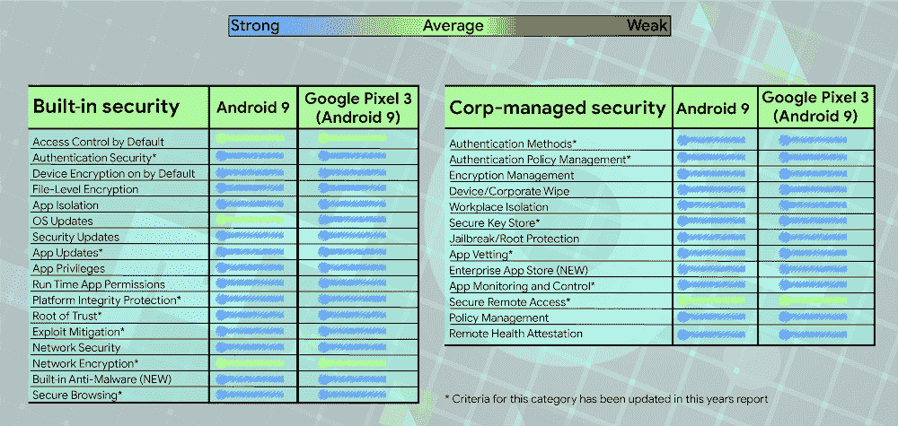
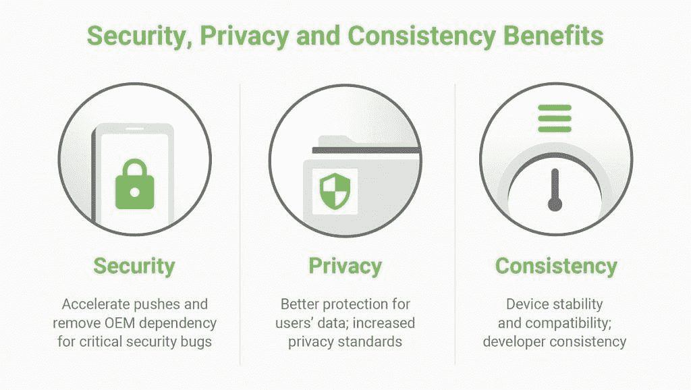

# 谷歌在 Android Q 中的项目主线将有助于加快安全更新

> 原文：<https://www.xda-developers.com/android-q-project-mainline-security/>

Android 版本碎片化是谷歌要解决的最大挑战之一。虽然谷歌 Pixel 智能手机是市场上最安全的智能手机之一，这要归功于 Pixel 和 AOSP 工程师令人难以置信的努力，但许多其他智能手机也容易因运行过时的操作系统版本或过时的安全补丁级别而被利用。来自 Gartner 的最新报告显示，Android 9 Pie 是一个令人难以置信的安全操作系统，然而所有智能手机中只有大约 10% 在发布。

 <picture></picture> 

Overview of the 2019 Mobile OSs and Device Security: A Comparison of Platforms report. Source: [Gartner](https://www.gartner.com/document/3913286). Via: [Google](https://www.blog.google/products/android-enterprise/android-enterprise-security-assessed-gartner/).

谷歌正在通过各种举措解决版本碎片问题，如 [Project Treble](https://www.xda-developers.com/tag/project-treble/) ，Android 的重大重组导致 Android OS 框架组件和供应商 HAL 组件分离，[扩展的 Linux 内核 LTS](https://www.xda-developers.com/linux-kernel-long-term-support-google/) ，[两年强制安全补丁更新](https://www.xda-developers.com/google-mandating-major-oems-2-years-android-security-updates/)，以及 [Android Enterprise 推荐的](https://www.xda-developers.com/google-introduce-android-enterprise-recommended-program/)。在 Google I/O 2019 上，该公司宣布了其加快安全更新的最新举措:Android Q 的 Project Mainline。

## 项目主线:通过 Google Play 更新 Android Q 系统模块

在过去的几个月里，我们在 AOSP 追踪了一种叫做“ [APEX](https://www.xda-developers.com/android-q-apex-biggest-thing-since-project-treble/) 的东西。APEX，或 [Android Pony EXpress](https://android.googlesource.com/platform/system/apex/+/refs/heads/master/docs/README.md) ，是一种新的包裹类型，类似于 APK。然而，APEX 不是容纳 Android 应用程序，而是本地或类库、可由 Android 应用程序调用的预编译代码、硬件抽象层(HAL)和 Android 运行时(ART)的家园。像 APK 一样，APEX 软件包可以通过 Android 中的传统软件包安装方法提供给用户:谷歌 Play 商店/软件包管理器或 ADB。

与基于 APK 的模块相比，APEX 模块可以在更早的启动过程中使用，并且它们还受到 dm-verity 和 Android 验证启动的支持，以提高安全性。在 APEX 包中挂载有效负载映像需要 Linux 内核的循环驱动程序，因此设备需要 Linux 内核版本 4.9+。管理 APEX 包需要新的 APEX 守护程序，这是 Android Q 引入的。虽然使用 Linux 内核 4.4 升级到 Android Q 的设备可以支持 APEX(如 Google Pixel 3)，但原始设备制造商需要合并额外的补丁才能使其工作。在很大程度上，只有搭载 Android Q 的设备才能支持项目主线。

GNU/Linux 发行版很久以前就能够独立于完整的系统更新来更新系统组件，但 Android 一直需要系统更新来更新它们。Google 选择不使用传统的 Linux 包管理系统如 dpkg 和 rpm 来分发这些包，因为它们不使用 dm-verity 在安装后保护包。

由于设备制造商需要很长时间来推出更新，许多设备的系统组件可能会过期几天、几周甚至几个月。通过将这些组件作为 APEX 包分发，谷歌可以绕过原始设备制造商推出系统更新的漫长等待。

 <picture></picture> 

The benefits of Project Mainline. Source: Google.

然而，谷歌并没有完全控制所有的系统组件。该公司与其 OEM 合作伙伴合作，选择了一组系统应用程序(作为 apk)和系统组件(作为 APEX 包)进行模块化，以便他们可以为所有使用 Android Q 设备的用户提高安全性、隐私性和一致性。尽管谷歌没有透露他们是如何开发出最初的系统组件集的，但他们向我们提供了将由谷歌更新的 Android Q 设备上的系统组件列表:

*   **安全性**:媒体编解码器、媒体框架组件、DNS 解析器、Conscrypt
*   **隐私**:文档 UI，权限控制器，ExtServices
*   **一致性**:时区数据、角度(开发者选择加入)、模块元数据、网络组件、强制网络门户登录、网络权限配置

对 Java 安全库 Conscrypt 和媒体组件的即时更新将使 Android 设备更加安全，这些组件“占最近修补的漏洞的近 40%”。对许可控制器的更新将改善隐私。标准化时区数据将有助于在一个国家决定改变时区时，让世界各地的 Android 设备保持在同一页面上。再者，游戏开发者将受益于[角度](https://www.xda-developers.com/android-q-support-vulkan-backend-angle-game-development/)的标准化。

谷歌正在开始使用这些系统组件，但可能会在未来的 Android 版本中添加更多组件。在这 13 个组件中，Conscrypt、时区数据、媒体编解码器和媒体框架组件将作为 APEX 包交付。其他 9 个组件是系统 apk。虽然 APEX 和 apk 都可以通过 Google Play 交付，但更新 APEX 包[需要重启](https://www.xda-developers.com/google-play-store-material-theme-redesign-apex-packages-android-q/)。谷歌还没有分享这将如何发生的 UI 流，但一旦设备开始推出 Android Q，我们可能会了解更多关于项目主线和 APEX 包的信息。