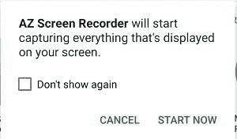

# Android Q 将允许应用程序记录其他应用程序的音频，并监控设备温度

> 原文：<https://www.xda-developers.com/android-q-record-audio-monitor-device-temperature/>

谷歌给予，谷歌拿走。每一个新的 Android 版本都引入了许多新的 API，这些 API 要么改善了现有应用的功能，要么开辟了新的应用类别。另一方面，谷歌还取消了对现有 API 的访问或限制其功能，以提高 Android 平台的安全性。Android Q 版本也不例外，我们已经谈了很多关于共享存储、剪贴板访问、通知和其他 API 的变化。在今年的谷歌 I/O 开发者大会上，谷歌宣布了 Android Q 中用户和手机游戏开发者特别感兴趣的新 API:AudioPlaybackCapture 和 Thermal APIs。

## 使用 Android Q 中的 AudioPlaybackCapture 录制来自其他应用程序的音频

手机游戏是一个巨大的行业，短期内没有放缓的迹象，尤其是在美国、中国和印度等市场。随着越来越多的人花时间在智能手机上玩游戏和社交媒体，人们希望在线分享游戏体验也就不足为奇了。

Android 基本上从一开始就支持截图，但是从 Android 5.0 Lollipop 开始，随着 [MediaProjection API](https://developer.android.com/reference/android/media/projection/MediaProjection) 的引入，才支持捕捉屏幕视频。遗憾的是，这个 API 不允许第三方应用程序记录其他应用程序的内部音频输出，迫使第三方屏幕记录器记录设备麦克风的外部音频输出。三星和[华为](https://www.xda-developers.com/emui-9-review-features-apps-huawei-honor-android-pie/)等原始设备制造商提供系统应用程序来记录屏幕录制期间的内部音频输出，但其他设备的所有者正确记录其设备的视频和音频输出的唯一方法是购买[第三方配件](https://support.mobizen.com/hc/en-us/articles/226494547-Can-I-record-Internal-Sound-)。幸运的是，谷歌终于在 Android Q 中引入了一种方法，让第三方应用程序可以录制其他应用程序的音频。

AudioPlaybackCapture API 被 Google 描述为屏幕捕捉的模拟，但用于音频记录。虽然迄今为止唯一使用该 API 的应用程序是谷歌的 [Live Caption](https://www.xda-developers.com/google-accessibility-live-caption-android-q-live-relay-live-transcribe/) ，这是一个为设备上播放的任何视频添加字幕的辅助工具，但该 API 的文档表明，其主要目的是允许流媒体应用程序捕捉游戏播放的音频。想想手机游戏玩家在 Twitch 或 YouTube 等服务上的流媒体游戏。该 API 旨在不影响正在捕捉音频的应用程序的音频延迟，使其非常适合游戏录制，因此音频和视频不会失去同步。

与 Android 早期不同，谷歌对新 API 的态度更加谨慎。仅当正在捕获音频的应用程序和执行捕获的应用程序都满足特定要求时，才能使用 AudioPlaybackCapture。以下是对这些要求的总结:

*   要让第三方应用程序采集应用程序的音频，必须满足以下要求:
    *   该应用程序必须在其清单中将 allowAudioPlaybackCapture 设置为 true 或取消设置。(针对 Android Q 的应用默认为 true，但针对 Android Pie 的应用可以手动设置。)
    *   产生音频的应用程序的音频使用类型必须为 USAGE_MEDIA、USAGE_GAME 或 USAGE_UNKNOWN。
    *   音频捕获策略(setAllowedCapturePolicy)必须设置为 ALLOW_CAPTURE_BY_ALL。此策略可以在运行时设置，但必须重新启动播放，策略更改才能生效。如果设定了 ALLOW_CAPTURE_BY_SYSTEM，则只有系统应用程序可以录制音频(但受到限制，因为它们不能存储音频、将音频传递给第三方应用程序或以大于 16kHz 的 16 位单声道质量进行录制。)
*   对于从另一个应用程序录制音频的应用程序，必须满足以下要求:
    *   该应用程序必须调出 mediaprojectionmanager . createscreencaptureintent 提示，用户必须接受它。<picture></picture>

        当应用程序试图使用 MediaProjection API 捕捉屏幕时，用户看到的确认对话框。

        T12
    *   app 必须持有 [RECORD_AUDIO](https://developer.android.com/reference/android/Manifest.permission.html#RECORD_AUDIO) 权限。
    *   该应用程序必须与将要录制音频的应用程序位于同一用户配置文件中。

我可以想象，大多数游戏将允许它们的音频被使用这种新 API 的应用程序捕获，但游戏可能需要一些时间来更新以支持它。另一方面，由于许可问题，不要指望任何音乐或视频流媒体应用程序支持第三方的这种 API。然而，如果一个应用程序将其音频捕获策略设置为 ALLOW_CAPTURE_BY_SYSTEM，谷歌施加的限制意味着音乐和视频流媒体应用程序的开发者应该可以通过系统启用音频捕获来提高可访问性。

要阅读更多关于 Android Q 中的 AudioPlaybackCapture API 的信息，请查看本页。

## Android Q 中使用 Thermal API 监控节流

热量调节几乎完全由系统管理，受调节影响最大的应用程序没有任何输入，甚至没有任何通知。如果设备的资源过于紧张，大多数设备都会降低 CPU 和 GPU 的速度，从而影响游戏的性能。作为一名游戏开发者，除了在用户更改任何设置之前警告用户他们的更改可能对性能产生的潜在影响之外，你真的无能为力。

然而，通过 Android Q 中新的 Thermal API，应用程序可以接收不同阶段性能调节的回调——让开发人员有机会通过减少需要大量 CPU、GPU 或调制解调器使用的活动来帮助减轻设备的压力。例如，游戏可以动态降低分辨率，直到设备不再受 GPU 限制，或者地图应用程序可以禁用增强功能，如[增强现实导航](https://www.xda-developers.com/google-maps-ar-mode/)，以减少 CPU 的负载。

要使用这种新的 API，应用程序在 power manager(addThermalStatusListener)中注册一个监听器，系统会向应用程序发送以下热量状态代码之一:

*   THERMAL_STATUS_NONE:“未节流。”
*   THERMAL_STATUS_LIGHT:“在 UX 不受影响的情况下进行轻度节流。”
*   THERMAL_STATUS_MODERATE:“适度节流，UX 不会受到太大影响。”
*   THERMAL_STATUS_SEVERE:“严重节流，UX 受到很大影响。”
*   THERMAL_STATUS_CRITICAL:“平台已尽一切努力降低功耗。”
*   THERMAL_STATUS_EMERGENCY:“由于热状况，平台中的关键组件正在关闭。设备功能将受到限制。”
*   THERMAL_STATUS_SHUTDOWN:“需要立即关机。

对 Thermal API 的支持显然需要 Android Q，但另一个要求是增加一个新的 HAL。谷歌表示，Android Q 上的 Pixel 设备(指 Pixel、Pixel XL、Pixel 2、Pixel 2 XL、Pixel 3、Pixel 3 XL、 [Pixel 3a](https://forum.xda-developers.com/pixel-3a) 和 [Pixel 3a XL](https://forum.xda-developers.com/pixel-3a-xl) )支持 Thermal API，但谷歌正在努力增加对其他设备的支持。

点击阅读更多关于 [Thermal API 的信息。](https://developer.android.com/preview/features#thermal)