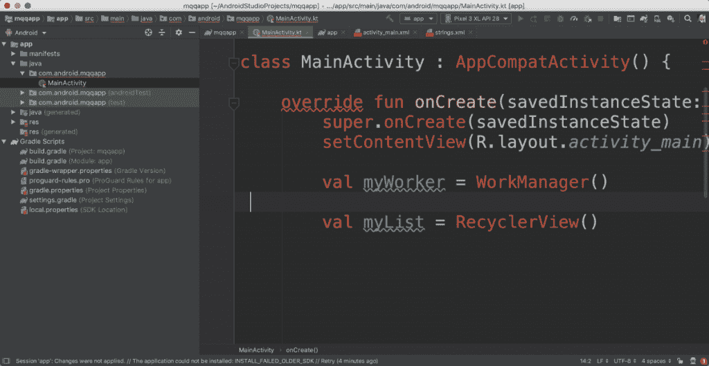
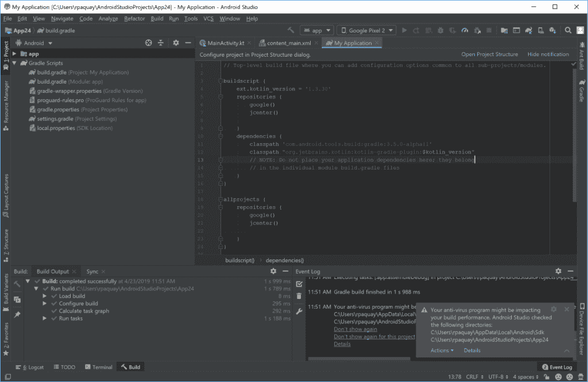
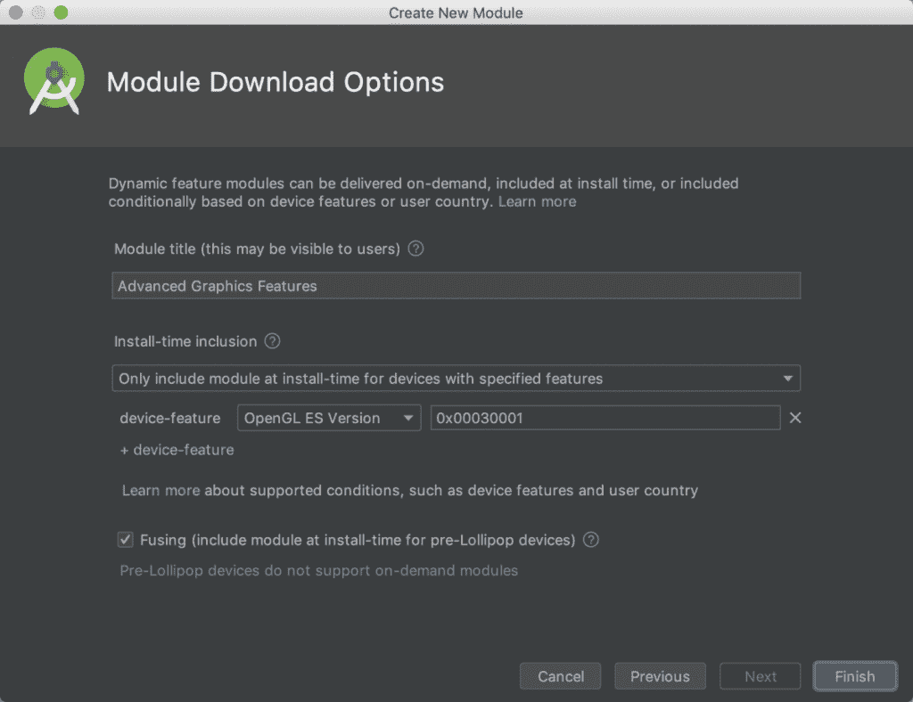
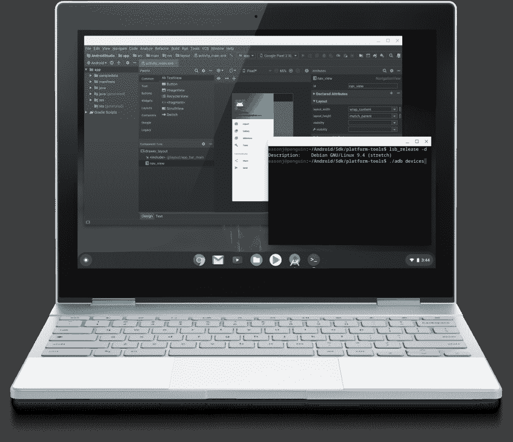

# Android Studio 3.5 测试版增加了谷歌 Pixel 3a 模拟器皮肤、高端 Chromebook 支持、可折叠设备模拟器等等

> 原文：<https://www.xda-developers.com/android-studio-3-5-changelog/>

谷歌官方的 Android 软件开发 IDE Android Studio 最近进行了很多改动，以提高整体稳定性。谷歌将他们的 bug 粉碎计划命名为“云石项目”，他们的目标是将所有注意力集中在解决开发人员对 IDE 的许多抱怨上，例如恼人的“T2”内存泄漏问题。然而，随着 IDE 的每一次发布，谷歌仍然带来了新的功能，例如 [Android Studio 3.4 的](https://www.xda-developers.com/android-studio-3-4-stable-android-q-emulator-r8-proguard/)资源管理器和项目结构对话框。在谷歌 I/O 2019 上，谷歌宣布了 Android Studio 3.5 的第一个测试版，修复了我们期待的错误和功能抛光。以下是 3.5-beta1 版本的亮点，后面是每个更改的摘要。

**Android Studio 3.5 测试版变更日志**

*   系统健康
    *   内存设置
    *   内存使用报告
    *   减少例外
    *   用户界面冻结
    *   构建速度
    *   IDE 速度
    *   Lint 代码分析
    *   输入输出文件访问
    *   仿真器 CPU 使用率
*   特色抛光
    *   应用更改
    *   同步处理
    *   项目升级
    *   布局编辑器
    *   数据绑定
    *   应用部署
    *   C++改进
    *   Intellij 2019.1 平台更新
    *   用于动态特征支持的有条件传送
    *   仿真器可折叠和像素设备支持
    *   Chrome 操作系统支持

* * *

## 系统健康

### 记忆

过去几个月，谷歌已经修复了许多导致内存泄漏的问题，但他们最近开始允许用户选择向他们发送内存不足异常的数据，以便他们可以找到剩余的问题。当 IDE 在 3.5-beta 1 版本中耗尽内存时，将自动捕获有关内存堆大小和堆中主要对象的高级统计信息，以便 Android Studio 可以建议更好的内存设置，并提供更深入的分析。如果一个应用程序需要比默认堆大小 1.2GB 更多的 RAM，IDE 将自动增加堆大小以适应这些更大的项目。您也可以在设置中手动调整堆大小。最后，3.5-beta1 更新允许您触发对个人数据进行清理的内存堆转储，您可以与 Google 共享这些数据以进行故障排除。

### 例外

在 3.5-beta1 中，您将会遇到更少的异常，因为 Google 现在可以通过从选择加入的用户收集的数据更快地在金丝雀频道中发现问题。您还会看到更少的异常通知，因为崩溃报告和分析需要用户更少的输入来报告给 Google。

 <picture></picture> 

Android Studio Exception Bubble. You'll see the bottom right red icon less often.

### 用户界面冻结

底层 Intellij 平台的基础设施已经扩展到测量持续时间超过几分钟的 UI 线程停止。利用他们收集的数据，他们可以找出导致 UI 冻结的常见问题。例如，该团队使用他们在 Marble 项目开发期间获得的数据优化了 3.5-beta1 版本中的 XML 代码编辑性能。

### 构建速度

随着对 Glide、AndroidX 数据绑定、Dagger、Realm 和 Kotlin 等注释处理器增加了增量构建支持，项目的构建速度得到了提高。谷歌的初步分析表明，增加对 Kotlin 的增量支持，使谷歌 I/O 2019 应用的子模块非 ABI 代码更改提高了 60%。

### IDE 速度

Android NDK 的几个不必要的部分已经被删除，以提高整体 IDE 速度，所以开发者不再需要完全禁用 Android NDK 插件，只是为了提高 Android Studio 的性能。

### Lint 代码分析

Lint 的代码分析速度现在提高了两倍，特别是在 bath 分析模式下，这要归功于对几个内存泄漏的修复。

### Windows 的 I/O 文件访问

对于 Windows 用户，性能可能会受到反病毒应用程序的负面影响，包括用于扫描的构建和安装目录。在 3.5-beta1 版中，IDE 将根据项目的编译目录检查排除的防病毒目录是否不一致，并通知您进行更改以避免不必要的速度减慢。

 <picture></picture> 

System Health Notification - Anti-virus check

### 仿真器 CPU 使用率

谷歌发现，Play 服务及其相关服务正在后台积极运行，因为模拟器设备被设置为交流电源，而不是电池放电。为了将后台 CPU 使用率降低 3 倍以上，最新的 Android 模拟器将默认设置为电池放电。

## 特色抛光

### 用于动态特征支持的有条件传送

Android Studio 3.5 中的应用捆绑包支持通过有条件交付得到改善。这允许您设置设备配置要求(例如，OpenGL 版本、AR 支持、API 级别、用户国家等。)用于安装期间自动下载的动态功能模块。

 <picture></picture> 

Module Selection for Conditional Delivery

### 模拟器可折叠和谷歌像素 3a 支持

更新后的 Android Studio 模拟器现在支持创建虚拟的可折叠设备。它还为新推出的谷歌 Pixel 3a 和谷歌 Pixel 3a XL 带来了皮肤。

 <picture></picture> 

Android Emulator - Foldable Support

### Chrome 操作系统支持

在 2018 年 Android Dev 峰会上，谷歌[宣布【Android Studio 支持将于 2019 年进入 Chromebooks。现在是时候支持 Chrome OS 了，从运行 Chrome OS 72 及更高版本的基于 x86 的高端 Chromebooks 开始。应用程序可以部署到通过 USB 连接的 Android 设备上。这里有一个安装程序](https://www.xda-developers.com/android-studio-chromebooks-chrome-os/)。

 <picture></picture> 

Android Studio in Chrome OS

### 其他变化

*   **应用更改:** Android Studio 3.5 引入了[应用更改](https://www.xda-developers.com/android-studio-3-5-canary-apply-changes-instant-run-replacement/)让你不用重启应用就能测试代码更改。在过去的几个月中，我们重新设计了部署管道，以提高部署速度，并调整了运行和部署工具栏按钮，以获得更简化的体验。
*   **Gradle Sync:** 最近的 Gradle 更改导致项目依赖项的缓存被清除以节省存储空间，从而导致丢失依赖项的错误。IDE 3.5-beta 1 版现在会检查这种状态。
*   **项目升级:**输出窗口、弹出窗口和对话框已经更新，可以告诉您何时需要更新到新的版本，最新版本还允许您独立更新 IDE 和 Gradle 插件。
*   **布局编辑器:**布局编辑器的可用性在诸如约束选择和删除到设备预览大小调整等方面得到了改进。
*   **数据绑定:** Google 修复了在 XML 中创建数据绑定表达式时代码编辑器中的挂起问题。
*   **应用部署流程:**一个新的下拉菜单让您可以查看和更改您打算将项目部署到哪个(哪些)设备。
*   **C++改进:**由于并行 Ninja 目标调用，CMake 构建速度提高了 25%，您可以使用新的单一构建变体 UI 单独指定 ABI 目标，并且可以在 build.gradle 中并行使用多个版本的 Android NDK
*   **Intellij 平台更新:**[2019.1 Intellij](https://www.jetbrains.com/idea/whatsnew/#v2019-1)平台特性已包含在内。

* * *

如需完整的发行说明，请查看本页。要下载最新的测试版，请访问[本页](https://developer.android.com/studio/preview)。(确保您下载了 Android Emulator v29.0.6，以利用上述功能。)如果你遇到任何 bug，你可以在这里通知团队任何问题[。最后，在](https://source.android.com/source/report-bugs#developer-tools) [Twitter](http://www.twitter.com/androidstudio) 和 [Medium](https://medium.com/androiddevelopers) 上关注 Android Studio 开发团队，了解 IDE 的最新消息。