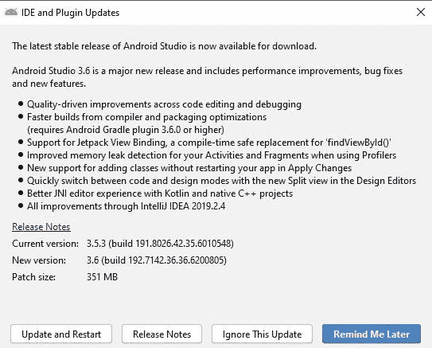
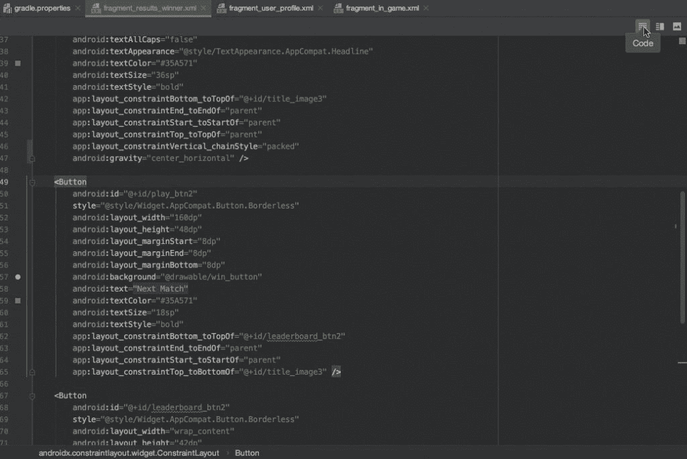
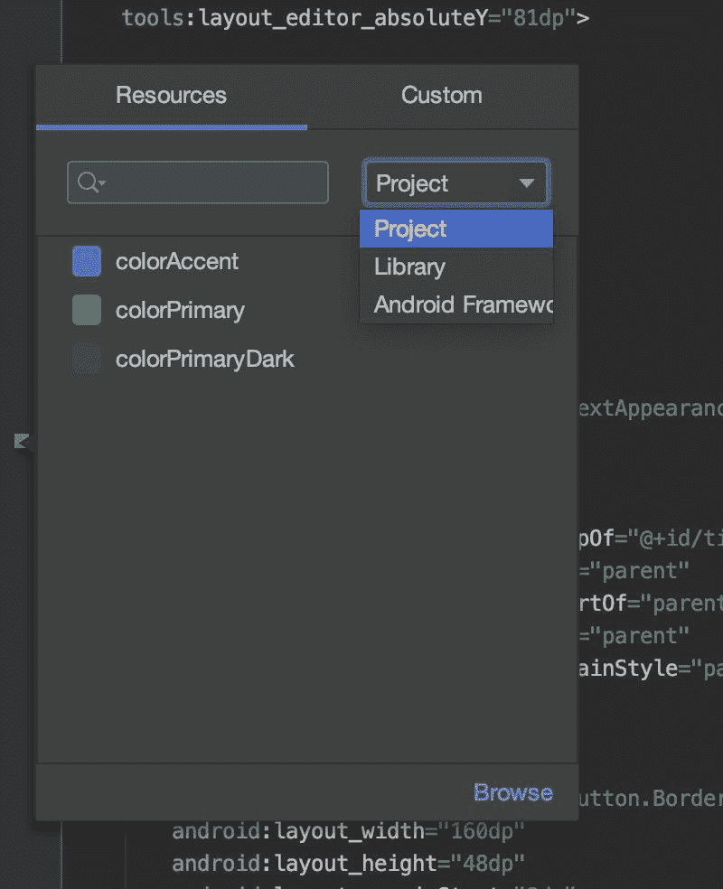
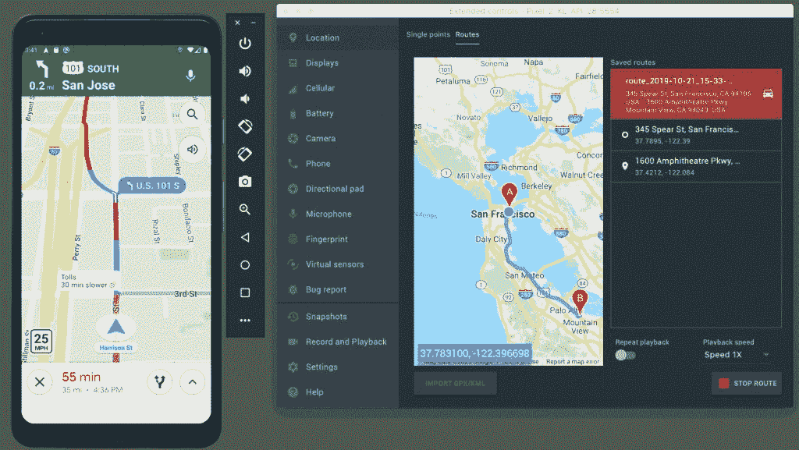

# 谷歌发布 Android Studio 3.6 稳定版

> 原文：<https://www.xda-developers.com/android-studio-3-6-stable-release/>

谷歌在去年年中向稳定渠道发布了其 Android 应用开发 IDE 的 3.5 版本。该版本是数月来漏洞修复和稳定性改进的高潮。今天，谷歌宣布下一个稳定版本 Android Studio 3.6 现已向开发者开放。该更新已经测试了几个月，它专注于改善代码编辑和调试的体验。下面是最新版本中新增内容的概述。

 <picture></picture> 

Android Studio 3.6 abbreviated changelog

**在设计编辑器中分割视图**

布局编辑器和导航编辑器的一个新的分割视图使得同时查看 UI 的设计和代码视图成为可能。拆分视图取代了预览窗口，可以逐个文件地进行配置，以保存缩放级别和设计视图选项等上下文信息。要启用拆分视图，请单击编辑器窗口右上角的“拆分”图标。

 <picture></picture> 

Split View in design editors. Source: Google

**拾色器资源标签**

谷歌在 Android Studio 3.6 的颜色选择器中增加了一个“资源”标签。此选项卡显示您定义为颜色资源的颜色，以便于选择或编辑它们。它可以在设计工具和 XML 编辑器中访问。

 <picture></picture> 

Color picker resource tab in Android Studio 3.6\. Source: Google

**安卓模拟器-谷歌地图 UI**

Android 模拟器的最新版本是 29.2.12，它包括一种可视化模拟设备位置的方法。谷歌在扩展控件菜单中嵌入了谷歌地图用户界面，这样开发者可以指定虚拟位置和构建虚拟路线。

 <picture></picture> 

Android Emulator location UI with real-time location streaming. Source: Google.

**多显示器支持**

Emulator 29.1.10 添加了对显示多个虚拟显示器的初始支持，以便于为具有多个显示器的设备开发应用程序。开发者可以通过设置菜单(扩展控件>设置)在 Android Studio 模拟器中配置多虚拟显示器。

**其他变化**

*   **视图绑定:**XML 布局文件和代码之间的不兼容会导致构建在运行时失败。为了防止这种情况，Google 引入了[视图绑定](https://developer.android.com/topic/libraries/view-binding)，当通过在每个模块的 build.gradle 文件中添加一行来启用该功能时，“为该模块中出现的每个 XML 布局文件生成一个绑定类”视图绑定旨在取代 findViewById，允许您引用所有带有 Id 的视图，而不会遇到空指针或类强制转换异常。点击了解更多关于此功能[的信息。](https://medium.com/google-developer-experts/exploring-view-binding-on-android-44e57ba11635)
*   **安卓 NDK 更新:**谷歌为[带来了 Kotlin 支持，这两个安卓 NDK 特性](https://developer.android.com/studio/preview/features/#3.6-ndk-updates)以前在 Java 中也支持。它们包括“[导航]从 JNI 声明到 C/C++中相应的实现函数”和“自动[创建]JNI 声明的存根实现函数。”
*   **IntelliJ 平台更新:** IntelliJ 2019.2 包含在 Android Studio 3.6 中。这篇 [JetBrains 博客文章](https://blog.jetbrains.com/idea/2019/07/intellij-idea-2019-2-java-13-preview-features-profiling-tools-services-tool-window-and-more/)解释了主要的变化。
*   **添加应用更改的类:**单击“应用代码更改”或“应用更改并重新启动活动”将允许您添加类，然后将代码更改部署到正在运行的应用程序。这两个动作的区别在[这里](https://developer.android.com/studio/run#apply-changes)解释。
*   **Android Gradle 插件更新:**Android Gradle 插件 3.6 版本增加了对 Maven Publish Gradle 插件的支持。在这里了解更多。
*   **导入的 apk 的就地更新:** Android Studio 3.6 现在自动检测对导入的 apk 的更改，并允许您就地重新导入它们，这样您就不必重新附加符号和源代码。
*   **将 Kotlin 源文件附加到导入的 apk:**您现在可以将 Kotlin 源文件附加到导入的 apk。在这里了解更多。
*   **内存分析器中的泄漏检测:** Google 已经更新了内存分析器，使其能够检测可能已经泄漏的活动和片段实例。此功能的文档可在[此处](https://developer.android.com/studio/profile/memory-profiler#profiler-memory-leak-detection)获得。
*   **在 APK 分析器中去除类和方法字节码:**当使用 APK 分析器检查 DEX 文件时，现在可以通过加载正在分析的 APK 的 ProGuard 映射文件来去除类和方法字节码。更多信息[在这里](https://developer.android.com/studio/build/apk-analyzer)。

* * *

谷歌还发布了一段 YouTube 视频，总结了 Android Studio 3.6 的变化:

你可以从 Android Studio 下载最新的稳定版本，或者从谷歌网站下载[。更多细节，请查看](https://developer.android.com/studio)[谷歌在 Android 开发者博客](https://android-developers.googleblog.com/2020/02/android-studio-36.html)上的博客文章或最新的 [Android Studio 发布说明](https://developer.android.com/studio/releases#3-6-0)。IDE 的下一个主要更新将是 Android Studio 4.0，引入了新的 Jetpack 库，包括 CameraX 和 Compose。4.0 版本目前是金丝雀中的[，所以它还需要几个月才能准备好一个稳定的版本。](https://developer.android.com/studio/preview)