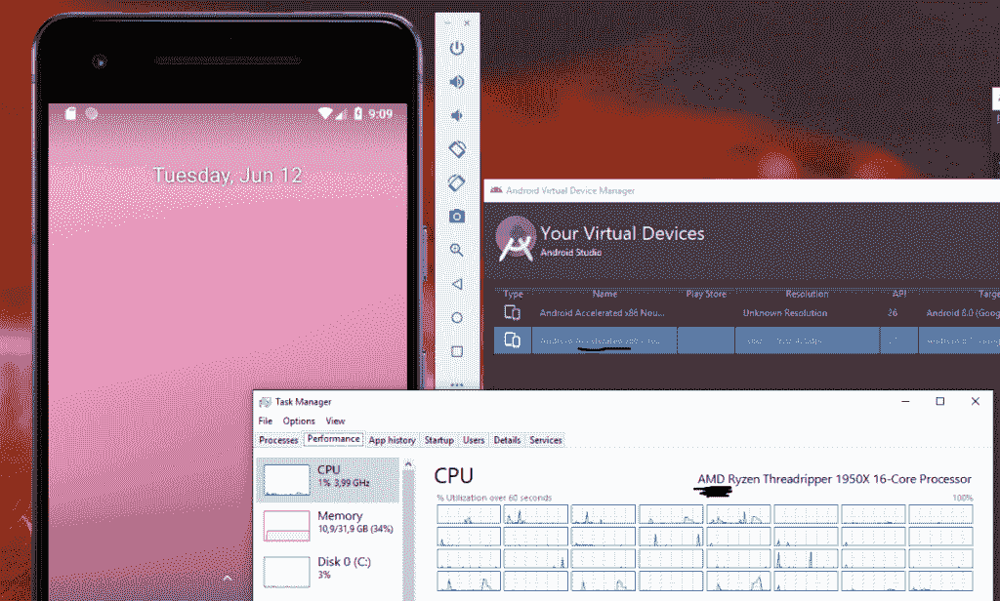

# Android Studio 3.2 中的 Android 模拟器支持 Windows 10 上的 AMD 处理器

> 原文：<https://www.xda-developers.com/android-studio-canary-android-emulator-support-amd-windows-10/>

# Android Studio 3.2 中的 Android 模拟器现在支持 Windows 10 上的 AMD 处理器

在最新的 Android Studio 版本中，为 Windows 10 上的 AMD 用户提供了正确的 Android 模拟器支持和硬件加速。

Android Emulator 27.3.6 最近在 Canary 和 Dev 频道与 [Android Studio 版本](https://www.xda-developers.com/android-studio-3-1-now-available/)一起发布，为 AMD 用户在 Windows 10 上带来了期待已久的功能。这个新版本最终支持在 AMD 处理器上运行带硬件加速的仿真器。

以前，Windows 10 上的 AMD 用户无法运行具有硬件加速的 Android 仿真器，这导致仿真器运行缓慢、效率低下，与英特尔平台上的体验相比，使用起来通常令人沮丧。

随着[新版本](https://androidstudio.googleblog.com/2018/06/emulator-2736-canary.html)的发布，这种情况发生了变化，同时也带来了其他变化，例如:

*   修复了从快照加载颜色缓冲区时，在初始快照加载后崩溃的问题。
*   修复了保存 OpenGL 着色器程序信息日志的快照时潜在的内存损坏。
*   修复了检查主机系统的 CPUID 时潜在的内存损坏。
*   在运行最新 Windows 10 的 AMD 机器上，并且可以成功启用 Windows 虚拟机管理程序平台的地方，仿真器现在可以在加速模式下引导 API 级别 26+x86/x86 _ 64 avd。
    *   **警告:**我们发现，在许多 AMD 锐龙机器上启用 Hyper-V 或 Windows Hypervisor 平台，尤其是配有 Vega GPUs 的笔记本电脑，会导致 Windows 无法启动。如果您的 AMD 系统已经在启用 Windows 虚拟机管理程序平台的情况下成功运行，我们仅建议您尝试此方法。
    *   **修复:**如果 Windows 由于启用 Windows 虚拟机管理程序平台而变得无法启动，请在系统 BIOS 中禁用虚拟化并重新启动，这将允许您禁用该功能。

 <picture></picture> 

Credits: Reddit User /u/Ssunde2

Android Studio 模拟器开发者 [/u/lfy_google](https://www.reddit.com/r/androiddev/comments/8qhirc/amd_finally_gets_google_emulator_support_canary/e0jjj0j/) 也澄清了硬件加速应该也可以在 Windows 10 家庭系统上工作，尽管后者没有“Hyper-V”选项。只需在 Windows 可选功能中启用“Windows 虚拟机管理程序平台”选项就可以了。此外，还不包括对 API 25 及以下版本的支持；用户可以期待在下一个 canary 版本中看到这个问题得到解决。

* * *

[**Via:Reddit**](https://www.reddit.com/r/androiddev/comments/8qhirc/amd_finally_gets_google_emulator_support_canary/?st=jicbvslf&sh=5d376057)