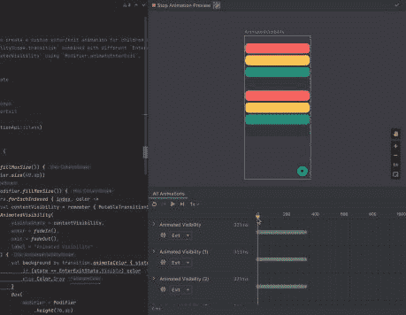
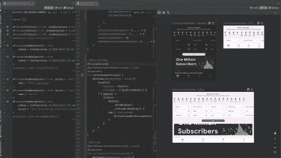
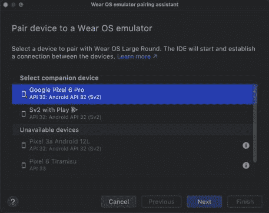
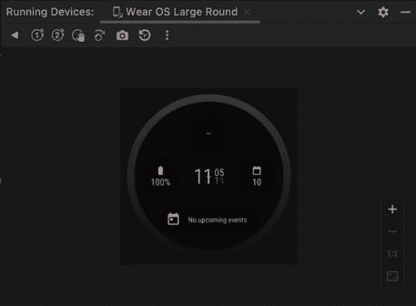
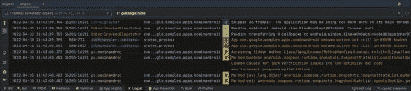
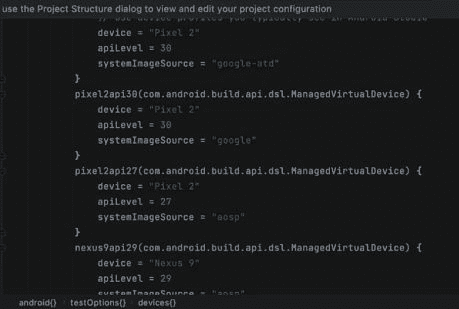

# Android Studio Dolphin Beta 现已提供下载

> 原文：<https://www.xda-developers.com/android-studio-dolphin-beta/>

Android Studio Dolphin 在 Canary 已经有一段时间了。在今天的 I/O 开发者大会上，谷歌终于将其升级到测试频道，并在金丝雀频道上推出了代号为 Electric Eel 的新版本。Android Studio 的最新测试版和 Canary 版本都带来了许多新功能，如在动画预览中查看合成动画，调整大屏幕设备模拟器的大小，配对和控制 Wear OS 模拟器以及启动磁贴、观看面孔等。直接从 Android Studio，等等。在本帖中，我们将看看最新测试版中的所有新内容。

## Android Studio Dolphin Beta 有什么新功能？

第一个 Android Studio Dolphin 测试版包括以下新功能和改进:

### Jetpack 复合

Android Studio Dolphin Beta 为 Jetpack Compose 工具包带来了一些新功能。在最新版本中，开发人员现在可以一次看到所有的 UI 动画，并在动画预览中协调它们。他们还可以选择冻结特定的动画。

 <picture></picture> 

Compose Animation Coordination

此外，开发人员还将能够使用多个预览定义来定义注释类，并使用这个新的注释来立即生成预览。得益于此，单个注释将帮助开发人员同时预览多个设备、字体和主题，而无需为每个可组合组件重复这些定义。

 <picture></picture> 

Multi preview Annotations

此外，在 Android Studio Dolphin Beta 中，开发人员将能够在布局检查器中查看合成应用程序的重组次数。他们还可以在组件树和属性面板中看到重组计数和跳过计数。

### 佩戴操作系统

Android Studio Dolphin Beta 也为 Wear OS 模拟器带来了一些改进。它现在有一个新的 Wear OS 模拟器配对助手，允许开发人员在设备管理器中查看 Wear 设备，并将多个手表模拟器与一部手机配对。与以前不同，开发人员也不必经常重新配对设备，因为 Android Studio 现在会在关闭后记住配对。

 <picture></picture> 

Wear OS Emulator Pairing Assistant

Wear OS 模拟器还提供了一个新的侧工具栏，开发人员可以使用 Wear 专用的模拟器按钮，这些按钮类似并模拟物理按钮，包括主按钮、手掌按钮和倾斜按钮。

 <picture></picture> 

Wear OS Emulator Side Toolbar

Android Studio Dolphin Beta 还支持 Wear OS Direct Surface Launch，允许开发人员运行/调试 Wear OS tiles、watch faces 和 complications 的配置，并直接从 Android Studio 启动它们。

Android Studio Dolphin Beta 也获得了一些新的开发工具，包括使用 Logcat V2 更快地诊断应用程序问题的能力。Logcat V2 引入了新的格式，这将使开发人员更容易扫描有用的信息，分割视图跟踪更多一目了然，并给出了一个新的过滤日志的语法。

 <picture></picture> 

Logcat V2

在最新版本中，开发人员还将能够描述虚拟设备以进行自动化测试，并让 Gradle 处理 SDK 下载、设备供应以及测试执行和拆卸设置。Gradle 还带来了更智能的功能，比如快照管理、测试缓存和测试分片。

 <picture></picture> 

Gradle Managed Devices

最后，Gradle Managed Devices 还引入了一种新型的测试设备，称为自动化测试设备。它为自动化测试优化了设备，减少了测试执行期间的 CPU 和内存使用。

## 下载 Android Studio Dolphin Beta

Android Studio Dolphin Beta 现已提供下载。你可以点击下面的链接，按照这里[提供的说明](https://developer.android.com/studio/preview/install-preview)将它与当前的稳定版本并列安装。谷歌声称，测试版接近稳定的发布质量，但漏洞可能仍然存在。如果你遇到任何问题，你可以[在这里](https://issuetracker.google.com/issues/new?component=192708&template=840533&pli=1)分享你的反馈。

**[下载安卓工作室海豚测试版](https://developer.android.com/studio/preview)**