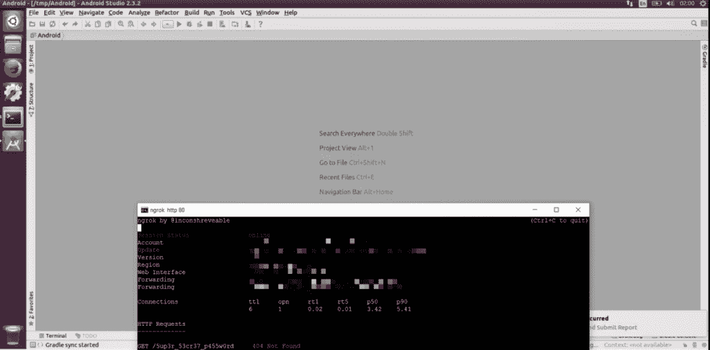
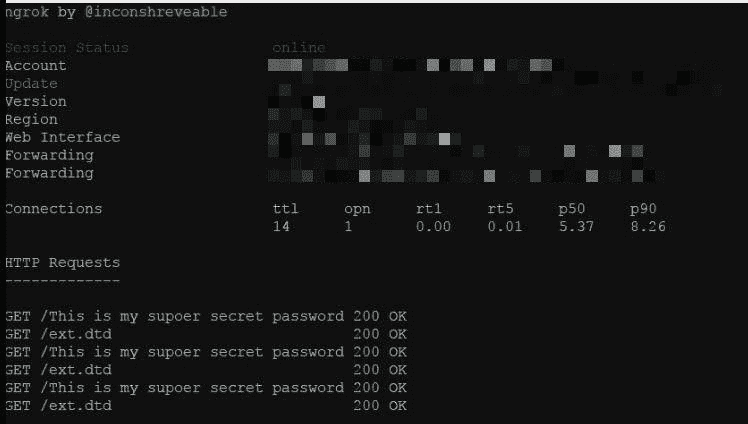
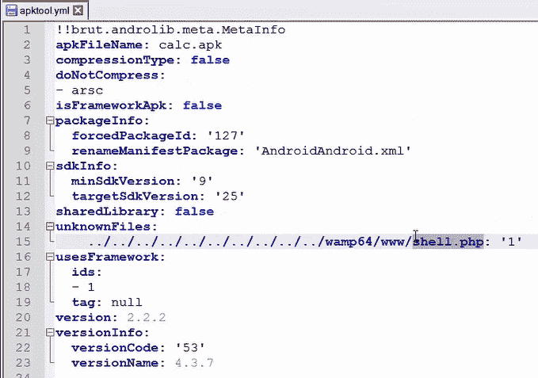

# 在包括 Android Studio、IntelliJ IDEA 和 Eclipse 在内的常见 Android IDEs 中发现了几个漏洞

> 原文：<https://www.xda-developers.com/android-studio-eclipse-itellij-parsedroid-vulnerability/>

当我们想到 Android 漏洞时，我们通常会想到一个零日漏洞，该漏洞利用一些过程来提升权限。这可以是任何东西，从欺骗您的智能手机或平板电脑连接到恶意 WiFi 网络，或允许代码从远程位置在设备上执行。然而，最近发现了一种新的 Android 漏洞。它被称为 ParseDroid，利用了包括 Android Studio、IntelliJ IDEA、Eclipse、APKTool、Cuckoo-Droid 服务等开发工具。

然而，ParseDroid 并不仅仅局限于 Android 的开发者工具，这些漏洞已经在程序员目前使用的多个 Java/Android 工具中被发现。不管你使用的是可下载的开发者工具还是在云中工作的工具， [Check Point Research](https://research.checkpoint.com/parsedroid-targeting-android-development-research-community/) 已经在最常见的 Android 和 Java 开发工具中发现了这些漏洞。一旦被利用，攻击者就能够访问开发人员工作机器的内部文件。

Check Point Research 首先对最流行的第三方 Android 应用逆向工程工具(APKTool)进行了一些挖掘，发现其反编译和构建 APK 功能都容易受到攻击。在查看源代码后，研究人员设法确定了一个可能的 XML 外部实体(XXE)漏洞，因为 APKTool 的配置 XML 解析器在解析 XML 文件时没有禁用外部实体引用。

一旦被利用，该漏洞会暴露 APKTool 用户的整个操作系统文件系统。反过来，这可能允许攻击者通过使用利用 XXE 漏洞的恶意“AndroidManifest.xml”文件来检索受害者 PC 上的任何文件。一旦发现该漏洞，研究人员就会查看流行的 Android IDEs，并发现只需加载恶意的“AndroidManifest.xml”文件作为任何 Android 项目的一部分，ide 就会开始吐出攻击者配置的任何文件。

 <picture></picture> 

Credits: Check Point Research

Check Point Research 还展示了一个潜在影响大量 Android 开发人员的攻击场景。它通过将包含 XXE 有效载荷的恶意 AAR (Android 归档库)注入在线存储库来工作。如果受害者克隆了存储库，那么攻击者就可以从受害者的操作系统文件系统中访问潜在的敏感公司财产。

 <picture></picture> 

Credits: Check Point Research

最后，作者描述了一种方法，通过这种方法他们可以在受害者的机器上执行远程代码。这是通过利用 APKTool 中名为“APKTOOL.YAML”的配置文件来实现的。该文件有一个名为“unknownFiles”的部分，用户可以在其中指定将在 APK 重建期间放置的文件位置。这些文件存储在受害者机器上的“未知”文件夹中。通过编辑保存这些文件的路径，攻击者可以在受害者的文件系统中插入他们想要的任何文件，因为 APKTool 不会验证从 APK 中提取未知文件的路径。

攻击者注入的文件会导致在受害者的机器上完全远程执行代码，这意味着攻击者可以通过手工创建恶意制作的 APK 并让受害者尝试解码然后重建它来利用安装了 APKTool 的任何受害者。

 <picture></picture> 

Credits: Check Point Research

由于上面提到的所有 ide 和工具都是跨平台和通用的，利用这些漏洞的可能性很高。令人欣慰的是，在联系了这些 ide 和工具的开发人员之后，Check Point Research 已经确认这些工具不再容易受到这种攻击。如果您运行的是这些工具的旧版本，我们建议您立即进行更新，以防止 ParseDroid 式的攻击。

* * *

[**来源:查点研究**](https://research.checkpoint.com/parsedroid-targeting-android-development-research-community/)