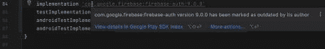
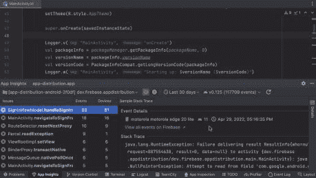
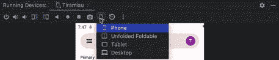
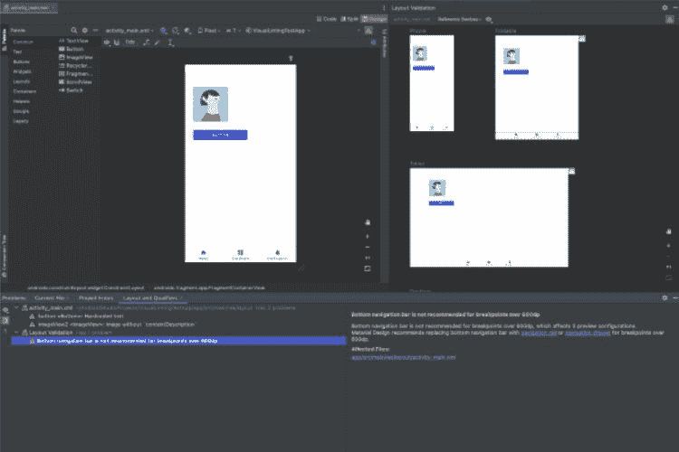
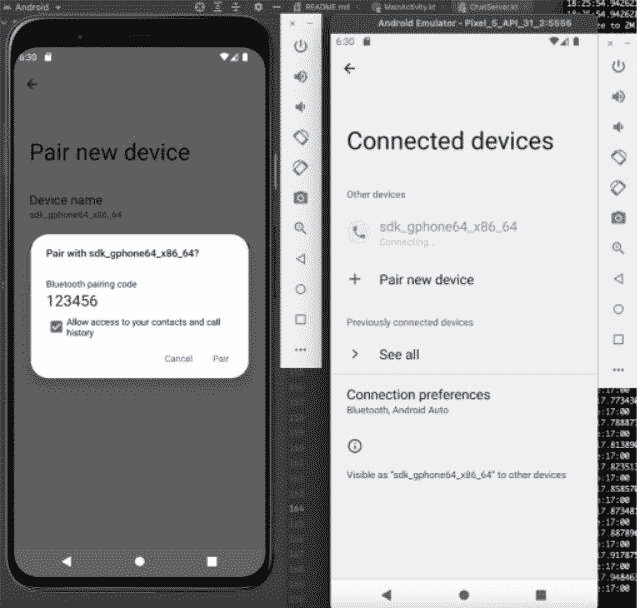

# Android Studio Electric Eel Canary 为撰写预览带来了实时编辑

> 原文：<https://www.xda-developers.com/android-studio-electric-eel-canary/>

在金丝雀频道进行了几个月的测试后，谷歌终于在今天的 I/O 开发者大会上将 Android Studio Dolphin 升级到了测试频道。测试版包含了各种 Jetpack Compose 特性和改进，Wear OS 模拟器的新特性，以及一些额外的开发工具。随着 Dolphin beta 版的发布，谷歌推出了第一个 Android Studio Electric Eel Canary 版本。它也带来了许多新的特性和改进。在本帖中，我们将看看最新版金丝雀的所有新特性。

## Android Studio 电鳗金丝雀有什么新功能？

Android Studio Electric Eel Canary 版本带来了一些额外的功能和改进。以下是新功能概述:

### Jetpack 复合

与 Android Studio Dolphin Beta 一样，Electric Eel Canary 版本带来了新的 Jetpack Compose 功能。在此版本中，开发人员将发现一个新的实时编辑功能，该功能允许他们在撰写预览和仿真器或物理设备中实时查看代码更改。

实时编辑是一项可选功能，开发者必须在 Android Studio 设置中启用。

### Google Play 和 Firebase

Android Studio Electric Eel Canary 还带来了一些新的 Google Play 和 Firebase 改进。例如，这个版本将让开发者获得 Lint 警告，警告那些被作者在 Google Play SDK 索引中标记为过时的 SDK 和库。这将让他们在开发期间轻松更新过时的依赖版本，以避免应用程序提交到 Play 控制台时出现问题。

 <picture></picture> 

Google Play SDK Index insights

Electric Eel Canary 版本还带来了 Firebase Crashlytics 集成，这将让开发人员在 Android Studio 和本地源代码环境中发现、调查和解决 Crashlytics 报告的问题。

 <picture></picture> 

App Quality Insights from Firebase Crashlytics

谷歌声称，这种集成将有助于*“减少从崩溃到代码(以及从代码到崩溃)的导航之间的摩擦”*并显示关于每次崩溃的重要上下文数据，以帮助开发人员在本地重现问题。

### 大屏幕

为了帮助开发人员为大屏幕 Android 设备开发更好的应用程序，谷歌还在 Electric Eel Canary 版本中包含了一个可调整大小的模拟器。该模拟器将允许开发人员在代表性参考设备之间快速切换，以在单个模拟器实例中测试各种应用程序布局状态。这项功能实际上是在 Android Studio Chipmunk 中引入的，但谷歌这次再次强调了这一点。

 <picture></picture> 

Resizable Emulator

此外，布局验证面板将帮助开发人员发现和修复不同设备之间的布局问题。

 <picture></picture> 

Visual Linting

模拟器将自动运行布局，检查不同屏幕尺寸上的可视 Lint 问题，以避免出现问题，如大屏幕设备上的按钮隐藏在边界之外。

Canary build 还获得了仿真蓝牙支持，这将允许开发人员使用虚拟蓝牙发现和连接两个电话仿真器。该特性在 Android Emulator v31.3.8 及更高版本的系统映像 T (API 33)中可用。谷歌计划在未来的版本中增加对信标和心率监测器等虚拟外设的支持。

 <picture></picture> 

Pairing two Android Emulators using Emulated Bluetooth

谷歌还增加了设备镜像支持，以尽量减少应用开发过程中的中断次数。该功能允许开发人员将其设备显示直接传输到 Android Studio，使他们能够使用运行设备窗口与物理设备进行交互。

## 下载安卓工作室电鳗金丝雀

Android Studio 电鳗金丝雀现已可供下载。你可以点击下面的链接，按照这里[提供的说明](https://developer.android.com/studio/preview/install-preview)将它与稳定版并列安装。

**[下载安卓工作室电鳗金丝雀](https://developer.android.com/studio/preview)**