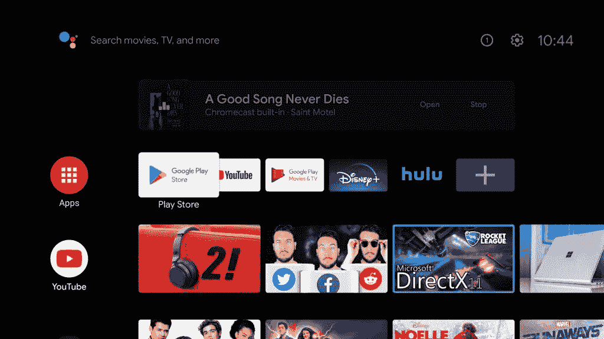

# Android TV 现在可以在后台播放播放的音频

> 原文：<https://www.xda-developers.com/android-tv-play-casted-audio-background/>

# Android TV 现在可以在后台播放播放的音频

Android TV 增加了在使用其他应用程序时在后台播放广播音频的支持。只需打开 Spotify 或 YouTube 音乐，然后投射到您的电视上。

Android TV 是智能电视和机顶盒的优秀操作系统。它基于 Android(尽管谷歌可能会更名，所以普通用户[不会知道那个](https://www.xda-developers.com/android-tv-version-google-tv/))并且可以在 Google Play 中访问专为电视优化的应用程序目录。不过，该平台最好的特性之一是对 Google Cast 协议的集成支持。由于预装了“Chromecast 内置”应用程序，所有 Android TV 认证设备都可以充当 Chromecast 接收器。如果你曾经拥有过 Chromecast 设备，你就会知道这个功能有多方便。现在，Android TV 的内置 Cast 功能获得了一个新功能:在后台播放 casted 音频内容。

 <picture></picture> 

Casted audio playing in the background while the home screen is showing. Image credits: [Ben Schoon/9to5Google.](https://9to5google.com/2020/05/20/android-tv-chromecast-audio-background-streaming/)

如果你现在还没有安卓电视，这个消息可能会让你有点震惊。毕竟，为什么 Android TV *不*允许你在后台播放播放的音频？你必须记住，我们谈论的是电视和连接到电视的机顶盒，因此，你可能不会在它们身上进行大量的多任务处理。但是如果你想做，现在你可以了。你所要做的就是打开一个像 Spotify 或 YouTube Music 这样的应用程序，然后从你的手机投射到你的电视上。(我们应该注意的是，你已经可以在 Spotify for Android TV 等一些应用程序中在后台播放音乐，但这一新功能将这一功能扩展到了你可能使用的其他音乐应用程序。)

谷歌的原始报道指出，背景播放音频适用于大多数音乐应用。不过，它不适用于 casted video，因为当你按下 home 键时，视频内容将会停止。通知本身为您提供了基本的控制:它显示专辑封面、艺术家的名字，当然还有歌曲标题。你还会看到几个按钮:“打开”返回到播放它的应用程序，“停止”停止施法。如果音乐已经在一个应用程序中播放，而你在另一个应用程序中启动媒体，音乐播放将根据应用程序继续或暂停。 *9to5Google* 注意到 Google Play 电影和 Disney+保持音乐播放，而 Hulu 不会。

目前还不清楚这项功能何时上线。可能与此同时, [Android 电视设备可以被添加到 Google Home 应用程序的扬声器组](https://www.xda-developers.com/android-tv-speaker-group-google-home/),这是在 Chromecast 内置应用程序的最近测试版更新中启用的。