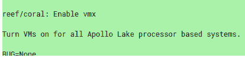

# 来自宏碁、华硕、联想和戴尔的 18 款 Chromebooks 获得 Linux 应用程序支持

> 原文：<https://www.xda-developers.com/apollo-lake-chromebooks-acer-asus-lenovo-dell-linux-app/>

# 来自宏碁、华硕、联想和戴尔的 18 款 Chromebooks 获得 Linux 应用程序支持

来自宏碁、华硕、联想和戴尔等品牌的所有基于英特尔 Apollo Lake 的 Chromebooks 将很快在 Chrome OS canary 频道支持 Linux 应用。

基于英特尔 Apollo Lake 架构的 18 款 Chromebooks(其中包括许多来自宏碁、华硕、联想和戴尔等品牌的产品)一举获得了 Linux 应用支持。

在周三早上登陆的一项改变中，开发人员在 baseboards Reef 和 Coral 下为所有阿波罗湖 Chromebooks 开启了 Linux 应用支持。下面是这些基板下的 Chromebooks 列表。

 <picture></picture> 

All Reef and Coral boards get Linux app support, that's a lot of Chromebooks!

据我们所知，Reef 和 Coral 旗下有 18 款 Chromebooks，来自宏碁、华硕、联想和戴尔等品牌，但可能有更多来自其他 OEM 厂商的 Chromebooks 没有出现在此列表中:

| 

设备原产商

 | 

模型

 | 

代号

 | 

踢脚板

 |
| --- | --- | --- | --- |
| 联想（电脑的品牌名） | 联想 Thinkpad 11e Chromebook /联想 Thinkpad Yoga 11e Chromebook | 放火狂者 | 矿脉 |
| 联想（电脑的品牌名） | 联想 500e Chromebook | Robo360 | 珊瑚 |
| 联想（电脑的品牌名） | 联想 100e Chromebook | 机器人 | 珊瑚 |
| 宏基电脑公司 | 宏碁 Chromebook Spin 11 R751T | 电镀物品 | 矿脉 |
| 宏基电脑公司 | 宏碁 Chromebook 15 CB515-1HT/1H | 沙 | 矿脉 |
| 宏基电脑公司 | 宏碁 Chromebook 11 (C732、C732T、C732L 和 C732LT) | 宇航员 | 珊瑚 |
| 宏基电脑公司 | 宏碁 Chromebook 11 (CB311-8H 和 CB311-8HT) | 圣诞老人(= Santa Claus) | 珊瑚 |
| 宏基电脑公司 | 宏碁 Chromebook Spin 11 (CP311-1H 和 CP311-1HN) | 火山岩 | 珊瑚 |
| 华硕 | 华硕 Chromebook Flip C213SA | 矿脉 | 矿脉 |
| （里面或周围有树的）小山谷 | 戴尔 Chromebook 11 5190 | 汉瑟 | 珊瑚 |
| （里面或周围有树的）小山谷 | 戴尔 Chromebook 11 二合一 5190 | Nasher360 | 珊瑚 |

Apollo Lake 是专注于高效、低功耗外形的新一代英特尔移动芯片。它们不如 Pixelbook 和 HP Chromebook X2 中的 Kaby Lake 芯片强大，但应该可以轻松处理基本的 Linux 应用程序。

由于这一变化刚刚落地，Canary 和开发者渠道将在未来几天和几周内首先看到这一点。稳定版或测试版用户将不得不等待 Chrome OS 版本 69。

许多 Reef 和 Coral boards 以教育为重点，因此值得注意的是，如果您有一台受管理或注册的设备，对 Linux 应用程序的访问由管理员切换。