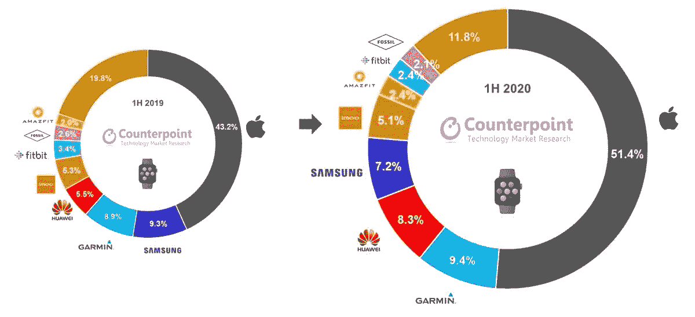
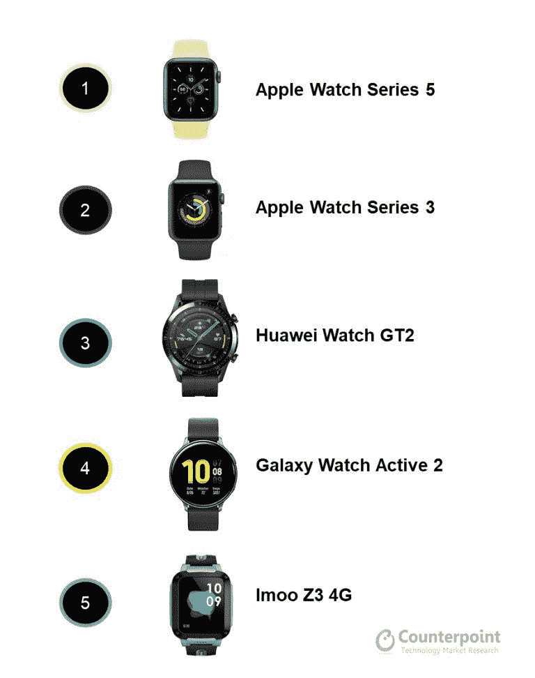

# 苹果、Garmin 和华为将在 2020 年继续占据智能手表市场的首位

> 原文：<https://www.xda-developers.com/apple-garmin-huawei-smartwatch-market-2020/>

尽管新冠肺炎事件导致全球经济下滑，但过去几个月，智能手表的销售收入却出现了健康增长。根据市场研究公司[*Counterpoint Research*](https://www.counterpointresearch.com/global-smartwatch-market-revenue-h1-2020/)的数据，2020 年前六个月，苹果、Garmin 和华为可穿戴设备占智能手表市场总收入的近 70%。Apple Watch 继续占据主导地位，占总市场份额的 50%以上，高于 2019 年 H1 的 43%。 *Counterpoint Research* 高级分析师 Sujeong Lim 表示:“2020 年上半年，智能手表出货量接近 4200 万只，随着消费者越来越注重健康，可穿戴设备的需求持续增长。”。

 <picture></picture> 

Global Smartwatch Shipment Revenue Share % in H1 2020 vs H1 2019\. Source: [Counterpoint Research](https://www.counterpointresearch.com/global-smartwatch-market-revenue-h1-2020/)

随着全球各地的人们被迫隔离，许多消费者开始优先考虑照顾自己的健康，因此他们没有购买新的智能手机，而是选择了可穿戴设备。智能手表在印度(同比增长 57%)、欧洲(同比增长 9%)和美国(同比增长 5%)的出货量增长， *Counterpoint Research* 表示，这抵消了其他市场的下滑。

在中国和其他亚洲市场，[华为的手表 GT2](https://www.xda-developers.com/huawei-watch-gt-2-kirin-a1-chip-india/) 系列是一个受欢迎的选择，这家中国公司的智能手表在中国和亚洲的出货量同比增长 90%,全球增长 57%。这一增长推动华为在 2020 年 H1 全球智能手表出货量收入方面排名第二。与此同时，Garmin 的 Forerunner 和菲尼克斯系列在欧洲和北美广受欢迎，Forerunner 和菲尼克斯系列的总体需求同比增长 31%。诚然，Garmin 和华为在 H1 2020 年仅获得了全球智能手表出货量收入的 17.7%，远低于苹果的 51.4%，但考虑到目前的情况，这两家公司仍然取得了不错的回报。

Amazfit、小米、Fitbit、Mobvoi 和 Suunto 也在 *Counterpoint Research* 的数据中被提及，但与去年由 Apple Watch Series 5 引领的苹果智能手表业务相比，它们的市场份额微不足道。尽管如此，Amazfit 和小米都发布了可观的增长数据(同比分别增长 51%和 47%)，而且仍有增长空间，特别是在即将到来的假日购物季。此前智能手表领域排名第二的三星在 2020 年 H1 奥运会上有些挣扎，但[新款 Galaxy Watch 3](https://www.xda-developers.com/samsung-galaxy-watch-3/) 可能会在 2020 年 H2 奥运会上扭转这家韩国公司的潮流。

 <picture></picture> 

Global Smartwatch Best-Selling Models by Shipment Volumes, H1 2020\. Source: [Counterpoint Research](https://www.counterpointresearch.com/global-smartwatch-market-revenue-h1-2020/)

市场上最畅销的智能手表中的一些常见健康功能包括心率监测器和跌倒检测。方形外形显然比其他设计卖得更好，这可能是因为方形设计允许制造商挤进更多的传感器和电池电源。支持 LTE 的智能手表也越来越受欢迎，超过四分之一的智能手表在 2020 年 H1 出货，配备了蜂窝调制解调器。这种转变有利于高通，该公司最近在今年早些时候宣布了其[骁龙 Wear 4100](https://www.xda-developers.com/qualcomm-snapdragon-4100-announcement-wear-os-smartwatches/) 可穿戴平台。

随着智能手表类别越来越受欢迎，未来需要关注的一件事是谷歌的硬件部门将如何进入市场。虽然该公司开发了基于 Android 的 Wear OS 平台，占据了 2020 年 H1 智能手表市场的 10%，但它还没有销售自己的智能手表。然而，[谷歌推动收购 Fitbit](https://www.xda-developers.com/google-officially-acquires-fitbit/) 暗示，一旦监管障碍被清除，该公司非常打算重新关注可穿戴设备[。](https://www.xda-developers.com/eu-launch-investigation-google-fitbit-acquisition/)

*特色图片:华为 Watch GT 2*