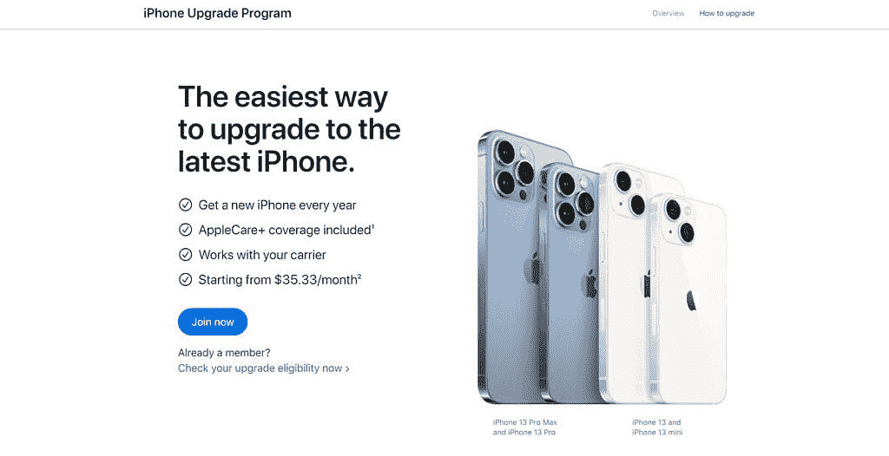

# 据报道，苹果正在为 iPhones 开发硬件订阅服务

> 原文：<https://www.xda-developers.com/apple-hardware-subscription-iphone-report/>

像许多其他科技公司一样，苹果在过去几年里加大了对订阅服务的关注。有 Apple Music 流媒体服务，用于电影和电视的 Apple TV+，用于游戏的 Apple Arcade，用于云存储的 iCloud+等等。现在看来，如果一份新的行业报告是准确的，该公司可能会跳入硬件订阅的世界。

彭博报道称，苹果正在为 iPhone 和其他硬件产品开发订阅服务，这可能会让 iPhone 变得更像是租赁，而不是支付购买费用。对于每年都想升级的人来说，这可能是一个很好的选择，但目前还没有定价或可能限制的细节。

值得注意的是，苹果已经有了类似于硬件订阅服务的东西:iPhone 升级计划。根据现有的计划，买家在 12 个月的付款期内付清一部 iPhone，然后可以以同样的速度升级到一部新的 iPhone。iPhone 升级计划最便宜的选项是 128GB 的 iPhone 13 Mini 每月 35.33 美元，1TB 的 iPhone 13 Pro Max 高达 74.91 美元。

 <picture></picture> 

Apple's existing iPhone Upgrade Program

苹果也不是唯一一家尝试硬件产品订阅的公司。微软有 [Xbox All Access](https://www.xbox.com/en-US/xbox-all-access) ，给买家一台 Xbox Series X 或 Series X 主机，以及 24 个月的 Xbox Game Pass Ultimate。Xbox S 系列的订购起价为 24.99 美元/月，Xbox x 系列的订购起价为 34.99 美元。

目前还不清楚苹果可能计划何时公布订阅，但该公司今年可能已经有很多计划了。苹果刚刚发布了带 5G、M1 iPad Air、Mac Studio 和 Studio Display 的新 iPhone SE，iPhone 14 系列可能将在几个月后推出。还有传言称，MacBook Air 和 13 英寸 MacBook Pro refresh 可能会使用首批 M2 芯片，而 T2 的 15 英寸 MacBook Air 也可能会在某个时候出现。

**来源:** [彭博](https://www.bloomberg.com/news/articles/2022-03-24/apple-aapl-is-working-on-a-hardware-subscription-service-for-iphones?sref=9hGJlFio)