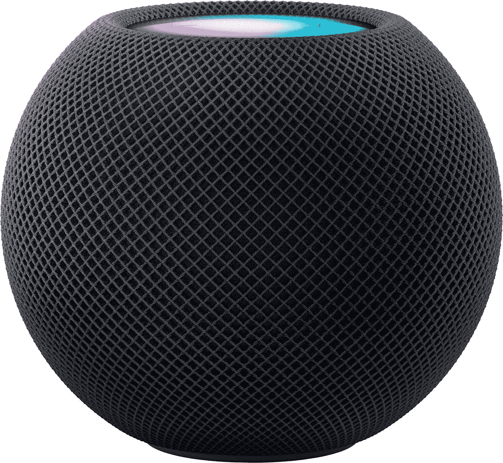

# 您可以在 Apple HomePod Mini 上使用的所有音乐服务

> 原文：<https://www.xda-developers.com/apple-homepod-mini-music-services/>

HomePod Mini 采用了一种与当今其他[最佳智能音箱](https://www.xda-developers.com/best-smart-speakers/)不同的方法。就像亚马逊和谷歌一样，苹果也有一个生态系统，但 Siri 作为人工智能语音助手平台的内容要少得多。你可以用 HomePod Mini 来控制你的智能家居，但你不能用亚马逊或谷歌的扬声器来控制。但是一个共同的特点是你可以使用不同的音乐服务。

HomePod Mini 的优势在于它是一款音乐设备。尽管它的尺寸很小，但它的音质却非常出色。它也很实惠，对于大多数苹果产品来说是罕见的，如果你想要的只是一个免提音乐系统，它就有很大的价值。

对于音乐，你需要一个曲调的来源，在 HomePod 迷你这里你可以使用。

## HomePod Mini 支持哪些音乐服务？

尽管与苹果自己的内容生态系统有明显的联系，但 HomePod Mini 仍然可以用来通过基于广播的服务听一些音乐，而无需付费订阅。同样，HomePod 原本是苹果的专属设备，但现在你可以听第三方音乐来源。

### 苹果音乐和苹果播客

大多数人对 HomePod Mini 感兴趣的主要原因是它集成了苹果音乐。Apple Music 不是免费的，但是它有一个月的免费试用期,可用于不同的计划。如果你以前没有订阅，你拿起一个 HomePod 迷你你也可以抓住六个月的免费使用该服务。

除了传统的个人和家庭计划，还有学生和语音接入的选择。前者是个人计划的克隆，但对能够证明其教育状况的学生打折。语音套餐的价格是个人套餐的一半，但你只能通过 Siri 使用它。所以，如果你想要的只是在家里用你的 HomePod 迷你听音乐，这可能是个不错的选择。

苹果播客也被整合到 HomePod 迷你中，并将成为默认服务，就像苹果音乐一样。你只需让 Siri 播放你喜欢的播客，就可以听了。

### 潘多拉

美国的 Pandora 用户(目前该服务的唯一市场)可以将他们的免费、plus 或 premium 帐户与 HomePod Mini 相连，在家中享受免提声控音乐。

这包括播客和特定层级的额外津贴，比如无限跳过 plus 和 premium 订阅。要将 Pandora 与 HomePod Mini 连接起来，你还需要在你的 [iPhone](https://www.xda-developers.com/apple-iphone-se-3-review/) 或 [iPad](https://www.xda-developers.com/apple-ipad-mini-6-review/) 上安装 Pandora 应用。

### Deezer

Deezer 的 7300 万首歌曲库只供付费用户在 HomePod Mini 上使用。与其他一些智能扬声器不同，HomePod 迷你还支持 Deezer HiFi 的 FLAC 高保真音频。

[HomePod Mini 上的 Deezer](https://support.deezer.com/hc/en-gb/articles/360019279917-Using-Deezer-with-your-Apple-HomePod)目前仅支持音乐，播客、有声读物和实况广播不能通过 Siri 播放。此外，要在 HomePod Mini 上设置 Deezer，您需要在 iPhone 或 iPad 上安装该应用程序的最新版本。

### 调谐收音机

TuneIn Radio 的基本服务是你可以用 HomePod 迷你听音乐的免费服务之一。更好的是，它被嵌入到设备中，所以你不需要下载或设置任何东西。

要收听您最喜爱的广播电台，只需说“嘿 Siri，播放...”你会得到一个由 TuneIn 提供的流。这对北美以外的人特别有用。

### 伊海尔特拉迪奥

就像 TuneIn 一样，iHeartRadio 可以在 HomePod Mini 上免费使用，以收听广播电台，前提是你所在的市场受到支持。你也不用担心设置的问题。

只需让 Siri 播放你最喜欢的 iHeartRadio 电台，你就可以开始了。这仅适用于 iHeartRadio 支持的市场，例如，在欧洲，您将通过 TuneIn Radio 获得指导。

### 其他音乐服务:Spotify、YouTube 音乐、亚马逊等等

苹果已经通过 Siri 在 HomePod Mini 上开放了对第三方音乐服务的支持。但不管出于什么原因，接受度一直很低。游戏中一些最大的玩家，特别是 Spotify，在 HomePod Mini 上不支持语音访问。

然而，由于与苹果其他硬件的紧密集成，你可以很容易地播放任何不支持服务的音乐。问题在于，你必须从 iPhone、iPad 或 Mac 上启动播放。

这方面的好消息是，苹果让这变得非常容易。您可以使用 AirPlay 手动将音频共享到 HomePod Mini，或者将您的设备放在扬声器顶部。这样，Handoff 将自动在设备之间传输数据。你可以通过发出相关命令来使用 Siri 与音乐进行交互，例如“嘿 Siri，下一首曲目”。

* * *

如果你没有 iOS 设备或 Mac 电脑，你根本不会想要 HomePod 迷你。首先，你需要一台 iOS 设备来设置 HomePod 迷你。HomePod 迷你支持蓝牙，但不支持音频，所以你不能用它作为任何设备的音乐目标。

如果你在苹果生态系统中，HomePod 迷你是一个非常好的智能扬声器。即使你没有订阅苹果音乐，你也有选择。其他人拥有亚马逊 Echo 或谷歌 Nest Audio 会更好。

 <picture></picture> 

Apple HomePod Mini

##### 苹果 HomePod 迷你

对于那些投资于苹果生态系统的人来说，苹果唯一的扬声器仍然是一个很好的选择，它的声音很棒，可以与你的其他设备无缝使用。