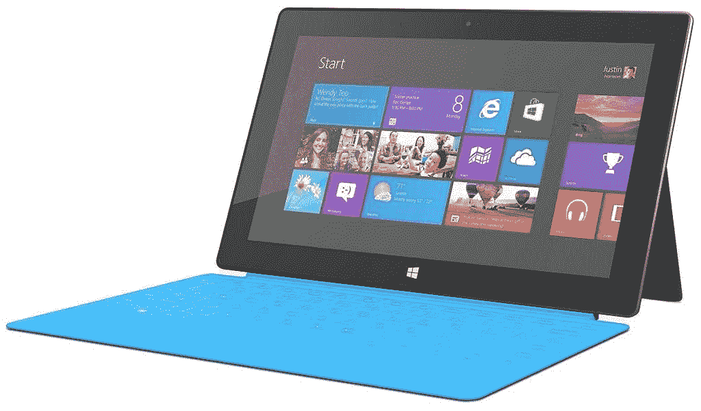
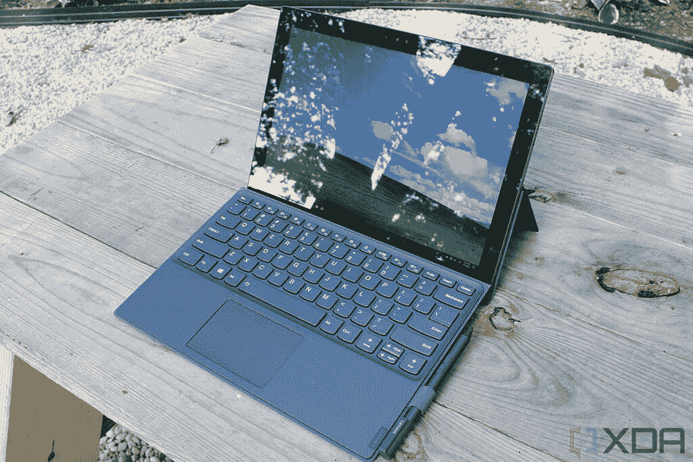
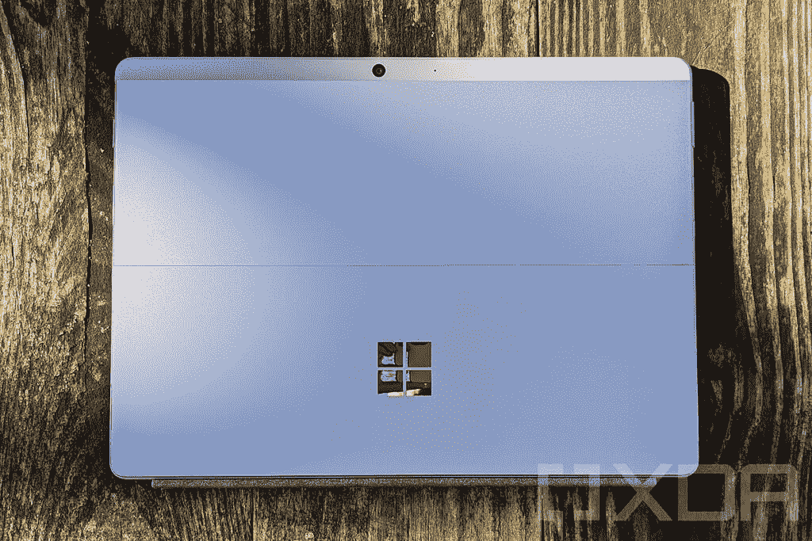
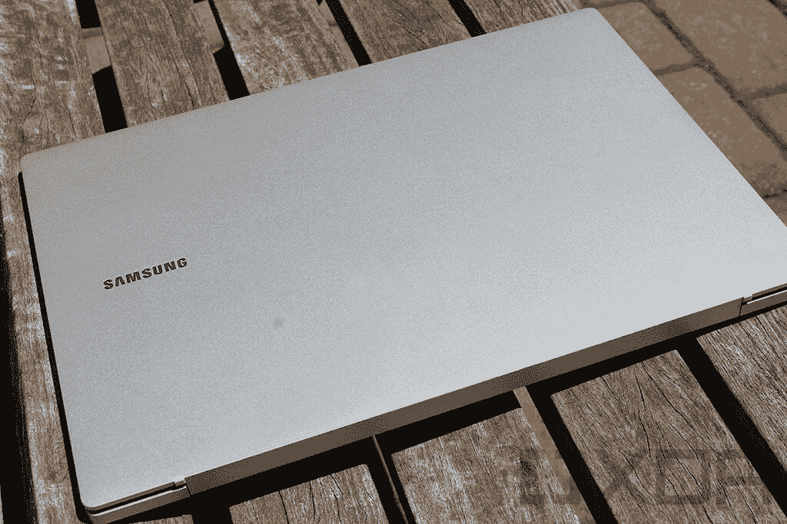
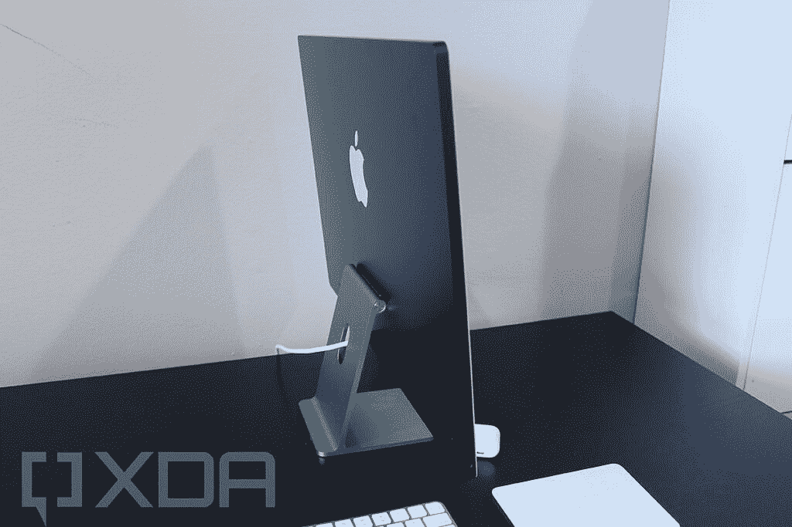
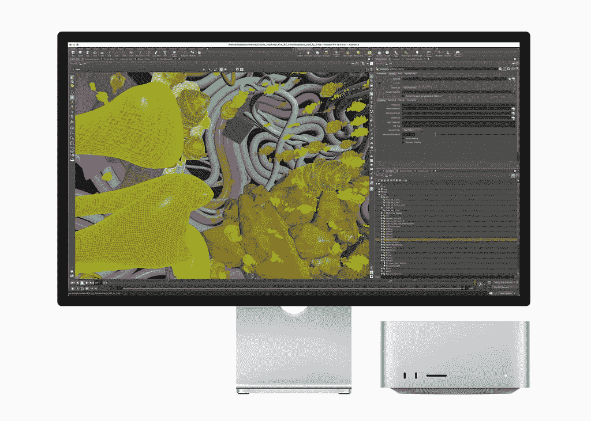

# 苹果真的让 Arm 上的高通和 Windows 相形见绌

> 原文：<https://www.xda-developers.com/apple-making-qualcomm-windows-on-arm-look-bad/>

我是 Arm 上的 Windows 粉丝。事实上，我是 Windows 的粉丝。我职业生涯的大部分时间都在撰写关于 Windows、微软、笔记本电脑和整个生态系统的文章。当高通和微软在 2016 年宣布采用实际 x86 仿真的 Arm 上的 Windows 时，我很兴奋。我并不是因为 Arm 处理器承诺的好处而兴奋。

这是我书呆子的一面，是对它极客了。这是基于新处理器架构的 Windows，在某种程度上可能真的有效！虽然早期的 Windows 不缺乏它支持的 CPU 架构，但当 Windows 10 推出时，它只是 AMD64 或 x64。

高通承诺的东西，如惊人的电池寿命，集成的蜂窝连接，和即时唤醒。起初只有几个合作伙伴，但随着时间的推移，除了戴尔，几乎所有人都加入了。

然后，苹果加入了这个群体。该公司宣布，它将在 2020 年 6 月将其 Mac 产品线过渡到苹果芯片，这比本文撰写前不到两年。从那以后，它在个人电脑领域取得了一些突破，这些突破仍然是 Windows 无法比拟的。鉴于高通在这一领域已经试错了五年多，苹果真的让 Arm 上的 Windows 看起来很糟糕。

## Arm 上的 Windows 简史

Windows 已经在 Arm 处理器上运行了很长时间，至少以某种形式运行。显然，Windows Phone 运行在 Arm 芯片上，这为我们今天看到的许多东西铺平了道路。Windows Phone 7 运行在带有 Silverlight 应用程序的 Windows CE 内核上，而这一切都被使用 Windows NT 内核的 Windows Phone 8 所取代。没有一款 Windows Phone 7 设备升级到 Windows Phone 8，尽管几个月前发布了诺基亚 Lumia 900 等旗舰产品。

与 Windows Phone 8 一起出现的还有 Windows RT(以及 Windows 8)，这是第一次尝试让 Windows 在 Arm 处理器上正常运行。当时，大合作伙伴是 NVIDIA 及其 Tegra 处理器，这些处理器见于 Surface RT 和 Surface 2。不过，诺基亚的 Lumia 2520 搭载了 Snapdragon 800。

 <picture></picture> 

Surface RT

Windows RT 是一个可怕的失败。尽管看起来与 Windows 8 相同，但它只能运行来自 Windows 商店的应用程序，这让从网上下载应用程序的客户感到困惑，这些应用程序声称可以在 Windows 7 或更高版本上运行。更糟糕的是，由于其彻底重新设计的用户界面，Windows 8 甚至是历史上最差的 Windows 版本之一。微软最终在 Surface RT 平板电脑上遭受了 9 亿美元的打击，根本卖不出去，或者不得不大幅打折。尽管如此，Surface 2 还是发布了。

2015 年宣布 Windows 10 时，确认 Windows RT 设备不会接收。这些用户反而得到了 Windows RT 8.1 Update 3，它提供了开始菜单的返回，并没有太多其他功能；当然不是 Windows 10 内核或者通用的 Windows 平台。

在 2016 年 12 月的骁龙技术峰会上，高通和微软宣布了他们在 Arm 处理器上的 Windows 最新尝试。关键的区别是 x86 仿真。理想情况下，用户甚至不会知道 Windows 10 的 ARM64 和 AMD64 版本之间的区别。显然，x86 仿真意味着没有 64 位仿真，这是微软当时表示不会做的事情。大多数应用程序都有 32 位版本，人们希望应用程序开发人员无论如何都会将他们的应用程序转换为原生运行。

 <picture></picture> 

Lenovo Miix 630

一年后的 2017 年 12 月，骁龙峰会移师夏威夷的毛伊岛。这是第一批两台 ARM64 电脑向记者展示的时候。它们是华硕 NovaGo 和惠普 Envy x2，而联想随后推出了 Miix 630。他们使用 Snapdragon 835 芯片组，这是同名移动处理器的轻微修改版本。

骁龙 850 发布的时间稍晚一些，它是基于骁龙 845 芯片组的。同样，只有少数笔记本电脑和平板电脑使用它，如三星的 Galaxy Book 2(不要与刚刚发布的三星 Galaxy Book 2 混淆)，联想 Yoga C630 和中国独家的华为 MateBook E。其他一些人后来也加入了这一行列。

但在高通宣布其首款完全为个人电脑打造的芯片组骁龙 8cx 之后，其他公司也加入了进来。它于 2018 年在骁龙峰会上推出。“c”代表计算,“x”代表极限。使用这种技术的设备包括联想 Flex 5G、三星 Galaxy Book S 和微软 Surface Pro X(芯片组略有修改，更名为微软 SQ1)。

不幸的是，骁龙 8cx 过了一段时间才发货。在 2019 年的骁龙峰会上，高通推出了骁龙 8c 和 7c，而普通的骁龙 8cx 设备仍未发货。为了缩短发货时间，骁龙 8cx Gen 2 几乎没有任何改动。

去年 12 月，高通发布了骁龙 8cx Gen 3，对芯片进行了适当的更新。它有望大幅提升性能，但仍赶不上苹果的 M1。这将在今年下半年开始播种给原始设备制造商，这要归功于该公司对 Nuvia 的收购，这将使其有能力制造定制的 Arm 芯片。

去年发生的另一件大事是 [Windows 11](https://www.xda-developers.com/windows-11/) 发布，为 Arm 带来了 64 位应用模拟。我们稍后会详细讨论这一点。

## 高通没有兑现承诺

高通对 Arm 上的 Windows 做出了三个主要承诺。首先是出色的电池寿命。Arm 芯片使用大。小型架构，强大的内核用于需要它的任务，高效内核用于其他一切。这不仅能延长电池寿命，还能让电脑立即唤醒，就像你的手机一样。

第三个承诺是集成蜂窝连接。高通的芯片组集成了蜂窝调制解调器，因此 5G(当时的 4G LTE)首次成为产品的标准，而不是像英特尔笔记本电脑那样昂贵的溢价。

最突出的问题是，我们承诺的电池寿命并没有在现实世界中显示出来。当然，随着新的处理器架构更加高效，许多笔记本电脑都采用了更纤薄的设计，这意味着它们的电池更小。然而，这不是我们可以像承诺的那样把充电器留在家里的情况。

 <picture></picture> 

Microsoft Surface Pro X

我亲自审查了几乎所有生产的 Windows on Arm 笔记本电脑，从每一代处理器，我可以告诉你这一点:除了联想 Flex 5G，我从未将电池续航时间作为该设备的一个优点。Surface Pro X 的电池续航时间与采用英特尔技术的同类产品没有区别。

集成蜂窝连接也没有兑现承诺。几乎今天出货的每台 Windows on Arm 笔记本电脑都有一个仅支持 Wi-Fi 的基本型号，所以即使在 2022 年，你仍然需要通过热点定位手机来在旅途中连接互联网。

问题是，这种体验基本上没什么意思。设备的价格比你预期的要高得多，尤其是在 Snapdragon 835 和骁龙 850 的早期。同样在早期，性能并不存在。很容易将 Snapdragon 835 视为一个起点，但现在我们已经经历了五年，我认为我们期望它会更好。

 <picture></picture> 

Samsung Galaxy Book Go

我不想在这里抨击高通，因为我喜欢 Arm 笔记本电脑上的 Windows。三星 Galaxy Book Go 的入门级价格，重量只有 3 磅。这在那个价位是闻所未闻的，而且是用 Arm 处理器解锁的东西。联想 Flex 5G 是第一款使用 Sub6 和 mmWave 的 5G 笔记本电脑，事实上，每台支持这两种技术的笔记本电脑都有 Arm 处理器。说起高通胜，就连市场上基于英特尔技术的 5G 笔记本电脑几乎都配有高通调制解调器。

三星 Galaxy Book S 也相当狂野。它的无风扇设计非常轻薄，我认为这是一种只有 Arm 处理器才能实现的外形。它确实在某一点上搭载了英特尔 Lakefield 芯片，但这并不好；莱克菲尔德是英特尔首次尝试混合芯片。

## 苹果现在是提供新体验的公司

苹果将其整个 Mac 产品线从英特尔转移出去是一件大事。在撰写本文时，该公司仍在销售的只有两款英特尔 Mac 电脑:Mac Pro 和 Mac Mini 的某些配置。

Cupertino 公司提供了一种体验，这种体验是微软在苹果硅苹果电脑上市之前无法提供的。它可以无缝运行所有为基于英特尔的电脑设计的应用程序。事实上，MAC 甚至不支持任何类型的 32 位应用程序，所以苹果建立的只是 64 位仿真。旁注:你可能还记得，在 M1 处理器在产品中发布之前，苹果有一个使用 iPad Pro 最新芯片组的开发工具包，所以像这样的新功能就是在那时发布的。

苹果的解决方案叫做 Rosetta 2。当你第一次安装 x64 应用程序时，系统会提示你安装 Rosetta 2，你再也不用考虑这个问题了。您也不会注意到任何性能问题。

苹果在这方面抢先了微软一步。微软在 2020 年 9 月宣布在 Arm 上为 Windows 提供 64 位仿真，比苹果晚了三个月。正如我之前提到的，2016 年的官方说法是，Arm 上的 Windows 将*永远不会*拥有 x64 仿真。我可以告诉你，正如我当时报告的那样，这种情况在 2019 年底发生了变化。换句话说，这早在苹果宣布之前就在酝酿中了，但苹果抢先了一步。

然后，苹果发布了一款产品。我对 M1 最初的三款产品并不太感兴趣，它们是 MacBook Air、13 英寸 MacBook Pro 和 Mac Mini。它只支持一个外部显示器，这对于带有“Pro”字样的东西来说是不可接受的。此外，性能很好，电池寿命也很长，但它并没有以任何方式吹走英特尔提供的东西。

 <picture></picture> 

24-inch iMac

当新的外形开始出货时，事情变得有趣起来。苹果发布了采用 M1 芯片的 24 英寸 iMac。它不仅薄得不自然，而且该公司在从 11 英寸 iPad Pro 到 24 英寸台式电脑的设备中使用了相同的处理器。这是第一次值得指出高通和微软没有像苹果那样做。高通的目标不是一体机，甚至不是最佳性能。它的目标始终是超轻薄、优质的体验。

 <picture></picture> 

16-inch MacBook Pro

接着是 MacBook Pro 和 M1 Pro 和 M1 Max 芯片组的推出。作为一个 Windows 爱好者，这些东西如此之好让我感到不安是理所当然的。再说一次，这真的不是性能的问题。但其性能与配备专用显卡的英特尔电脑不相上下，电池续航时间也很惊人。如果我带着有这种能力的笔记本电脑上路，我肯定会带一个充电器。有了 MacBook Pro 我就不用了；在这一点上，还值得记住的是，这是高通的一个重大承诺。

不仅如此，它还允许苹果第一次在 14 英寸和 16 英寸的机型中安装相同的内部部件。此前，13 英寸的 MacBook Pro 使用了集成显卡的 U 系列芯片，而 16 英寸的型号则获得了 45W 处理器和专用显卡，因为它有空间来做这件事。

再说一次，这不是高通目前的目标。几年前，我问它是否有任何超越与英特尔 U 系列竞争的扩张计划，我被直截了当地告知没有。这当然可以改变，因为苹果正在这么做。但这只是苹果引领 Arm 计算领域潮流的又一个例子。

 <picture></picture> 

Apple Studio display and Mac Studio

如果这还不够，苹果刚刚推出了 Mac Studio 及其新的 [M1 超](https://www.xda-developers.com/apple-m1-ultra/)芯片组。使用一种叫做 UltraFusion 的过程，它基本上将两个 M1 Max 芯片组粘在一起，这是你在设计芯片时可以做到的。苹果公司将 M1 超高性能与配备 NVIDIA GeForce RTX 3090 GPU 的高端英特尔 PC 进行了比较。

当然，Mac Studio 与这种基于英特尔技术的电脑的最大区别在于，Mac Studio 只有 3.7 英寸高，占地面积为 7.7x7.7 英寸。仅供参考，你甚至找不到长度小于 12 英寸的 RTX 3090，更不用说拥有使用它所需热量的计算机了。

再说一遍，这真的不是性能本身的问题。这是关于如何在不影响英特尔实现这一目标的前提下实现这一性能。这就是苹果硅如此有趣的原因。

## 高通需要加快步伐，它很可能会这样做

首先，我非常期待第一台使用高通骁龙 8cx Gen 3 的设备[联想 ThinkPad X13s](https://www.xda-developers.com/lenovo-thinkpad-x13s/) 。我在骁龙峰会上用了几天骁龙 8cx Gen 3 参考设计，它给我留下了深刻的印象。将它放入 ThinkPad 提供的那种制造质量的笔记本电脑中是令人兴奋的。

 <picture></picture> 

Snapdragon 8cx Reference Design

不过，这并没有为 Arm 计算设置标杆。苹果正在这么做，我认为在这一点上没有人可以否认。

不过，高通正在努力开发自己的定制硅片，这时候事情会变得非常有趣。由于收购了 Nuvia，它将在今年晚些时候向原始设备制造商提供样片。它需要迎头赶上，但这应该会给高通提供与苹果竞争所需的工具。

随着其他芯片供应商进入 Arm 领域的 Windows，这也将是令人兴奋的，正如联发科技计划在微软和高通之间的独家协议到期后所做的那样。我们也可能会看到其他供应商。

但不管它是如何做到的，高通需要在这里加快步伐。2016 年，它准备在一个由英特尔和 AMD 主导和构建的市场上分一杯羹。它有能力成为第三个芯片制造商，一步一个台阶地往上爬。但是现在，苹果公司展示了 Arm 芯片在个人电脑中真正能做什么，并且凭借其领先优势，高通是应该这样做的人。