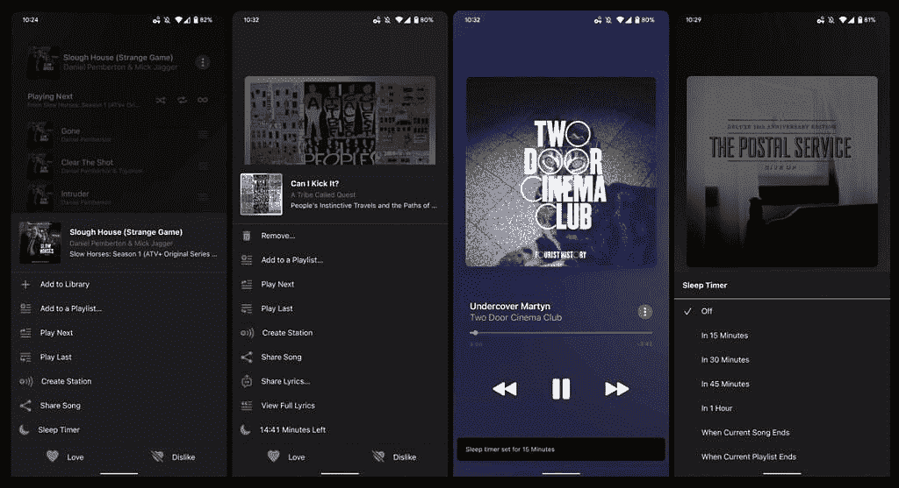

# 苹果音乐 3.10 测试版引入了睡眠定时器

> 原文：<https://www.xda-developers.com/apple-music-beta-android-sleep-timer/>

大公司并不总是有意义的。例如，谷歌经常在把新功能引入安卓系统之前，先在它的 iOS 应用上引入新功能。同样，有时苹果会在将安卓产品植入 iOS 之前对其进行修改。最新的案例围绕着库比蒂诺科技巨头的音乐流媒体服务。Android 上的 Apple Music 3.10 测试版引入了睡眠定时器——该公司自己的操作系统(在某种程度上)仍然没有这一功能。

 <picture></picture> 

Credit: *9to5Google*

根据谷歌的一份报告，苹果音乐 3.10 测试版为安卓带来了一个睡眠计时器。如您所料，该功能允许用户在指定的时间间隔后自动停止音乐播放。这些选项目前包括 15 分钟、30 分钟、45 分钟、1 小时以及当前歌曲、专辑或播放列表结束的时间。您可以通过“正在播放”屏幕上的三点菜单访问新计时器。

[iOS 15](https://www.xda-developers.com/ios-15) 上的 Apple Music 还是缺少睡眠定时器。但是，用户可以通过更长的过程自动停止播放。通过进入时钟应用程序的定时器部分，你可以选择停止播放选项——这将在定时器结束后中断你的 [iPhone](https://www.xda-developers.com/best-iphone/) 上的任何音频播放。暂时还不清楚苹果是否会将睡眠定时器直接烘焙到 iOS 音乐应用中。毕竟，iOS 上仍然没有 crossfade 尽管它在 Android 上可用。

根据 APK 的文件销毁，还提到了当当前节目或剧集结束时停止播放。然而，这个选项现在在应用程序中似乎是不可访问的。很难说它指的是什么——因为即使在收听苹果电台时，这个选项也不会出现。该公司可能会在 Android 平台上为苹果音乐应用带来播客支持。这不会让我们感到惊讶，因为该公司现在提供付费播客订阅。因此，它可以通过向 Android 用户开放来获得更多收入。

*您最常用哪种音乐流媒体服务，为什么？请在下面的评论区告诉我们。*

* * *

**Via:**[9 to 5 Google](https://9to5google.com/2022/05/03/apple-music-sleep-timer/)