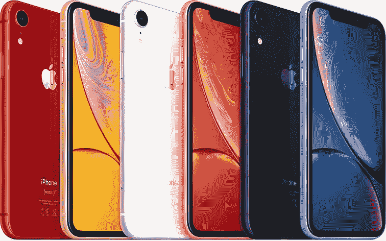

# 苹果的新阵容和 iPhone XR 将如何影响 Android 趋势

> 原文：<https://www.xda-developers.com/apple-new-iphone-xr-influence-android-trends/>

苹果的年度活动是安卓纯粹主义者反思的时间和原因。这是一年一度的一天——除非你把苹果的平板电脑活动计算在内——安卓一直无法与之抗衡。在这一天，苹果可能会失去最多，但也有最多多余的东西，向世界展示他们认为公众*在未来一年*想要什么。这些年来，这一点取得了巨大的成功，iPhone 不仅是世界上最畅销的手机型号，而且无可争议地建立了一个价值数十亿美元的应用商店生态系统，并帮助人们以全新的方式完成工作。“给予的手，拿走的手”也是一个准确的说法，男孩已经把 iPhone 拿走了。失去的不动产和全屏满足感，发誓反对三星及其被认为可怕的人不得不哀悼的 3.5 毫米耳机插孔，以及市场其他人喜欢效仿的“一切专有解决方案”模式。iPhone XS、iPhone XS Max 和 iPhone XR 是其设备系列中的最新产品，一如既往，它们将极大地影响 Android 智能手机在 2019 年及以后的发展轨迹——无论我们喜欢与否。

如果你还没跟上，这里是要点。iPhone XS 和 iPhone XS Max 实际上与去年的 iPhone X 是一样的手机。首先，他们将处理器升级到另一个令人恐惧的 Android 版本，A12 Bionic，带有第二代神经处理引擎。他们转向 IP68 认证，借用了谷歌 Pixel 相机，并在此过程中清理了一些东西。他们还保留了去年 iPhone X 及其直接替代品 iPhone XS 的价格，起价为 999 美元，最大版为 1099 美元。iPhone XR 可以说是最令人兴奋的公告:它的起价为 749 美元，包括了 iPhone XS 机型的大部分功能，但放弃了有机发光二极管，采用了略高于 720p 的液晶显示屏，取消了第二个摄像头，但保留了散景模式(选择基于软件的图像分割)，失去了 3D 触摸功能，但获得了长按手势，并放弃了不锈钢表带，采用了彩色铝制表带。把这个想象成 iPhone 5C...*那也不完全烂*。以上是苹果这三款新手机的基本情况，它对 Android 的影响可能既令人担忧又令人兴奋。

* * *

## **生物认证:Face ID 与显示指纹扫描仪**

首先，我们需要谈谈安全性和认证。虽然 Android 正坚定地走向继续使用指纹传感器，但这些 iPhones 在没有任何指纹认证的情况下前行，包括圣杯博客作者多年来(错误地)预测的显示器传感器。就我个人而言，我不认为苹果会很快采用这种解决方案，因为 FaceID 在所有三种模式中都得到了改进和平等，相反，所有苹果产品使用该技术，完全消除其他形式的身份验证应该只需要短短几年时间。这是一条我赞同的道路。FaceID 确实有它的缺点，但不可否认的是它在处理过程中的效率和准确性——记住这是在“第一代”产品中。早期的指纹传感器要差得多，有着笨拙的刷卡阅读器，反应缓慢，并且仍然经常有一个无法让所有人满意的位置。FaceID 在 iPhone X 上没有这些问题，在我拥有这款设备的一年里，它并不比当前的指纹传感器更糟糕，当你的手指潮湿或手机躺着时，指纹传感器无法工作。它确实有自己的问题，比如太阳镜和帽子，但在许多方面，它优于三星的虹膜扫描仪——它仍然会让你以一个怪异的角度拿着手机。

显示指纹传感器仍处于早期阶段，但我迄今为止看到的看起来并没有比我们已经拥有的有任何大的改进，它只是不占用任何空间。相比之下，有着明显缺陷的 FaceID 在安卓停滞不前的地方前进，而在某些方面*在倒退*。不过这一切都可能会改变，因为我们看到 Android 派[在一定程度上支持更多形式的生物认证](https://www.xda-developers.com/android-p-new-biometrics-api/)来认证支付解决方案，一些[早期传言指出](https://www.xda-developers.com/google-pixel-3-xl-video-antutu/)Pixel 3 拥有某种 FaceID 系统，尽管我们不知道这是否会最终发生。

* * *

## **爬行价格**

与认证技术的发展相对应的是价格，如果你希望我们至少会在一段时间内保持 1000 美元的稳定水平，那你就错了。一些传言，甚至在发布前一周，指向苹果公司降低其 2018 年 iPhones 的价格，但似乎并非如此，Android OEMs 厂商十有八九会跟随这一趋势。在美国和其他一些国家，我们已经如此习惯于为我们的手机支付月租费，以至于这些公司正在拓展我们作为消费者在实践中会积极注意到的界限。基础价格提高 100 美元，每月只需 4.17 美元，或者大约一大杯调味咖啡，如果这些设备的销量像三星和苹果手机一样好，那么收入就会大幅增加。它还会进一步破坏市场结构的稳定，将大致相当的设备的上限提高，将目标向下移动，而不仅仅是在末端。这导致或至少导致了 OnePlus 6 等设备的成本远高于 OnePlus 1 或 OnePlus 3，并在没有创建全新旗舰层的情况下提升了中端市场。索尼和 LG 正在追随这一趋势，[新款 Xperia XZ3 比即将上市的——同样定价过高的——Xperia XZ2](https://www.xda-developers.com/sony-xperia-xz3-specs-renders-pricing-availability/)贵 100 ，LG V30 的价格仍为 899 美元，尽管 [LG V40](https://www.xda-developers.com/tag/lgv40/) 将于下月上市。像 Pocophone F1 [这样的手机旨在抵制这种趋势](https://www.xda-developers.com/xiaomi-pocophone-f1-launches-globally/)，但它会产生多大的影响还有待观察。如果你之前对手机价格的上涨趋势感到恶心，这可能不会很快好转，我们只能责怪苹果，但还有一线希望 iPhone XR。

| 

品牌:

 | 

名称:

 | 

价格:

 |  | 

品牌:

 | 

名称:

 | 

价格:

 |
| --- | --- | --- | --- | --- | --- | --- |
| **苹果** | iPhone 7-2016 年发布 | $649 |  | **三星** | galaxy Note 7-2016 年发布 | $770 |
| 苹果 | iPhone 8-2017 年发布 | $699 |  | **三星** | galaxy Note 8-2017 年发布 | $929 |
| **苹果** | iPhone XR-2018 年发布 | $749 |  | **三星** | galaxy Note 9-2018 年发布 | $999 |
| **一加** | 一加 3-2016 年发布 | $399 |  | **谷歌** | pixel XL-2016 年发布 | $769 |
| **一加** | 一加 5-2017 年发布 | $479 |  | 谷歌 | pixel 2 XL-2017 年发布 | $849 |
| **一加** | 一加 6-2018 年发布 | $529 |  | **谷歌** | Pixel 3 XL -发布 2018 | $?？？ |

* * *

## iPhone XR:人民的 iPhone...*有点像*

在过去一周宣布的所有事情中，我觉得 iPhone XR 是苹果最重要的，这可能是为什么它被留到了最后，而没有与它的老大哥们一起提到共享组件。iPhone XR 对该行业的其他发展也有着大规模的影响。在解释为什么我觉得这是一个如此重要的设备之前，让我们先把大象从房间里拿出来:749 美元并不便宜，你是对的。虽然有些人可能会声称 iPhone XR 是一款廉价手机，但它不是——这一桂冠属于最近去世的 iPhone SE，它是一部塞进 iPhone 5S 机身的 iPhone 6S。然而，iPhone XR 是*“预算”iPhone* ，Android OEMs 厂商需要关注这款设备，苹果做了什么，最重要的是，*苹果没有做什么*。简而言之，**iPhone XR 可能是未来几年智能手机中最重要的产品。原因如下:苹果给了消费者他们需要的东西，没有多余的东西(是的，我今天很弱小，但我不会放弃我的日常工作)。先说显示器。**

### **一如既往的显示能力**

关于 iPhone XR 的这款产品有很多抱怨，并不是说它的显示屏不是有机发光二极管的，而是说它“甚至不是 1080p 的”我甚至听到一个 YouTuber 用户说，你甚至不能在这部手机上观看 1080p 的视频，好像这是一个巨大的不利因素。这里有一些有趣的数据。iPhone 6、iPhone 7 和 iPhone 8 都有一个 326ppi 的 750x1334 16:9 4.7 英寸显示屏，iPhone XR 有一个 326ppi 的 828x1792 19:5:9 6.1 英寸显示屏。一些人认为这不一样，因为它的对角线长 6.1 英寸，但增加的分辨率完全符合现有 iPhone 的分辨率，这意味着你将获得与即将推出的型号相同的体验。事实上，可以说，因为它更大，你会把它放在离你的脸稍微远一点的地方，增加它实现或感知的 ppi，但是我跑题了。值得一提的是，高分辨率本身并不能使显示效果变好，而戊型有机发光二极管由于其子像素布局而导致了有效分辨率的损失。理论上，勉强超过 720p 的显示器意味着它不是一个好显示器，然而，它对大多数用户来说已经足够了，包括目前使用基本 iPhone 的任何人，并且不介意拥有更大的显示器。同样重要的是要注意，至少在苹果占有很大市场份额的美国，运营商已经让用户很难通过手机网络传输任何超过 720p 的视频，这进一步减少了“无法观看 1080p 视频”的损失

许多人也不会错过 3D Touch 的损失，因为这是一个被许多 iPhone 用户忽略的功能，他们增加了一个长按功能，以解决最常见的使用情况。3D Touch 是一个很好的东西，他们取消它当然很有趣，但不属于“必须拥有”的类别，特别是当成本节约是一个因素时。HDR 的缺乏令人失望——但这也仅仅是一个不错的额外奖励，但对消费者来说却没有太大的好处。这种显示器的另一个好处是苹果决定采用的视窗和缩放比例。从 iPhone 6 和 iPhone 6+开始，苹果改用两种秤，一种是 Plus 秤，一种是普通秤。Plus scale 包括水平桌面、横向键盘上的快捷键、双窗格横向应用程序等等。当 iPhone X 去年发布时，它缺少 Plus 缩放比例，而是普通类型。这意味着 iPhone X 没有额外的屏幕内容，我一直面临的一个问题是，它感觉用户界面太大了。iPhone XS Max 使用旧的 Plus 缩放，iPhone XR 也使用这种 Plus 缩放。这意味着 iPhone XS Max 和 iPhone XR 将显示相同的内容，本质上以略小的尺寸和价格给你带来额外的“感觉”。不利的一面是，一切都将在较低的分辨率，这可能会导致像素窥视者的文本细线丢失。这是 iPhone 用户一段时间以来一直想要的，也是 iPhone XR 的另一个额外好处。

### **iOS 上更便宜的头像**

这种给消费者提供他们所需要的东西的思路比显示屏更进一步，也是 iPhone XR 的精髓所在。例如，拿照相机来说。我认识的许多人拥有更大的 iPhone 的原因之一是相机的改进。最初是为了配合 iPhone 6 系列的光学防抖，后来演变为长焦镜头，最重要的是每个 InstaStar 都需要的模式:人像模式。传统上，失去第二个镜头意味着放弃人像模式，但现在不再是这样了。[和谷歌](https://www.xda-developers.com/google-portrait-mode-technology-open-source/)很像，苹果在它的新 iPhones 上做了很多计算欺骗，这意味着单镜头解决方案仍然可以实现出色的人像模式拍摄。失去第二个射手意味着你只失去了长焦，这是我和我妻子很少使用的东西。苹果知道，为了让 iPhone XR 取得成功，他们需要保持 iPhone XS 机型所吹捧的同样出色的相机性能，这正是他们希望通过相同的主射手实现的。

### **最新的硅**

我觉得足球是最能体现这一点的领域。我怀疑我不是一个人在这里，但我认为苹果会把完美的 A11 仿生 SoC 放在更便宜的 iPhone 中，而不是他们最新最棒的。苹果公司通过将全新的 A12 SoC 放入其中，逆势将旧 SoC 放入更便宜的设备中。从表面上看，这可能并不意味着什么，但当你看到它的更广泛的含义时，你会发现它实际上是一件大事。所有 2018 款 iPhone 都有相同的 SoC，所以与 iPhone SE 或 iPhone 5C 不同，[或竞争对手](https://www.xda-developers.com/lg-g7-one-lg-g7-fit-specifications-details/) LG G7 One，在价格*上的吝啬并不*意味着你会失去性能，或者更重要的是，失去长期支持。尽管价格相差 250 美元，但 iPhone XR 的支持年限将与价格高出一倍的高级机型相同。正如我前面提到的，您还可以从所有其他 SoC 增强功能中受益，包括照片处理、AR 功能和超越当前最伟大的 Android SoCs 的原始性能水平。Galaxy S10 中的[即将推出的三星 exy nos 9820](https://www.xda-developers.com/samsung-galaxy-s10-five-cameras-exynos-9820/)、Mate 20 上的[海思麒麟 980](https://www.xda-developers.com/hisilicon-kirin-980-honor-magic-2-huawei-mate-20-pro/) 和[高通骁龙 8150](https://www.xda-developers.com/qualcomm-snapdragon-855-dedicated-npu/) 将如何对比，还有待观察。

### **提高赔率&结束**

他们也没有完全放弃防水，保持了 iPhone 8 和 iPhone X 达到的相同水平:IP67。虽然 iPhone XS 型号跳到了 IP68，这很好，但 IP67 仍然可以保护你免受大多数事故，甚至一些轻微的扣篮，这正是消费者需要的。显示器仍然以 120Hz(不要与 120Hz 刷新率混淆)读取输入，这意味着输入延迟绝对最小。它仍然具有双扬声器，同样升级的 FaceID 系统和前置摄像头升级，Qi 无线充电支持，以及*超快* 64GB 的内部存储——它还可以以 50 美元的价格升级到 128GB，这是唯一允许这一步的型号。我也一直提到颜色，但 iPhone XR 的设计赋予了手机自己的身份。它有许多手机的小片段，从 iPhone 8 的简单背面，iPhone X 的正面，到 iPhone 5C 的颜色。苹果本可以在这款手机上做最少的事情，但我觉得他们尽力满足了普通消费者的需求，他们将是这款手机的主要购买者，而没有很多他们可能不想要的额外需求。

 <picture></picture> 

iPhone XR

* * *

## 苹果的范式转变，对安卓的深远影响

iPhone XR 不仅是发布的最重要的 iPhone，而且 **it** **也是 Android OEMs 厂商最能借鉴的手机**。更注重预算的旗舰*版本不需要在重要领域*上吝啬。相机不需要更换为劣质型号，SoC 仍然可以是顶级的，手机可以切断所有多余的部分，而不会严重影响用户体验。有时，我们作为专注于技术的消费者过于关注规格，1080p 显示屏与 720p 面板，单摄像头谷歌 Pixel 3 而不是双摄像头设置，好像这是某种缺点。iPhone XR 也令人兴奋，它没有那些无聊的颜色，有着超高级的不锈钢框架，它的兄弟姐妹都有。它有光泽，华而不实，有趣的颜色，只是看起来很棒，所有都在第一天可用。我看着你，[三星](https://www.xda-developers.com/samsung-galaxy-sunrise-gold-burgundy-red/)和[一加](https://www.xda-developers.com/oneplus-6-red-photos-review-video/)。

苹果 2018 年 iPhone 活动还有其他突出的事情。谷歌对相机的看法是正确的:计算摄影*是前进的方向*，苹果知道它在 2017 年被击败，似乎打算在今年解决这个问题。虽然我确信苹果与谷歌相比做了一些不同的事情，但零快门延迟(ZSL)和合并照片以创建曝光组合之间的一般思维和功能几乎是相同的。苹果引领智能手机摄影多年，直到[谷歌推出 HDR+](https://www.xda-developers.com/google-pixel-xl-xda-review-a-foundational-release-for-google-post-nexus-android/) 我们才看到转变。如果苹果结合了他们相机的所有优点和谷歌在 Pixel 上 95%的技术，我们将会有一个新的顶级射手，至少到 10 月 9 日。苹果在相机上还没有做的是推出手动模式，所以我怀疑谷歌也不会在 Pixel 3 上…来吧，苹果，把你的东西放在一起，我们真的希望在谷歌相机应用程序中实现这一点。可悲的是，让苹果增加一项功能似乎是在 Pixel 手机上获得新功能(或失去一些功能)的最佳方式。

3.5 毫米耳机插孔也不会在这些型号上回来，这并不奇怪，所以我们应该继续看到这种趋势的增长，LG 和三星是最后两个坚持使用该端口的公司，因为[一加 6T 将不会有一个](https://www.xda-developers.com/oneplus-6t-no-headphone-jack-type-c-bullets/)。苹果确实在反消费主义方面向前迈进了一步，去掉了 3.5 毫米的加密狗。虽然你可以花 9 美元买到它们，但买一部 1100 美元的手机还是很便宜的。此外，进一步说，这些手机仍然配备了多年来一直使用的 5W 充电器，尽管有快速充电能力，但盒子里没有快速充电功能，如果它们没有达到 20W 或更高，iPad 充电器是更好的替代品。苹果只是拒绝将它们与手机捆绑在一起，基本款 iPhone XS Max 的价格为 1100 美元，512GB 版本的价格不到 1500 美元，苹果克扣价值几美元的充电器是不可原谅的。

### *iPhone XR 不是廉价手机，它是更便宜的 iPhone。*

正如苹果每年所做的那样，它们为我们未来的预期设定了基调。全玻璃、全显示屏手机将继续流行，既然苹果正在将刚愎自用推向市场，我预计其他人会继续效仿。我当然希望更多的努力放在替代的 Android 身份验证方法上，因为显示器上的指纹传感器并不能引起我的兴趣。这与其说是向前迈出了一步，不如说是迈出了一步。人们还需要密切关注 iPhone XR，因为它可能是阻止价格上涨的一种方式，引入我们缺乏的标准旗舰产品的新层次，然后是超级旗舰产品，如 Galaxy Note9、iPhone XS 和 iPhone XS Max，以及其他约 1000 美元的手机。iPhone XR 不是*的*廉价手机，而是*更便宜的 iPhone* 。它让人们有机会获得最新的产品，而不必支付最高的价格，并且仍然拥有一种型号相对于另一种型号的所有主要功能改进。不过，这确实让谷歌在 Pixel 3 XL 上陷入了一个非常棘手的境地。假设价格没有上涨，我对此表示怀疑，Pixel 3 XL 和 iPhone XR 将成为竞争对手，价格将低 100 美元，iPhone XR 比 Pixel 3 XL 真正牺牲的只是显示分辨率，你可能会注意到，也可能不会注意到。作为回报，你将获得更多的售后支持，更强大的处理器，进入整个苹果生态系统，以及一些有趣的颜色。10 月 9 日肯定会是非常有趣的一天。

人们很容易将事件后任何对苹果的正面报道视为喝了库尔 Aid 或接受了炒作，但感觉今年苹果受到了来自媒体的广泛抵制，从 YouTubers 到博客，再到点击诱饵网站等等。你可能会称之为冷漠，但也可能是苹果稍微转向主流消费者，而不是试图争夺顶级规格和技术恐惧。抱怨 iPhone XR 的文章数量之多足以证明他们正在做正确的事情，而不是提供那些关心规格的人所期望的东西。我认为，他们提供的产品将在很大程度上吸引主流用户，我敢打赌，iPhone XR 本身的销量将远远超过今年市场上的所有安卓手机。站在安卓一边可能会让我们反击苹果和他们的反消费主义之路，但客观地看待它，并试图了解安卓可以改进的地方和安卓擅长的地方，可以帮助我们对整个行业的未来采取健康的方法。