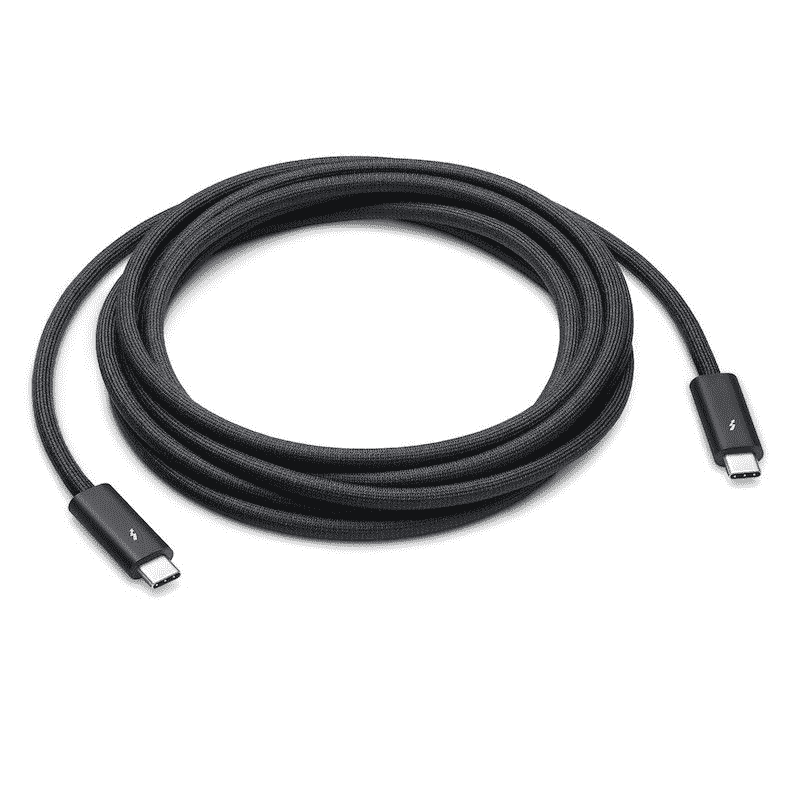

# 苹果公司的 3 米长的 Thunderbolt 4 Pro 电缆实际上是一笔 159 美元的大买卖

> 原文：<https://www.xda-developers.com/apples-3-meter-thunderbolt-4-cable-fairly-priced/>

# 与它花哨的抛光布不同，苹果新的 3 米长的 Thunderbolt 4 Pro 电缆价格相当合理

苹果已经开始销售 3 米长的 Thunderbolt 4 Pro 线缆。它目前是无与伦比的，在美国的价格是合理的 159 美元。

苹果因销售相对高价的产品而臭名昭著。有人可能会说，由于它们的优良品质和长寿命，它们的价格实际上是合理的。然而，一些产品几乎客观上有着荒谬的价格标签——比如臭名昭著的 19 美元抛光布。归根结底，这家位于库比蒂诺的科技巨头不是一家非营利组织，赚更多的钱是它的目标——作为一家不断扩张的企业。尽管如此，有时它的一些发布会让我们大吃一惊，这包括它最新的 Thunderbolt 4 Pro 电缆——它在三月份[宣布了](https://www.xda-developers.com/apple-thunderbolt-4-cables/)。尽管它是高端市场上第一个 3 米长的产品，但该公司仍然满足于 159 美元的价格。这使得它如此便宜——考虑到像 OWC、贝尔金和 CalDigit 这样的公司仍然不提供类似的产品。

如果你正在寻找一家知名公司的 3 米长的 Thunderbolt 4 电缆，那么苹果公司是你目前唯一的选择。它提供了一种编织结构，使其更加耐用，并且只有一种颜色——黑色。这款 Pro 线缆支持:

*   以高达每秒 40Gb 的速度传输数据
*   USB 3.1 第二代数据传输速度高达 10Gb/秒
*   显示端口视频输出(HBR3)
*   连接到 Thunderbolt (USB-C)和 USB 设备和显示器
*   高达 100 瓦的功率输出
*   以菊花链形式连接多达六个雷电 3 设备

苹果的 3 米 Pro 电缆是为那些想在远距离设备上利用 Thunderbolt 4 的额外功能的人准备的。如果你不需要 3 米的长度，那么该公司提供 1.8 米的版本，价格便宜 30 美元。在这种情况下，你也可以从其他体面的品牌中找到大量的其他选择，这些选择花费不多。考虑到在这个部门没有 3 米的竞争对手，苹果可以轻松地收取更多的费用，并出售单位就好了。令人耳目一新的是，终于看到这家万亿美元的公司在定价方面更加合理。

 <picture></picture> 

Apple Thunderbolt 4 Pro Cable (3 m)

##### 苹果雷电 4 Pro 线

苹果公司的这种 3 米长的 Thunderbolt 4 电缆目前是无与伦比的，价格仅为 159 美元。

*你打算买苹果的 3 米雷电 4 Pro 线吗？为什么或为什么不？请在下面的评论区告诉我们。*