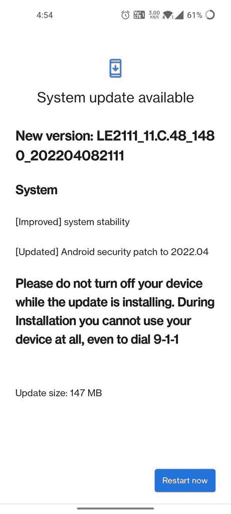

# 一加 9 和一加 9 专业版收到了 2022 年 4 月的最新安全补丁

> 原文：<https://www.xda-developers.com/april-2022-security-patches-oneplus-9-oneplus-9-pro/>

一加已经开始为其旗舰产品一加 9 和一加 9 Pro 推出新的 OxygenOS 12 更新。此次更新为设备带来了 2022 年 4 月的 [Android 安全补丁，以及一些系统稳定性改进。](https://www.xda-developers.com/april-2022-android-security-update/)

一加 9 系列的最新软件更新(固件版本 C.48)已开始在部分地区推出。它的大小为 147MB，并且有以下更改日志:

*   **系统**
    *   [改进的]系统稳定性
    *   【更新】安卓安全补丁至 2022.04

根据一加社区论坛上的多份报告，OxygenOS 12 (C.48)正在逐步向印度用户推出。与一加的所有软件更新一样，一加 9 和一加 9 Pro 的新软件版本应该会在未来几周内到达所有用户。

 <picture></picture> 

Credit: [Abhi@99](https://forums.oneplus.com/members/abhi-99.4654593/)

如果您的设备上没有收到更新，您可以通过转至设备设置中的软件更新部分并点击*检查更新*按钮来手动检查更新。

**XDA 论坛:[一加 9](https://forum.xda-developers.com/f/oneplus-9.12151/) || [一加 9](https://forum.xda-developers.com/f/oneplus-9-pro.12153/)**

或者，您可以通过下载最新的固件包来手动刷新更新。为此，请按照下面提供的链接下载增量固件更新。确保您下载的固件包与您设备上安装的 OxygenOS 的当前版本相对应。

## 为一加 9 和一加 9 专业版下载 OxygenOS C.48

如前所述，最新的 OxygenOS 更新(含 2022 年 4 月的安全补丁)将面向印度的一加 9 和一加 9 Pro 用户推出。因此，我们目前可以访问设备的印度和全球版本的固件包。我们将尽快更新其他地区的下载链接。

*   **一加 9** :
*   **一加 9 Pro** :

* * *

*感谢 XDA 公认开发者 [mlgmxyysd](https://forum.xda-developers.com/m/mlgmxyysd.8430637/) 提供的下载链接！*