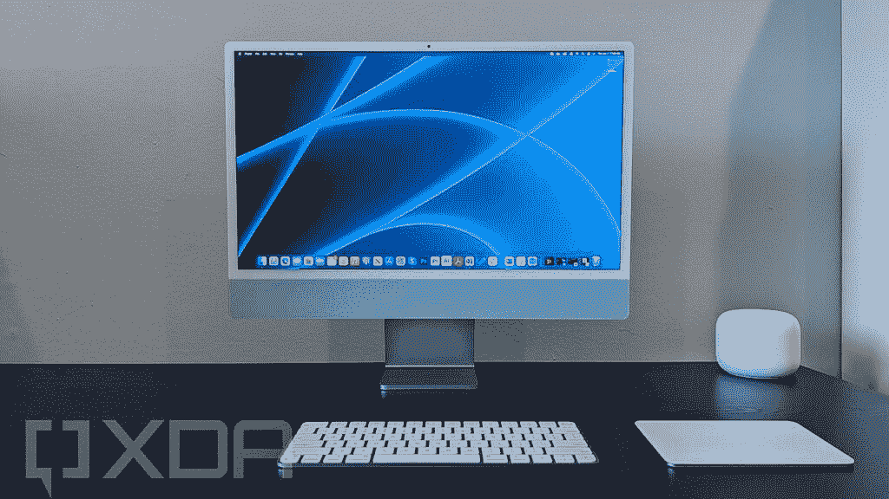
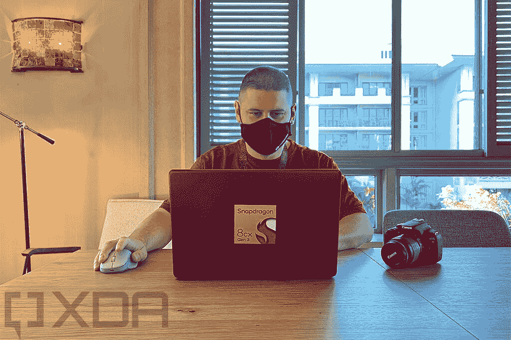
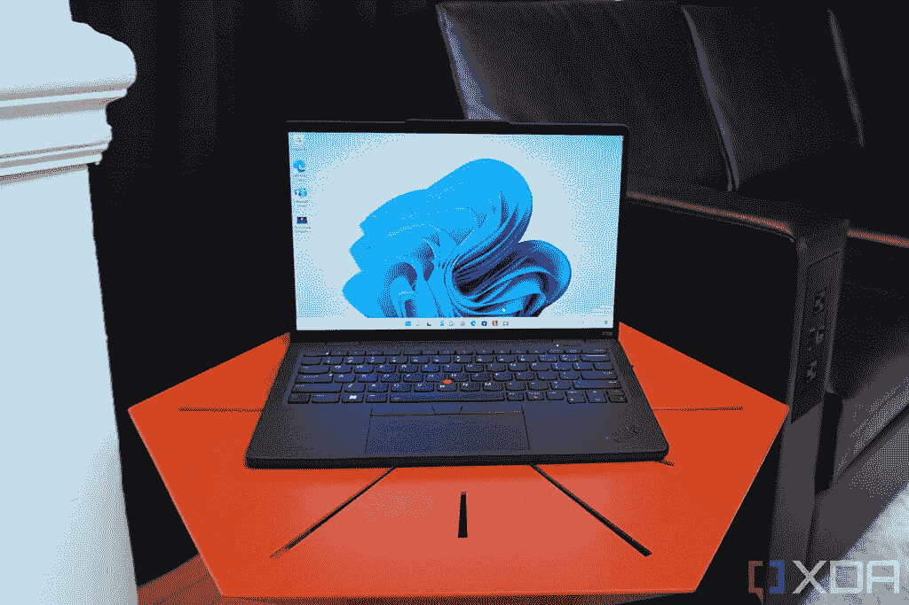

# 采访:Arm SVP 谈论 Arm 上的 Windows 以及与苹果的竞争

> 原文：<https://www.xda-developers.com/arm-interview-windows-on-arm-paul-williamson/>

任何了解我的人都知道，如果你让我和某人在一个房间里谈论 Arm 上的 Windows 或者 Arm 处理器上的计算，我可以一直聊到太阳下山。当 Arm 伸出手，问我是否想与 SVP 兼客户业务线总经理保罗·威廉姆森(Paul Williamson)通话时，我知道这将是我的世界移动通信大会的亮点。

展会上只宣布了一款 Windows 操作系统的 Arm 设备，那就是联想 ThinkPad X13s。不过也有一款 Chrome OS 平板电脑。不过，我首先想谈的是苹果。虽然我已经就这个话题采访了高通几次，但与 Arm 的人讨论这个问题有点不同，因为 MacBooks 使用的是基于 Arm 的[苹果芯片](https://www.xda-developers.com/apple-silicon/)。苹果只是在设计自己使用 Arm 指令集的芯片，而不是授权 Arm 的设计。

然而，这对于计算市场来说并不新鲜。十多年来，苹果一直在开发定制的 Arm 处理器，这些处理器的表现也超过了安卓手机中的芯片。所以我脑海中最大的问题是，为什么苹果的 Arm 处理器比实际上由 Arm 设计的处理器要好？

## 将手臂比作苹果

 <picture></picture> 

24-inch Apple iMac using M1 processor

**Rich:** 我首先想问的是，为什么 Arm PCs 上的 Windows 性能比不上苹果？高通的芯片使用 Arm 的设计，而苹果使用自己的设计。为什么苹果的 Arm 处理器比 Arm 的好？

**Paul:** 如果您在寻找笔记本电脑级别的终极性能，在过去，您会选择 Arm 架构的特定实施，它将针对某个性能点。您将看到我们以不同的规模进行实施。因此，您将看到我们的超内核、X 系列、大内核(7 系列)和小内核(5 系列)。将它们放入一个集群中，并针对性能进行优化。

当您以笔记本电脑为目标时，您会采取不同的移动方法，因为权衡略有不同。您将拥有不同的功耗范围，因此您可以拥有更多更大的内核。如果硅的价格更高，你可以放置更大的缓存和更多的层来增加你正在做的事情的频率，因为功率、热量和价格允许你这样做。因此，我认为笔记本电脑领域令人头痛的部分原因是，我们还没有看到它的最大潜力。

当我们去年发布 X2 系列时，我们特别强调，如果您设定适当的频率、适当的缓存大小、足够低的内存延迟路径，就可以获得顶级性能。

所以，你可以用 Arm 的实现 IP 来实现。问题是，当你进入一个市场时，在无法保证产量的情况下投资优质硅对我们的一些硅合作伙伴来说是一个巨大的挑战。

Rich: 现在只有一个硅合作伙伴。

保罗:这取决于你如何看待它，因为在 Windows 领域有高通，但在 Chromebooks 领域也有联发科的 Kompanio 芯片。

联发科技甚至表示，一旦高通和微软之间的排他性交易结束，他们就计划进入 Windows 领域。

* * *

## 骁龙 8cx Gen 3 使用 Cortex-X1，而骁龙 8 使用 Cortex-X2，但这是有实际原因的

总的来说，我对 Arm 上的 Windows 的一个担忧是，个人电脑市场发展缓慢。你可能还记得高通同时发布了骁龙 8cx Gen 3 和骁龙 8 Gen 1。但是，尽管骁龙 8cx Gen 3 拥有 Cortex-X1 内核，骁龙 8 却拥有更新的 Cortex-X2 内核。

这是一个与个人电脑市场如何运作直接相关的问题。原始设备制造商运作缓慢，他们希望在好的一年到 18 个月后有一个新的 CPU 在手。除非高通想要发布一款芯片，并说设备将在一年内上市——这是它在发布骁龙 8cx Gen 2 时积极试图改变的，几乎没有任何变化——否则它必须使用上一代 Arm 的内核。

 <picture></picture> 

Snapdragon 8cx Reference Design

另外，既然你提到了 X2 的设计——很明显高通的骁龙 8cx Gen 3 使用了 X1——我的理解是，这不是高通芯片的问题，而是个人电脑市场的问题。个人电脑市场发展如此缓慢，以至于这些原始设备制造商希望在产品发布后的 12 到 18 个月内将该芯片掌握在手中。所以，高通的发布总是要比 Arm 推出的晚一年，因为他们不想在 12 月宣布他们的芯片，并说产品将在 16 个月内推出。

保罗:我认为有些情况确实如此。PC 行业肯定有更长的开发周期。我们已经看到智能手机行业的开发周期缩短了。与芯片合作伙伴合作的原始设备制造商已经缩短了这个时间。

你认为他们会在个人电脑行业挤压它吗？

保罗:我认为这完全有可能。这需要雄心壮志。

**Rich:** 这是设置方式的根本问题。当你是苹果时，一切都是内部的，你可以做。当你是英特尔时，你在内部开发芯片，所以你拥有路线图。当你是高通，你必须等待 Arm，他们推出设计，然后你在事后推出芯片。

**Paul:** 如果你看一下移动设备的时间框架，你没有理由不能与 Arm 的 IP 时间框架相匹配。我们很早就开始与硅合作伙伴合作。

但是现在你要求个人电脑市场转变。

**Paul:** 为了实现这一目标，微软将在软件平台上，而芯片合作伙伴将缩短他们的开发时间表，这不是他们过去所做的。

**Rich:** 这是一个以英特尔为核心的行业。所以，这就像试图从多个角度扰乱，这是艰难的。你要求消费者接受它，你要求微软为它开发，你要求原始设备制造商加快生产速度。所以这不容易。

你有没有尝试过想办法和他们更好地合作，并实现它？

保罗:完全地。我们正与我们的芯片合作伙伴、直接与原始设备制造商以及微软密切合作，以确保软件生态系统能够实现更平稳的过渡。另一个变得有益的事情是我们谈论的总计算。因为 Arm 可以在构建 SoC 的底层方法中提供一致性，这意味着开发者正在一个平台上构建游戏，你可以将它从移动设备带到平板电脑上，在 MWC 的一个展台演示中，我们将它展示在冰箱的前屏幕上。计算能力对开发者来说是一致的，你可以把它带到任何你喜欢的地方。同样，如果我们能够做到这一点，使 PC SoC 具有相似的可移植性和相似性，您将获得一个更快的周期，而不必每一代都验证一个全新的平台。因此，我们认为有可能将移动 SoC 方法引入 PC 世界。但是你说的很多事情都是挑战。

他们是路障。当 8cx Gen 3 宣布时，我是 Arm 上的 Windows 的忠实粉丝，所以我不会抨击它，但有些人感到惊讶的是，当 X2 是事情时，芯片是基于 X1 的。X2 位于骁龙第八区。作为一个作家，我得解释一下为什么还是 X1。

保罗:我真诚地认为情况会好转。借助芯片合作伙伴方的适当投资水平，他们可以在进行移动芯片采样的同时进行芯片采样。所以，这个肯定可以改善。

* * *

## 定制芯片，Arm 上的 Linux，以及与苹果 M1 系列竞争的更强大的 Arm 处理器层

 <picture></picture> 

Lenovo ThinkPad X13s, using Snapdragon 8cx Gen 3

我知道高通也想改善它。但是现在，他们也在研究定制硅；他们试图走苹果路线。

**Paul:** 没错，所以他们雇佣了自己的团队，并打算打造自己的核心。

**Rich:** 这给 Arm 实现 IP 带来了什么？

**Paul:** 我们完全致力于 Arm 实施路线图，该路线图将年复一年地实施。我们有数百个合作伙伴使用该技术，我们提供一种商业模式，这意味着人们可以构建自己的实现。

**Rich:** 我很高兴看到个人电脑的 Arm 芯片领域更具竞争力。

保罗:我喜欢我们在这个行业看到的一些其他趋势。如果你看看谷歌来建立自己的芯片，这表明人们正在采用 Arm 实现 CPU，并引入像 Tensor 这样的定制加速器，并采取真正的创新措施。如果我们能够将这种移动创新引入 PC 平台，我认为这将非常令人兴奋。

你们对不同层次的 Arm 芯片有什么看法？在 PC 领域，我们一直专注于轻薄。重点是与英特尔 U 系列进行比较。高通将骁龙 8cx 与 U 系列酷睿 i5 进行了比较。你对游戏有什么看法？创造者笔记本电脑？与英特尔 H 系列竞争的专用显卡甚至是 M1 Max？

保罗:我认为这是一个令人兴奋的前景。有不同的方法，我认为我们会看到 Arm 的独立显卡。那将是令人兴奋的。观察市场如何演变，以及 Arm 的颠覆会如何影响市场，将会非常有趣。人们对 MacBook Air 外形和价格的关注无疑有所增加。

三年前，我问高通他们是否对游戏或 creator 笔记本电脑感兴趣，他们告诉我这是不可能的。然后苹果转投 Arm，合法化了。这对空间中的每个人都有好处。你认为我们会看到这样的设计吗？

**Paul:** 我认为有可能看到带有独立显卡的 Arm 包，我对 Arm 上的 Linux 感到非常兴奋。我知道重点是 Windows，但是对于在 Arm 上开发云的开发人员来说，他们正在寻找基于 Arm 的机器上的 Linux 来进行开发。他们想要大型平台，在那里他们可以在 Arm 上进行 Linux 开发。这也是我们会看到一些创新的领域。

我希望看到一些搭载 Linux 的 Arm 笔记本电脑上市，因为我不认为它们会上市。有一些困惑，因为你不能在 Arm 上下载 Windows 11 的 ISO。我知道微软会在某个时候改变这一点。

您认为在电脑中使用 Arm 处理器的关键价值主张是什么？我知道高通告诉人们什么，我想知道是否是一样的。因为和苹果不一样。

保罗:有几个非常有趣的因素正在发挥作用。一个是人们采用移动 SoC 方法进行设计，因此我们看到更多专用加速器用于某些用例，用于改善音频、更好的人脸识别、更多内置人工智能类型的加速器，这真的有很大的不同。显然，你可以实现热效率和功率范围。这款电池续航时间长达 28 小时的联想设备向人们展示，你可以在 Windows 上做到这一点。

**Rich:** 好吧，我看了就信续航了。我觉得 Arm 对笔记本电脑电池寿命的承诺并没有兑现。

保罗:我很想试试 X13s 来看看。

**有钱:**苹果的 Arm 笔记本电脑续航能力很棒，在这一点上我怪微软。我想知道他们有多努力为 Arm 优化 Windows。我知道他们现在更关注 Arm，因为苹果使其合法化，但他们参与 Arm 的原因是为了在英特尔下点火。

保罗:我认为我们最好的办法是看看微软接下来会怎么说。构建应该很快就会完成。那就是我们看他们接下来会说什么的时候了。这些设备正在整合，现在是时候看看软件支持了。

* * *

这里发生了很多事情，这一切都变得非常有趣。Arm 似乎准备接管整个计算世界。无论是 Windows 或 Linux PCs 获得基于 Arm Cortex 的处理器，还是苹果获得定制的 Arm 芯片，该平台似乎无处不在。

但英特尔仍然是 Windows 领域的现任者。事实上，英特尔实际上表示，它计划到 2025 年夺回性能功耗比的领先地位。要做到这一点，它必须努力让自己的芯片更像 Arm 的芯片，这一点它已经通过其新的混合架构做到了。