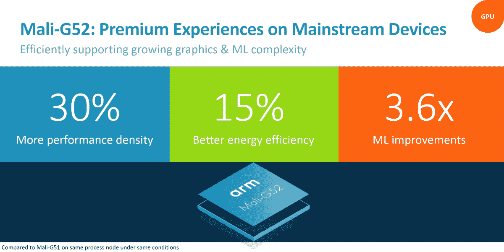
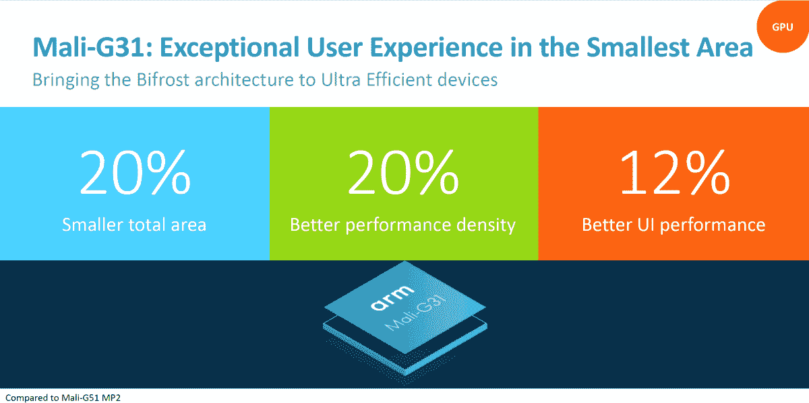

# ARM 推出 Mali-G52/G31 GPU、Mali-D51 DPU 等产品

> 原文：<https://www.xda-developers.com/arm-mali-g52-g31-gpus-mali-d51-display-mali-v52-video-processors/>

ARM 于 2016 年被软银收购，是一家英国控股公司，在数十亿部智能手机、机顶盒和物联网(IoT)小发明中开发和授权片上系统(SoC)架构。它的技术构成了三星、联发科和海思的 SOC 的基础，这些合作伙伴和其他公司迄今已售出超过 1250 亿片芯片。(ARM 预计这个数字到 2021 年将达到 2000 亿。)

周二，继 11 月发布 [Mali-D71](https://www.xda-developers.com/arm-mali-d71-assertive-display-5-hdr-vr/) 显示处理器和 Assertive Display 5 之后，ARM 推出了四款新芯片组:Mali-G52/G31 图形处理单元(GPU)、Mali-D51 显示处理器和 Mali-V52 视频处理器。

Mali-G51 的继任者 Mali-G52 的“性能密度”(fps/mm)增加了 30%，这要归功于更宽的执行引擎(最多三个，具体取决于配置)。它的执行引擎中有八个 ALU 管道，而不是四个(每个都可以处理 8 位点积操作)，它提供了 3.6 倍的机器学习性能。但它也比它的前身更节能。根据 ARM 的说法，Mali-G52 的功耗比前代 GPU 低 15%，产生的热量也少得多。

 <picture></picture> 

Source: ARM

Mali-G31 在原始性能方面比 Mali-G52 略有下降，是 ARM 基于 Bifrost 架构构建的超高效 GPU 系列中的第一款，该架构具有重新设计的标量和基于子句的 ISA、基于四元组的算术单元以及可降低内存带宽的新几何数据流。因此，Mali-G52 比 Mali-G51 小 20%，性能密度高 20%(UI 性能高 12%)，而*和*是支持 OpenGL ES 3.2 和最新一代 [Vulkan API](https://www.xda-developers.com/unity-5-6-released-with-tons-of-performance-improvements-and-support-for-vulkan-api/) 的最小处理器。

ARM 表示，它正在增加 Vulkan 等 API 的内容开发人员资源，并与谷歌合作，确保 Mali-G51 和 Mali-G31 等 GPU 与 ARCore 无缝协作。

 <picture></picture> 

Source: ARM

在显示处理器单元(DPU)方面，ARM 推出了 Mali-D51，这是第一款基于芯片制造商 Komeda 架构的 DPU。与前代设计相比，它的能效提高了 30%,内存延迟提高了 50%,并且支持八层场景复杂性。当与 ARM 的户外显示技术 Assertive Display 5 配合使用时，它能够驱动高动态范围(HDR)屏幕。(该公司表示，它还“完全优化”了工作系统内存管理单元，如 CoreLink MMU-600。)

今天宣布的最后一款芯片 ARM Mali-v 52 是该公司最新一代的视频处理器。它将解码性能提高了一倍，上传质量提高了 20%，ARM 声称这可以以每秒 60 帧(FPS)的速度产生“更清晰”和“更清晰”的 4K 视频——所有这些都在小 38%的硅面积上实现。

ARM 表示，Mali G52/G31、Mali-D51 和 Mali-V52 设计已经提供给 OEM 合作伙伴。如果一切按计划进行，预计今年晚些时候将在未来的手机、机顶盒和更多设备中看到它们。