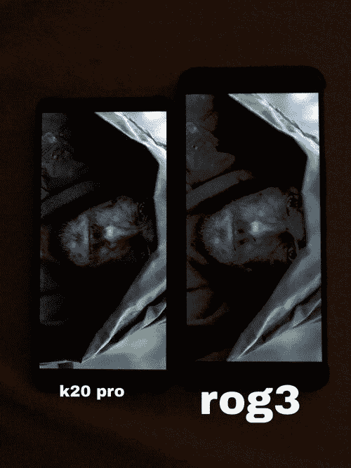

# ROG 手机 3 从华硕获得“黑色粉碎”修复

> 原文：<https://www.xda-developers.com/asus-updates-the-rog-phone-3-with-black-crush-fix-adds-portrait-mode-support-in-armoury-crate/>

# 华硕更新了 ROG 手机 3 的“黑色粉碎”修复，在军械库板条箱中增加了肖像模式支持

华硕为 ROG Phone 3 推出了新的软件更新，以解决“黑色粉碎”问题。请继续阅读以了解更多信息，并获取下载链接！

距离华硕[发布期待已久的 ROG Phone 3](https://www.xda-developers.com/asus-rog-phone-3-gaming-smartphone-snapdragon-865-plus-144hz-display-6000mah-battery-launch/)已经一个多月了，该公司已经为该设备推出了[少数](https://www.xda-developers.com/asus-rog-phone-3-first-update-brings-google-lens-shortcut-camera-app-outdoor-mode-3-finger-screenshot-gesture/)软件[更新](https://www.xda-developers.com/asus-rog-phone-3-update-improves-multi-finger-touch-response-adds-navigation-blocking-feature-game-genie/)。台湾的 OEM 厂商现在带着另一个修正漏洞的更新回来了，这个游戏怪物有一个有趣的变更日志。这款新软件的版本号为 17.0823.2007.58 ，显然解决了一些用户面临的 ROG Phone 3 显示屏“黑屏”问题。

**[华硕 ROG 手机 3 论坛](https://forum.xda-developers.com/asus-rog-phone-3)**

术语“黑色破碎”通常是指在屏幕上呈现黑色时，显示面板输出不一致的颜色和严重像素化的块的特定情况。谈到华硕 ROG 手机 3 的显示屏，在[我们自己的论坛](https://forum.xda-developers.com/asus-rog-phone-3/help/black-crush-issue-t4148627)、[华硕 ZenTalk 社区](https://zentalk.asus.com/en/discussion/33479/rog-3-suffers-from-heavy-black-crush-issue)和其他在线平台上有几份关于色彩输出异常的报告。

 <picture></picture> 

Redmi K20 Pro (left) vs ASUS ROG Phone 3 (right); Thanks to ZenTalk user [Cpz](https://zentalk.asus.com/en/profile/Cpz) for the image!

据 ZenTalk 社区的一名版主称，黑屏问题，尤其是在网飞上观看视频时，根源在于自动亮度算法。华硕现在正试图用一种新的固件来解决这种情况，[包含一个专门的修复程序](https://zentalk.asus.com/en/discussion/comment/108185/#Comment_108185)，用于“网飞应用程序和系统亮度功能之间的冲突”。此更新的完整变更日志可以在下面找到:

*   军械库现在也支持肖像模式。添加了 ROG 连接社区。
*   在挪威、瑞典和芬兰启用 Telia VoLTE/VoWiFi
*   修复了网飞 app 和系统亮度功能的冲突
*   修正了无法从底部 USB 端口检测 ROG Strix 阿里翁固态硬盘的问题
*   修复了电池页面下的总功耗项和状态栏中的实际功耗显示之间的巨大差异。

**[华硕 ROG Phone 3 XDA 点评:游戏智能手机之王回来了](https://www.xda-developers.com/asus-rog-phone-3-review/)**

新的在线旅行社正在逐步向用户推出。如果您还没有收到更新通知，并且不想等待它，您可以从下面的链接下载完整的软件包，并在您的设备上手动刷新它。

**[为 ROG 手机下载软件版本 17 . 0823 . 2007 . 58 3](https://dlcdnets.asus.com/pub/ASUS/ZenFone/ZS661KS/UL-ASUS_I003_1-ASUS-17.0823.2007.58-1.1.9-user.zip)**