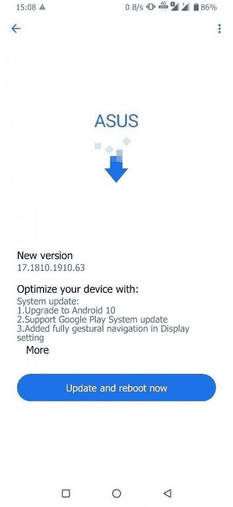

# 华硕为 ZenFone 6/6Z 推出 Android 10 更新

> 原文：<https://www.xda-developers.com/asus-zenfone-6-android-10-update/>

**更新(美国东部时间 11/4/19 @ 12:05PM):**华硕 ZenFone 6/6Z Android 10 更新的内核源代码出来了。

去年，华硕对其移动战略进行了戏剧性的转变。他们决定[更多地迎合超级用户和游戏](https://www.xda-developers.com/asus-mobile-shift-focus-gamers-power-users/)，正如他们所说，ZenFone 6 和 ROG Phone II 似乎符合这两个群体的所有想法。尽管华硕在 ZenFone 6 和 ROG Phone II 的硬件组件方面做得很好，这些组件都是发烧友们想要的，但该公司尚未证明他们是否能提供软件更新。好吧，看起来华硕并不只是说说而已，因为他们已经成功加入了为现有设备推出稳定的 Android 10 更新的原始设备制造商名单。今天，这家台湾智能手机品牌开始为 ZenFone 6 推出 Android 10，在印度被称为华硕 6Z。

809.89MB 的更新使软件版本达到 17.1810.1910.63，并搭载了 ZenUI 6。ZenUI 在这次更新中似乎没有太大的变化，但我不认为这是一个问题，因为在我看来，ZenUI 已经与 OxygenOS 和 Pixel 软件在一起了。它提供了大量的功能，但不会让软件看起来臃肿，因为它们几乎都是可选的。

 <picture></picture> 

Screenshot courtesy of XDA Senior Member [micky387](https://forum.xda-developers.com/member.php?u=4251307). The full changelog seems unchanged [from the public beta](https://www.xda-developers.com/asus-rolls-out-public-android-10-beta-zenui-6-zenfone-5z/).

如果你有华硕 ZenFone 6 的国际版，可以通过[下载增量 OTA 包](https://fota2.asus.com/delta_package/phone/ASUS_I01WD/formal/16.1220.1909.194-user-ASUS_I01WD-17.1810.1910.63-user-ASUS_I01WD-1031NOJP/WW_ZS630KL-16.1220.1909.194-17.1810.1910.63-10311713-fota-user.zip)或者[全 OTA 包](https://dlcdnets.asus.com/pub/ASUS/ZenFone/ZS630KL/UL-ASUS_I01WD-ASUS-17.1810.1910.63-1.1.1-user.zip)来侧装 OTA。我们还没有美国或印度版本的下载。然而，我们已经在 [Reddit](https://www.reddit.com/r/Android/comments/dr0rue/asus_delivers_android_10_to_zenfone_6/) 上看到报道称，该更新正在美国和印度推出，因此这似乎是一次全球推出。华硕的一名代表证实，更新正在交错推出，内核源代码将在未来一周内发布。

两个月前，谷歌发布了用于 Pixel 智能手机的 Android 10。一如既往，Essential 立即跟进更新了 Essential 手机。自那以后，一加和小米都发布了一些智能手机的稳定更新，而三星、华为、LG 和华硕自己也开始了一些设备的测试程序。华硕可能不是发布 Android 10 更新最快的，但他们现在已经证明了他们对软件更新的承诺。我们期待着 ZenFone 5Z 和 ROG Phone II 即将到来的更新。

请关注我们论坛的新发展。作为提醒，华硕[向定制 ROM 和内核开发者发送了多个 ZenFone 6 单元](https://www.xda-developers.com/asus-zenfone-6-custom-rom-twrp-lineageos/)。已经有一些定制的只读存储器，特别是 [LineageOS 17](https://www.xda-developers.com/asus-zenfone-6-asus-zenfone-5z-oneplus-6-oneplus-6t-lg-g2-android-10-custom-rom/) 已经上市。来自 XDA 知名开发商 phhusson 的[最新 GSI](https://www.xda-developers.com/android-10-custom-gsi-project-treble/) 甚至支持设备上的翻转摄像头。有超频显示刷新率的[内核](https://www.xda-developers.com/asus-zenfone-6-6z-75hz-display-refresh-rate-support-custom-proton-kernel/)，每周都有新发布的谷歌相机端口提高图片性能。这款设备拥有强大的开发者支持，所以从长远来看，这是一款不错的设备。

[**华硕增丰 6 论坛**](https://forum.xda-developers.com/zenfone-6-2019)

* * *

## 更新:内核源代码

华硕已经发布了 ZenFone 6/6Z 的 Android 10 更新的内核源代码。考虑到大多数原始设备制造商甚至懒得在设备发布后及时发布内核源代码，我们喜欢华硕这么快就做了更新。

**[内核源代码](https://dlcdnets.asus.com/pub/ASUS/ZenFone/ZS630KL/ASUS_I01WD-17.1810.1910.63-kernel-src.tar.gz) | [国际版全 OTA 下载](https://dlcdnets.asus.com/pub/ASUS/ZenFone/ZS630KL/UL-ASUS_I01WD-ASUS-17.1810.1910.63-1.1.1-user.zip)**