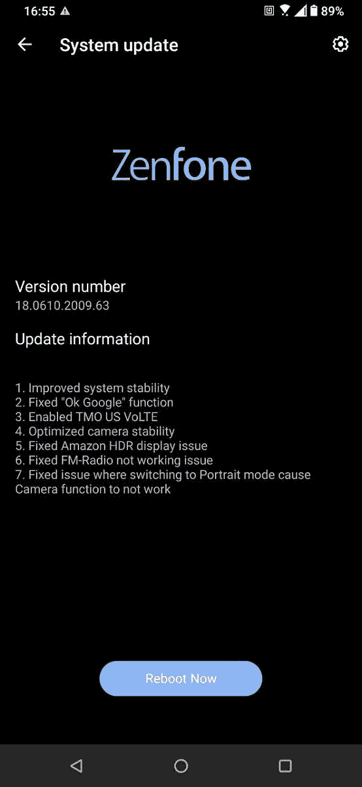

# 华硕 ZenFone 6 的最新 Android 11 测试版支持 T-Mobile 上的 VoLTE

> 原文：<https://www.xda-developers.com/asus-zenfone-6-android-11-beta-t-mobile-volte/>

# 华硕 ZenFone 6 的最新 Android 11 测试版更新在美国的 T-Mobile 上启用了 VoLTE

华硕 ZenFone 6 的最新 Android 11 测试版更新终于在 T-Mobile 网络上提供了 VoLTE 支持。继续阅读，了解更多信息！

早在 8 月份，华硕[就为 ZenFone 6 开发了](https://www.xda-developers.com/asus-zenfone-6-android-11-limited-beta-sign-up/)一个 Android 11 测试版程序。智能手机[一个月后收到了第一个 Android 11 测试版](https://www.xda-developers.com/asus-zenfone-6-receives-first-android-11-beta-update/)，它捆绑了华硕自己的 ZenUI 皮肤的许多改进。现在，华硕 ZenFone 6，或在印度被称为华硕 6Z，正在通过测试版渠道获得另一个更新。美国的 T-Mobile 用户对这个变更日志特别感兴趣，因为新版本最终为手机带来了运营商网络上的 LTE 语音(VoLTE)官方支持。

**[【ASUS zenfone 6 xd a 论坛】](https://forum.xda-developers.com/zenfone-6-2019)**

除了兼容 T-Mobile 的 VoLTE 服务，版本号为 **18.0610.2009.63** 的更新还优化了股票相机应用的稳定性。华硕还修复了最初的 Android 11 版本中引入的小错误，如损坏的肖像模式和不工作的 FM 收音机。你可以在下面找到 ZenFone 6 的 Android 11 beta 版本的完整变更日志:

*   提高系统稳定性
*   修正了“确定谷歌”功能
*   已启用 TMO US VoLTE
*   优化的相机稳定性
*   修正了亚马逊 HDR 的显示问题
*   固定调频收音机不工作的问题
*   修正了切换到肖像模式导致相机功能不工作的问题

 <picture></picture> 

Thanks to ASUS ZenTalk Community user [Averan](https://zentalk.asus.com/en/profile/Averan) for the screenshot!

虽然我们还没有看到固件包的下载链接，但更新似乎正在向现有的测试版用户推出。

值得一提的是，从 2021 年 1 月开始，任何在 T-Mobile [上不支持 VoLTE 的设备将不再能够连接到运营商的 4G LTE 或 5G 网络](https://www.xda-developers.com/t-mobile-att-require-volte-phone-calls-shut-down-3g/)。鉴于华硕最近[也为 ROG Phone 3](https://www.xda-developers.com/rog-phone-3-latest-update-finally-enables-volte-att-t-mobile-usa/) 带来了 T-Mobile VoLTE 支持，看起来台湾的原始设备制造商真的不想失去这个利润丰厚的市场。如果你在 ZenFone 6 上运行稳定的 Android 10 固件，你仍然可以在扎根你的设备后[手动启用 VoLTE(和 VoWiFi)，这要感谢我们出色的售后开发社区。](https://www.xda-developers.com/how-to-enable-t-mobile-volte-vowifi-on-asus-smartphones-root/)