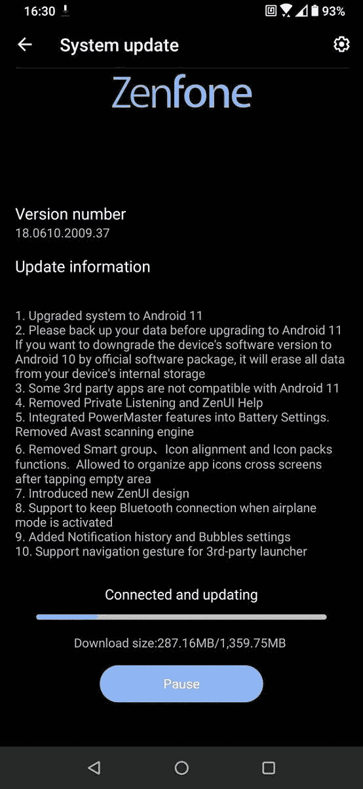

# 华硕 ZenFone 6 收到其第一个官方 Android 11 测试版更新

> 原文：<https://www.xda-developers.com/asus-zenfone-6-receives-first-android-11-beta-update/>

# 华硕 ZenFone 6 收到其首个 Android 11 测试版更新

华硕已经开始推出 ZenFone 6 智能手机的第一个 Android 11 测试版更新。请继续阅读，了解更多关于此首次展示的信息！

大约一个月前，华硕为 ZenFone 6 启动了 Android 11 测试程序。同一款手机在印度市场销售的名称是[华硕 6Z](https://www.xda-developers.com/asus-6z-zenfone-6-launch-india/) ，它也有资格参与测试计划。这家台湾 OEM 厂商尚未公布其 Android 11 推出计划的适当时间表，但这并不意味着你不能在手机上体验最新版本的 Android。第一个 Android 11 build 现在可以用于华硕 ZenFone 6 进行早期测试。

**[【ASUS zenfone 6 xd a 论坛】](https://forum.xda-developers.com/zenfone-6-2019)**

新版本的版本号是 **18.0610.2009.37** ，这是从最新稳定的基于 Android 10 的固件( **17.1810.2009.176** )的一个相当陡峭的跳跃。此次更新带来了包含在[稳定的 Android 11 代码库](https://www.xda-developers.com/android-11-source-code-aosp/)中的所有新功能，以及对华硕自己的 ZenUI 皮肤的微小改进。例如，PowerMaster 模块现在与电池设置集成在一起，以避免冗余。此外，一些启动器功能，如智能分组和图标包支持已被删除。华硕还在第三方启动器中启用了手势导航。

 <picture></picture> 

Thanks to ASUS ZenTalk Community member [TheLostSwede](https://zentalk.asus.com/en/profile/discussions/TheLostSwede) for the screenshot!

ZenFone 6 首次 Android 11 更新的完整变更日志如下:

1.  系统升级到 Android 11。
2.  请在升级到 Android 11 之前备份您的数据。如果你想通过官方软件包将设备的软件版本降级到 Android 10，它会擦除你设备内部存储的所有数据。
3.  一些第三方应用程序与 Android 11 不兼容。
4.  移除了私人监听和 ZenUI 帮助。
5.  将 PowerMaster 功能集成到电池设置中。已删除 Avast 扫描引擎。
6.  删除了智能组图标对齐和图标包功能。允许在点击空白区域后跨屏幕组织应用图标。
7.  介绍了新的 ZenUI 设计。
8.  支持在激活飞行模式时保持蓝牙连接。
9.  添加了通知历史和气泡设置。
10.  支持第三方启动器的导航手势。

显然没有增量 OTA，所以报名参加 beta 测试的 ZenFone 6 用户必须下载重约 1.3GB 的全尺寸更新 ZIP。当我们捕获到侧载友好的更新包时，我们将更新文章。