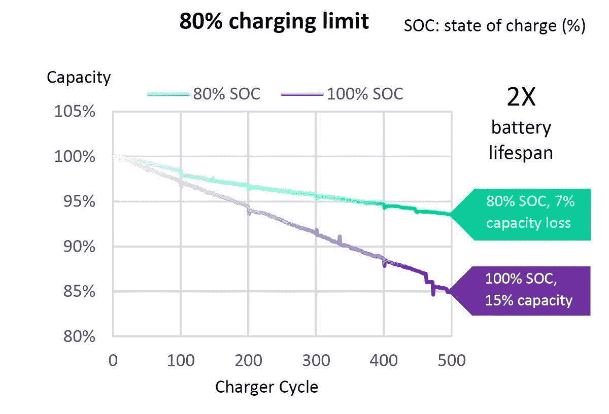

# 华硕 ZenFone 7 和 ROG Phone 3 支持直通充电

> 原文：<https://www.xda-developers.com/asus-zenfone-7-rog-phone-3-passthrough-charging-battery-limit/>

# 华硕 ZenFone 7 和 ROG Phone 3 支持在不降低电池性能的情况下为游戏进行直通充电

华硕 ZenFone 7 和 ROG Phone 3 都支持直通充电，可以延长游戏时的电池寿命。

由于*游戏*手机的兴起，在某些亚洲市场，智能手机和游戏机之间的区别变得越来越模糊。移动电子竞技游戏现在比以往任何时候都要大，因此看到用户花费数百小时在手机上玩多人游戏而不是在 PC 或游戏机上并不罕见。如此长的游戏时间显然对电池要求很高，因此用户最终会反复给手机充电以继续玩游戏。如果你一直充满电，手机的长期电池容量会受到影响。为了解决这个问题，最近推出的[华硕 ROG 手机 3](https://www.xda-developers.com/asus-rog-phone-3-gaming-smartphone-snapdragon-865-plus-144hz-display-6000mah-battery-launch/) 和[华硕 ZenFone 7 系列](https://www.xda-developers.com/asus-zenfone-7-pro-specs-features-pricing-availability/)带有充电限制功能，一旦电池电量达到一定限度，就可以进行直通充电。

 <picture></picture> 

Source: ASUS

**t1【ASUS rog phone 3 论坛】| |[ASUS zenfone 7 论坛](https://forum.xda-developers.com/asus-zenfone-7)| |[ASUS zenfone 7 pro 论坛](https://forum.xda-developers.com/asus-zenfone-7-pro)**

在回顾 ROG 手机 3 时，我们提到了华硕如何提供一个选项，将充电限制设置为 80%或 90%，以延长电池寿命。一旦启用，手机内部的充电电路将切换到直接从充电器而不是正在涓流充电的电池中获取电能——有效地绕过了电池！这类似于索尼在索尼 Xperia 1 II 上曝光的 [H.S .电源控制功能，该功能受到了广泛关注。该功能不仅消除了在长时间游戏过程中持续给电池充电的需要，还减少了总热量的产生，从而延长了手机和充电器的寿命。](https://www.xda-developers.com/sony-xperia-1-ii-gaming-feature-charge-and-play-without-degrading-battery-health-h-s-power-control/)

*感谢 XDA 资深会员 [ryu091](https://forum.xda-developers.com/member.php?u=4898039) 的截图！*

要进行设置，请在 ROG 手机 3 上进入“设置”->“电池”->“电源管理”->“电池保护”，或者在华硕 ZenFone 7 上进入“设置”>“电池”>“电池保护”。我们在 [ZenFone 7 Pro](https://www.xda-developers.com/asus-zenfone-7-pro-review-a-flipping-fantastic-flagship-smartphone/) 上测试了这项功能，并使用 Ampere 应用程序确认，一旦达到极限，手机就会停止给电池充电。电池限制功能在华硕目前搭载 ZenUI 7 的设备上可用，包括 ROG Phone 3 和 ZenFone 7，因此未来它可能会出现在华硕的其他设备上。