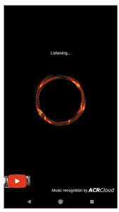
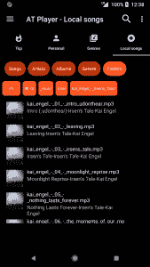
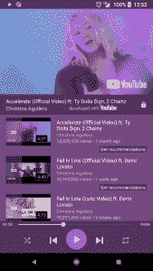
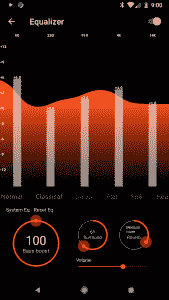

# AT Player 为 XDA 用户提供 100 个无广告代码

> 原文：<https://www.xda-developers.com/at-player/>

AT Player 是 Google Play 上最受欢迎的媒体播放器之一，下载量超过 2000 万次。这个音乐应用有一个独特的转变，旨在改变人们在 YouTube 上听音乐的方式。如果你没有订阅流媒体服务，而是在 YouTube 上听音乐，这款应用将极大地改善你的音乐体验。

AT Player 以前有一个付费的高级版本，但最近所有功能都完全免费。其中包括:

*   音乐识别
*   睡眠定时器(音乐播放器功能)，
*   歌词整合
*   书签
*   乞讨

该应用支持广告，但是, **AT Player 已经与 XDA 合作，为你提供 100 个终身无广告代码，可以在 Play store 上兑换。**使用下面的小工具赢取大奖。

[玩家的 100 个终身免广告代码](https://gleam.io/INkte/100-codes-for-lifetime-adfree-in-at-player)

# 音乐搜索和识别

内置的搜索功能将帮助您从 AT Player 使用的许多数据库中找到音乐，而音乐识别功能将听当前正在播放的歌曲，然后在应用程序中立即将其调出。

[第四段]

 <picture></picture> 

Music Recognition Feature

[/第四段][第四段]

 <picture></picture> 

Music Explorer

[/第四段][第四段]

 <picture></picture> 

Auto-Generate Playlists

[/第四段][第四段]

 <picture></picture> 

Equalizer

[/第四段]

一旦你开始播放你的歌曲，你会注意到应用程序会生成一个即将播放的歌曲的播放列表，类似于你正在听的歌曲。

# 离线和在线模式

该应用程序可以访问 YouTube 上的数百万首音乐曲目，并提供一个特殊的播放器锁定屏幕，可以节省电量并防止意外点击。虽然 YouTube 不允许你在屏幕关闭时继续播放音乐视频，但 ATPlayer 对此有三种解决方案:当锁屏可见时，YouTube 音乐仍会播放；当屏幕关闭时，播放器的收音机工作；你还可以听本地音乐，当然，即使没有互联网连接也能听。有一个带低音增强和混响的五波段均衡器，可以让你调整音乐的声音。

# 基于离线内容的在线音乐推荐

该应用程序连接在线和离线音乐，可以在一个播放列表中同时播放本地和在线音乐。你甚至可以点击离线曲目的推荐按钮，调出相应/相似的在线曲目。

# 明暗主题

AT Player 有一个漂亮的深色主题作为默认。它看起来很棒，并为使用 AMOLED 显示器的人节省电池电量。如果你更喜欢浅色主题，你可以在设置菜单中切换浅色和深色。

# 浮动弹出播放器

AT Player 使用的浮动弹出播放器和你在默认的 YouTube 应用程序中找到的一样。使用它进行多任务处理非常简单，在玩游戏、发短信甚至在驾驶导航时都非常方便。当它碍事时，有一个特殊的最小化功能；播放器弹出窗口可以暂时关闭，暂停播放。继续:使用通知区域或返回应用程序。

与默认的 YouTube 应用程序相比，AT Player 是听音乐的更好选择。从 Play store 免费下载该应用程序，并使用上面的小工具赢得终身无广告代码。

[**在播放器**下载](https://play.google.com/store/apps/details?id=com.atpc)

###### 我们感谢 AT Player 赞助了这篇文章。我们的赞助商帮助我们支付与运行 XDA 相关的许多费用，包括服务器成本、全职开发人员、新闻撰稿人等等。虽然您可能会在门户内容旁边看到赞助内容(这些内容将始终被标记为赞助内容),但门户团队对这些帖子不承担任何责任。赞助内容、广告和 XDA 仓库完全由一个独立的团队管理。XDA 绝不会通过接受金钱来赞扬一家公司，或以任何方式改变我们的观点或看法，从而损害其新闻诚信。我们的意见不能被收买。