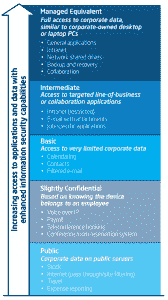

# 安全策略，根和自定义 rom 平衡该做什么和不该做什么

> 原文：<https://www.xda-developers.com/balancing-a-security-policy-root-and-custom-roms/>

我们热爱我们的移动设备——对于 XDA 的许多人来说，当我们想要将这种热爱带到我们的设备上并开始在办公室应用时，我们经常会面临一场斗争。

对于我们这些经营自己的企业并了解这些风险的人来说，我们的情况可能比其他必须遵守公司政策的人更容易。挑战在于，不管是好是坏，事情出于需要变得越来越安全。更大的公司正在追逐像 T2 ISO 27001 T3 这样的认证，以帮助确保客户的数据是安全的。中小型企业(SMB)市场正在发展到现代化意味着采用移动技术的阶段；这意味着他们也必须解决这方面的风险。那么，我们如何才能在以下两者之间找到一个令人愉快的平衡:一方面，公司需要控制与移动设备共享的信息，另一方面，公司又需要足够灵活，让我们能够利用我们在 XDA 做的一些伟大的事情？

在讨论开始时，需要注意的是，有时这两者是不可能结合的，如果一些人想要超越公司设备的限制，他们别无选择，只能携带第二个真正的个人设备。例如，那些遵循[美国设备安全标准](https://www.nsa.gov/ia/programs/csfc_program/index.shtml)的公司——许多大公司和政府也可能被要求遵循——需要明白，他们在那里保护的不仅仅是发送到你的设备的数据，还有可以发送回来的数据。在医疗保健等案件中，丢失敏感信息的风险非常严重，[美国政府提供了如何处理这种情况的建议](https://www.healthit.gov/providers-professionals/your-mobile-device-and-health-information-privacy-and-security)，并可能受到州或地方法律的进一步限制。但这并不意味着即使是世界上最大的一些公司也会强迫你采用“一刀切”的方法。

 <picture></picture> 

Intel's Tiered Security Approach (2012 Case Study)

在参加 2014 年的英特尔会议时，其中一位发言人谈到了英特尔的设备管理方法和自带设备(BYOD)趋势。让一些读者感到惊讶的是，他们几年前不仅欢迎而且拥护这种方法。英特尔没有对所有设备使用一种解决方案，而是使用分层方法来实现信息安全，这与 2012 年发布的[案例研究相比没有太大变化。如右图所示，与被访问数据或需要与之交互的数据相关的风险越大，公司的安全性和管理就越高。](http://www.intel.com/content/dam/www/public/us/en/documents/best-practices/improving-security-and-mobility-for-personally-owned-devices-paper.pdf)

正如发言人在会后澄清的那样，这可能就像限制用户使用公共信息或基于登录的系统一样简单。其他人可能需要注册设备的 MAC 地址，以便访问数据，这样就可以清楚地知道谁有访问权限，这在试图保留责任时是必要的。最后，那些希望或需要完全访问的人将不得不隔离他们的个人设备，或者接受英特尔提供的 MDM 解决方案的限制。关于这种方法的好消息是，它没有完全否认在设备上运行定制软件的能力。发言人是一名英特尔员工，他澄清说，在较低的级别这当然是可能的——在较高的级别，他们会要求容器化的解决方案(如[三星的 KNOX](https://www.samsungknox.com/en) )保持不变。

在很大程度上，它帮助我在日常工作中形成了 BYOD 和非公司设备的基本模型。我通常会将非公司设备限制在一个低带宽的公共 wifi 接入点，但即便如此，这也只对客人开放。目前不直接与我们的运营系统连接的公司设备被授权访问我们的电子邮件。但是，当我们接近平板电脑将分发给员工并将与我们的运营系统交换数据的时候——即使是间接的——这些设备将受到移动设备管理的制约。在大多数主要的 MDM 解决方案中，都有调整的空间:当我为我的前雇主测试 Airwatch 时，我们能够注册一个设备，观察它在检测到 root 访问或 Knox 标志触发时退出，或者将它分配给一个允许这种访问的组，然后限制该设备可以访问公司基础架构内的哪些数据和系统。浏览所有选项使我或其他 IT 管理员能够阻止我们环境中不需要的东西(对不起，员工，没有 YouTube ),同时确保我们保留完成工作所必需的功能。

对于那些好奇在自己的工作场所做什么的人呢？别担心，你并不孤单。无论您是公司的一名 IT 部门人员，还是试图解决这一问题的负责人，还是试图弄清楚什么可以做什么不可以做的员工，或者是需要了解可能存在哪些限制的供应商，我们企业环境之外的许多人现在都第一次面临这种情况。考虑到这一点，我们 XDA 公司为希望找到这种平衡的企业和用户提供了一些“注意事项”。

**商家:**

*   **是否**了解风险。即使像允许人们访问电子邮件或 wi-fi 网络这样简单的事情也会给公司带来风险。与此同时，你希望设备——甚至是现在安装了安卓系统的电视——不受限制地访问你不希望它们访问的东西吗？
*   **是否**制定一个如何降低这些风险的计划。不要害怕请安全专家来帮助您评估这些风险，尤其是在对移动设备在工作场所的处理方式进行重大改变之前。这可能不是 MDM，而是员工必须签署的一项政策——但是什么都不做会使您的环境相当于“西部荒野”
*   **务必**与你的用户交流这个计划。你越清楚员工/客人能做什么和不能做什么，就越容易坚持计划，必要时也更容易执行。
*   定期检查计划，确保它仍然符合业务需求。更重要的是，采取行动，必要时调整计划。
*   不要忽视解决这一问题的必要性。随着大量安全问题的出现，而且这些问题还在与日俱增，众所周知的逃避现实的方法只会推迟痛苦，而不会避免痛苦。
*   **不要选择你没有花时间研究的模型或安全计划。安全计划失败的最大原因之一是因为它不是基于您公司的需求而设计的，而是基于其他人的建议。**

**企业用户-员工、供应商、客人:**

*   **是否尊重公司对安全的需求，尤其是移动设备的安全。这个政策可能很简单，甚至不允许在公司场所使用设备，但最终这是*他们的*业务，如何妥善保护这是他们的选择。**
*   **一定要**询问，尤其是在你不知道的情况下，你可以选择自带设备还是通过移动设备访问公司数据。这可能是他们可能有一些工作，但还没有宣布。我还没见过哪个雇主会因为员工、供应商或客人在实际做某件事之前问他们能做什么而惩罚他们。
*   如果您觉得当前的安全计划不能满足您的需求，请向您的公司提出建议或反馈。许多公司提供反馈或改进政策来帮助解决这类问题。但是当你解释这个的时候，一定要解释*为什么* *以及*需要如何改变。细节在这里很重要。
*   不要为所欲为或试图规避政策...除非这是你的工作。大多数公司对此的重视程度如此之高，以至于即使无意违反安全策略也会导致纪律处分、解雇或更糟的情况。

你是面临这种情况的企业主还是用户？面对这种情况，但不知道如何进行？欢迎在下面的评论中添加您的想法，让我们继续讨论吧！