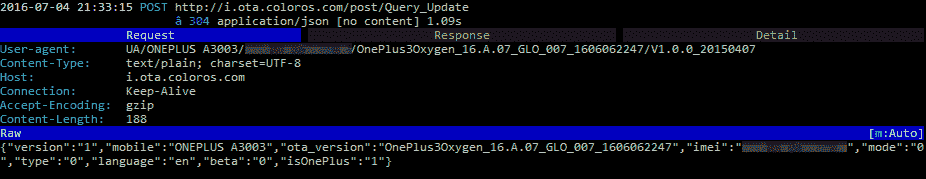

# 警告:尽管承认这个问题，一加仍然会在你检查更新时泄露你的 IMEI

> 原文：<https://www.xda-developers.com/be-warned-oneplus-is-still-leaking-your-imei-when-you-check-for-updates/>

OnePlus One 是首批证明消费者不需要为旗舰体验支付 600 多美元的 Android 智能手机之一。换句话说，即使在一个较低的价格点，你也应该 [*永远不要选择*](https://oneplus.net/) 购买劣质产品。

我仍然记得围绕 OnePlus One 规格披露的大肆宣传——该公司利用了 Android 爱好者在泄露时表现出的狂热。一加决定在正式发布前的几个星期里，慢慢地一个接一个地公布这款手机的规格——这很有效。

当时，我们对这款手机使用 5.5 英寸 1080p 显示屏的骁龙 801 以及与羽翼未丰的初创公司 Cyanogen Inc .非常诱人的合作关系垂涎三尺(由于 CyanogenMod 的流行，Android 爱好者对其非常兴奋)。然后一加给了我们最大的惊喜——299 美元的起步价。只有另一部手机的性价比让我真正感到惊讶 Nexus 5 和 [OnePlus One。我记得许多 Nexus 爱好者在升级 OnePlus One 或等待下一代 Nexus 发布之间犹豫不决。](http://www.xda-developers.com/device-review-oneplus-one/)

 <picture></picture> 

The OnePlus One Captured the Attention of Nexus Fans that No Other Phone could Entice

但随后，一加做出了一系列决定，尽管有些决定在经济上是合理的，但却扼杀了该品牌在安卓爱好者中的发展势头。首先是围绕邀请系统的争议，然后是有争议的广告和[与 Cyanogen](http://www.xda-developers.com/everything-oxygenos-what-we-know-what-to-expect/) ，*闹翻，然后*该公司因 [OnePlus 2](http://forum.xda-developers.com/oneplus-2) 发布而受到一些憎恨，在许多人看来[辜负了](http://www.xda-developers.com/oneplus-2-xda-review/)其“旗舰黑仔”的绰号，最后*有一个红头发的继子 [OnePlus X](http://forum.xda-developers.com/oneplus-x) 智能手机刚刚收到*安卓棉花糖**

* * *

**前进两步，后退一步**

一加的功劳在于，该公司能够凭借 [OnePlus 3](http://forum.xda-developers.com/oneplus-3) 重新点燃围绕其产品的宣传。这一次，一加不仅确保解决了许多评论者和用户对 OnePlus 2 的不满，甚至在[解决早期评论投诉](http://www.xda-developers.com/148634-2-oneplus-3-ota-impressions/)和[为定制 ROM 开发者发布源代码](http://www.xda-developers.com/dash-charging-kernel-code-released-for-the-oneplus-3/)方面做得更好。一加又一次创造了一款足够吸引人的产品，让我重新考虑等待下一款 Nexus 手机的发布，并让我们的几名员工为自己买一部(*或两部*)。但是有一个问题，我们的一些员工很担心，那就是软件。我们在如何使用手机的问题上存在很大分歧——我们中的一些人生活在前沿，为 OnePlus 3 安装了像 [sultanxda 的非官方 Cyanogenmod 13](http://www.xda-developers.com/sultanxdas-unofficial-cyanogenmod-13-lands-on-the-oneplus-3/) 这样的定制 rom，而其他人只在他们的设备上运行普通固件。在我们的员工中，对最近发布的 [OxygenOS 3.5 社区版本](http://www.xda-developers.com/embargo-oneplus-releases-oxygenos-3-x-x-community-build-for-the-oneplus-3/)的质量有一些分歧(我们将在未来的文章中探讨)，但有一个问题我们都同意:对一加**在检查软件更新时使用 HTTP 传输 IMEI 的事实感到完全困惑。**

 <picture></picture> 

Note the (Redacted) IMEI Included in the HTTP POST Request Body

是的，你没看错。当你的手机检查更新时(有或没有用户输入)，你的 IMEI，即**唯一识别你的特定手机**的号码，被不加密发送到**一加的服务器。这意味着，如果你的手机(或你)决定是时候检查更新了，任何人在你的网络中监听网络流量(或你不知道，当你连接到公共热点浏览我们的论坛时)都可以获取你的 IMEI。**

XDA 门户团队成员和前论坛版主 [b1nny](http://forum.xda-developers.com/member.php?u=987637) 通过[使用](http://forum.xda-developers.com/oneplus-3/how-to/news-oxygenos-3-2-0-update-delayed-t3411554/post67618361#post67618361) [mitmproxy](https://mitmproxy.org/) 拦截他设备的流量发现了这个问题，并于 7 月 4 日在一加论坛[上发布了这个问题。在对他的 OnePlus 3 检查更新时发生的事情做了一些进一步的挖掘后，b1nny 发现一加](https://forums.oneplus.net/threads/ota-and-imei-over-http.453992/)[不需要有效的 IMEI](https://forums.oneplus.net/threads/ota-and-imei-over-http.453992/page-2#post-15073895) 来向用户提供更新。为了证明这一点，b1nny 使用了一个名为 Postman 的 [Chrome 应用程序向一加的更新服务器发送 HTTP POST 请求，并用垃圾数据编辑了他的 IMEI。服务器](https://chrome.google.com/webstore/detail/postman/fhbjgbiflinjbdggehcddcbncdddomop?hl=en)[仍然按照预期返回了更新包](https://forums.oneplus.net/threads/ota-and-imei-over-http.453992/page-2#post-15072336)。b1nny 还发现了其他关于 OTA 过程的问题(例如，更新服务器与 Oppo 共享)，但最令人担忧的是，这个唯一的设备标识符是通过 HTTP 传输的。

* * *

**还没有修复的迹象**

在发现安全问题后，b1nny 进行了尽职调查，并试图联系[一加论坛版主](https://forums.oneplus.net/threads/ota-and-imei-over-http.453992/page-3#post-15112095)和[客户服务代表](https://twitter.com/OnePlus_Support/status/751860076424593408)，他们可能会将问题转发给相关团队。一位主持人声称这个问题会被传递下去；然而，他无法得到任何关于正在调查这一问题的确认。当这个问题最初在/r/Android subreddit 上引起 Redditors 的注意时，许多人都很担心，但他们相信这个问题会很快得到解决。在 XDA 门户网站上，我们也相信用于向 OTA 服务器发送更新消息的不安全的 HTTP POST 方法最终会被修复。最初发现该问题是在 OxygenOS 版本 3.2.1 的操作系统上(尽管它也可能存在于以前的版本中)，但 b1nny 昨天向我们证实，该问题在 Oxygen OS 的最新稳定版本 3.2.4 上仍然存在。

```
POST:

用户代理:UA/ONEPLUS a 3003/XXX/ONEPLUS 3 oxygen _ 16。a . 13 _ GLO _ 013 _ 1608061823/v 1 . 0 . 0 _ 2015 04 07

内容类型:文本/纯文本；字符集=UTF-8

主持人:i.ota.coloros.com

连接:保持活动状态

接受编码:gzip

内容长度:188

生的

{ "版本":" 1 "，"移动":" ONEPLUS A3003 "，" OTA _ version ":" ONEPLUS 3 oxygen _ 16。A.13_GLO_013_1608061823 "，" imei":"XXX "，" mode":"0 "，" type":"1 "，" language":"en "，" beta":"0 "，" isOnePlus":"1"}

回答:

服务器:nginx

日期:2016 年 8 月 24 日星期三 18:20:24 GMT

内容类型:应用程序/JSON；字符集=UTF-8

连接:保持活动

X-Server-ID: hz0231

没有内容
```

然而，随着 OxygenOS 3.5 社区版本的发布，我们再次好奇这个问题是否会持续。我们就此问题联系了一加，该公司的一位发言人告诉我们，这个问题确实已经得到了解决。然而，我们让我们的一个门户成员刷新了最新的社区版本，并使用 mitmproxy 来拦截他的 OnePlus 3 的网络流量，令我们惊讶的是，我们发现 **OxygenOS 仍然在 HTTP POST 请求中向更新服务器**发送 IMEI。

```
POST http://i.ota.coloros.com/post/Query_Update HTTP/1.1

用户代理:com.oneplus.opbackup/1.3.0

缓存控制:无缓存

内容类型:应用程序/JSON；charset=utf-8

主持人:i.ota.coloros.com

连接:保持活动状态

接受编码:gzip

内容长度:188

生的

{ "版本":" 1 "，"移动":" ONEPLUS A3000 "，" OTA _ version ":" ONEPLUS 3 oxygen _ 16。X.01_GLO_001_1608221857 "，" imei":"XXX "，" mode":"0 "，" type":"0 "，" language":"en "，" beta":"0 "，" isOnePlus":"1"}

尽管这一问题显然已经得到解决，但我们 XDA 对此深感忧虑。对于一加来说，使用 HTTP 向其服务器发送请求是没有意义的，如果他们想做的只是使用我们的 IMEI 进行数据挖掘，那么他们可能会使用更安全的方法。

 **IMEI 泄露而你**

你的 IMEI 在公共网络上泄露没有什么大不了的危险。尽管它唯一地标识了您的设备，但还有其他可能被恶意使用的唯一标识符。[应用程序可以很容易地请求访问](https://developer.android.com/training/articles/user-data-ids.html)来查看你设备的 IMEI。那么问题是什么呢？取决于你住在哪里，你的 IMEI 可能会被政府或显然对你很感兴趣的黑客用来跟踪你。但是这些并不是普通用户真正关心的问题。

最大的潜在问题可能是非法使用你的 IMEI:包括但不限于将你的 IMEI 列入黑名单或克隆 IMEI 用于黑市电话。如果这两种情况中的任何一种发生，都可能会给你带来巨大的不便。另一个潜在的问题是关于应用程序仍然使用你的 IMEI 作为标识符。例如，Whatsapp 曾经使用一个经过 MD5 哈希处理的反向版本的 IMEI 作为你账户的密码。在网上四处寻找后，一些可疑的网站声称可以使用电话号码和 IMEI 入侵 Whatsapp 帐户，但我无法验证他们。

尽管如此，**保护唯一识别您或您的设备的任何信息也很重要**。如果隐私问题对你很重要，那么一加的这种做法应该引起关注。我们希望这篇文章能让你了解这种做法背后潜在的安全隐患，并(再次)提请一加注意这种情况，以便迅速解决。

```