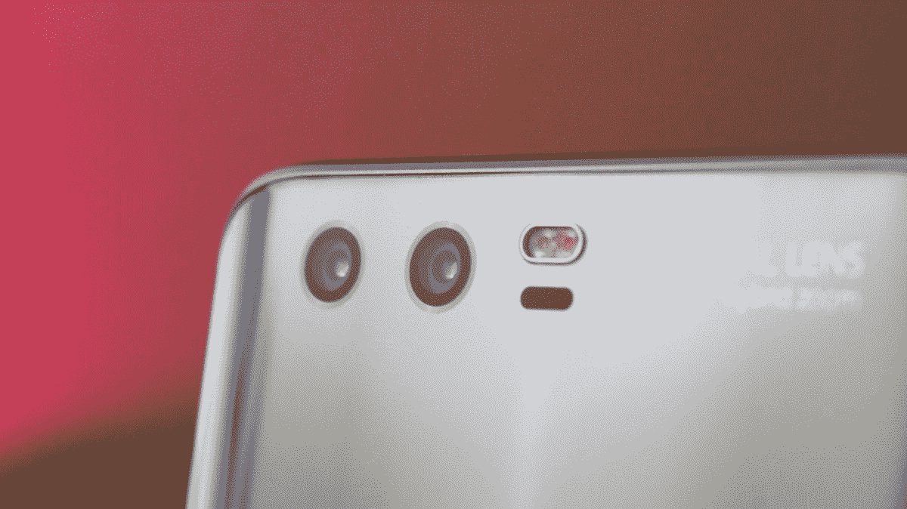
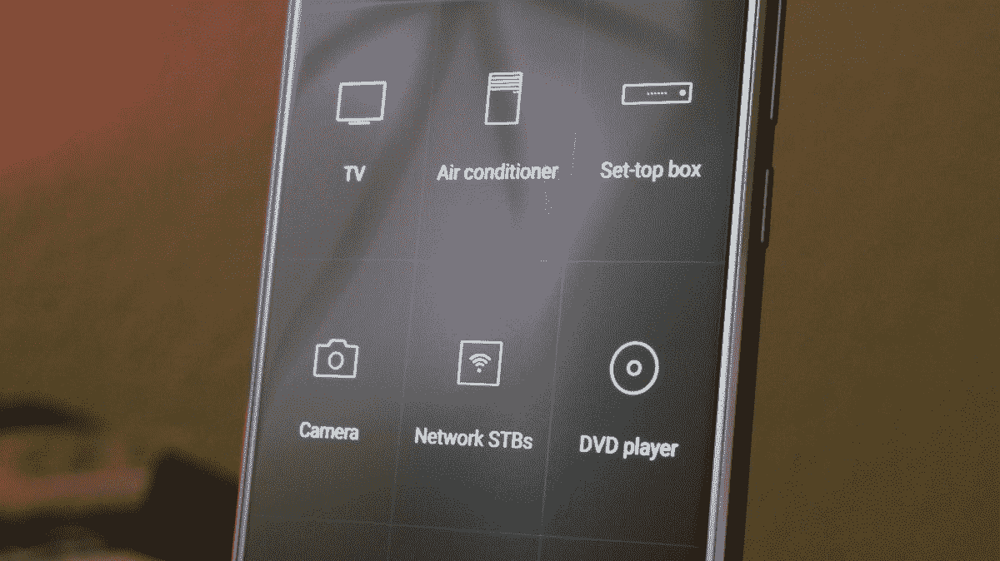
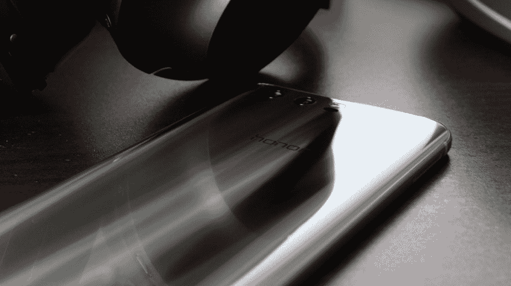
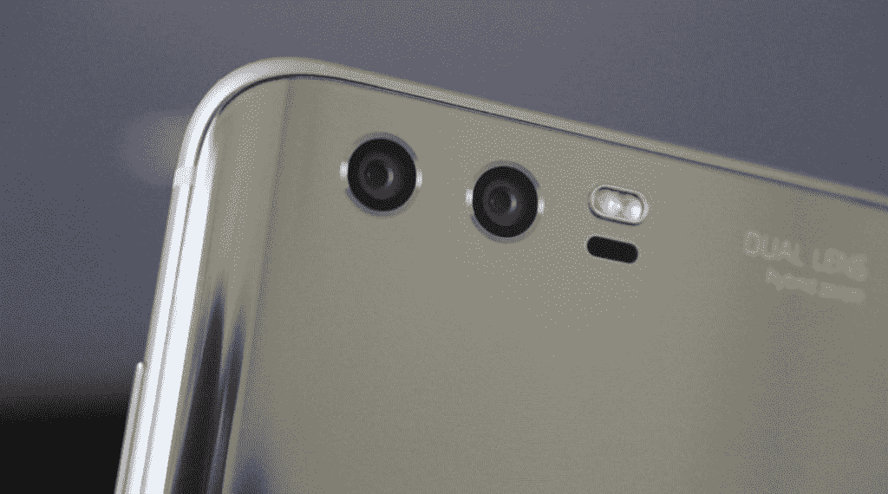

# 荣誉 9 最有趣的新功能

> 原文：<https://www.xda-developers.com/best-features-honor-9/>

Honor 9 是我们今年从 Honor 看到的最令人兴奋的新手机。在保持 Honor 8 精神的同时，通过恢复 15 层玻璃机身，Honor 9 也有许多新功能供我们探索。

## 人类工程学

Honor 9 的外观和感觉是它与市场上其他旗舰产品的不同之处。手机背面捕捉光线的方式使反射跳舞和扭曲，创造了一个非常酷的效果。这是 Honor 投入大量时间设计的东西。随着 Honor 9 设计的更新，后玻璃面板现在向手机边缘弯曲。这确实将这种设备的外观和感觉结合在一起。

## 相机改进

Honor 9 上的摄像头安装了 12MP 和 20MP 传感器，比 Honor 8 有了很大的改进。很高兴看到我们现在可以拍摄 4k 分辨率的视频。这个功能被排除在 Honor 8 之外。

## 速度

凭借麒麟 960 等强大的内部功能和高达 6GB 的内存，这款手机的速度快得惊人。由于 Honor 决定坚持使用 1080p 分辨率(很像 OnePlus 5)，因此性能不会因为将资源投入到更高分辨率的显示器而受到影响。将这款手机与 Galaxy S8 等手机进行对比测试，你可能会惊讶地发现，Honor 9 在大多数情况下都更快。

## 电容式导航键

你会在 Honor 9 上获得更多的屏幕空间，因为导航键已经被推到了手机的底部。home 键也是指纹传感器的两倍，让手机背面完全平滑和水平。您可以自定义电容式按键，使后退按钮位于右侧或左侧。

## 红外线增强器

这款手机附带了一个红外发射器，因此您可以将您的设备用作通用遥控器。这种东西已经存在很长时间了，但却经常被旗舰手机忽略。因此，IR blaster 的粉丝会很高兴地发现，他们的 Honor 9 可以控制他们所有的遥控物品。

## 

## 耳机插孔

尽管少数设备选择从手机上移除耳机插孔，Honor 还是选择坚持这样做。这可能是因为他们与耳机制造商 Monster 的新合作关系，他们正在利用这一合作关系推出几款新的耳机。

 <picture></picture> 

The new design of the Honor 9 features a curved back made with 15 layers of glass.

 <picture></picture> 

Improved cameras on the Honor 9 are fitted with 12MP and 20MP sensors.

在评论区告诉我们你最喜欢 Honor 9 的什么新功能。

[**XDA 荣誉 9 论坛**](https://forum.xda-developers.com/honor-9)

*[感谢荣誉与 XDA](https://www.google.com/url?q=https%3A%2F%2Fwww.xda-developers.com%2Fhonor-xda-2017%2F&sa=D&sntz=1&usg=AFQjCNHj-Sj8RYZJCiXTO-U3f8c8gmE5pg) 的合作*