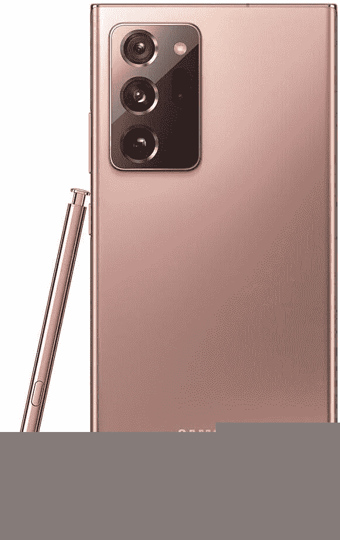
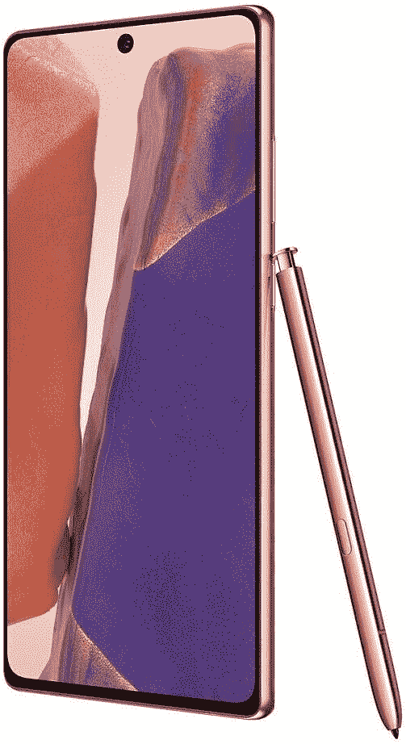

# 最佳 Galaxy Note 20 交易:在印度哪里购买 Galaxy Note 20 Ultra

> 原文：<https://www.xda-developers.com/best-galaxy-note-20-ultra-deals-india/>

三星已经正式宣布了其下一个 Galaxy Note 系列。尽管是 Galaxy Note 10 系列的继任者，这些新设备采用了一个适合 21 世纪最重要的一年(*到目前为止*)的名字。不出所料，[三星 Galaxy Note 20](https://www.xda-developers.com/samsung-galaxy-note-20/) 手机，尤其是[Galaxy Note 20 Ultra 5G(first impressions)](https://www.xda-developers.com/samsung-galaxy-note-20-ultra-exynos-preview/)，都储备了高级功能。在印度，三星的理由是在₹77,999 销售 Galaxy Note 20(约 1040 美元)，在₹1,04,999 销售 Note 20 Ultra(约 1400 美元)。

虽然这些价格与美国的价格一致(见[美国最佳 Galaxy Note 20 交易](https://www.xda-developers.com/best-galaxy-note-20-deals/))，但对大多数印度用户来说，这些手机绝对超出了舒适的消费区。幸运的是，三星在智能手机的预购上有一些优惠，这可能会给那些急切希望珍惜改善后的 Note 体验的人带来某种安慰。

**XDA 论坛:[三星 Galaxy Note 20](https://forum.xda-developers.com/galaxy-note-20) ||| [三星 Galaxy Note 20 Ultra](https://forum.xda-developers.com/galaxy-note-20-ultra)**

## 在印度哪里买 Galaxy Note 20

三星 Galaxy Note 20 和 Note 20 Ultra 在印度可以从亚马逊印度(Amazon India)购买，亚马逊印度是三星的在线商店，也是领先的线下零售连锁店，包括 Croma、Tata Cliq 和 Poorvika Mobile。

为了吸引顾客，三星提供高达₹76,340 的折扣，如果你有一部合格的手机，这可以覆盖 note 20 98%的成本。

**注:**三星在印度仅销售 Galaxy Note 20 和 Note 20 Ultra 各一款。Galaxy Note 20 只有 8GB/256GB 配置，缺乏 5G 支持，而你只能在印度购买 12GB/256GB 版本的 Note 20 Ultra。

## 印度最佳 Galaxy Note 20 交易

随着三星 Galaxy Note 20 系列的推出，三星带来了无数的优惠，使该设备更易于用户使用。与美国不同，从现在起，你只能在印度购买解锁版。通过亚马逊印度、三星自己的在线商店和印度其他主要零售连锁店，智能手机上有各种各样的优惠。

以下是我们到目前为止能够追踪到的所有好交易:

### 亚马逊印度

在亚马逊印度购买 Galaxy Note 20 和 Galaxy Note 20 Ultra，您可以获得价值₹12,000 的购物积分，这些积分可以在三星的在线商店或线下商店购买其他配件。此外，通过使用各种银行的信用卡，您可以获得长达 9 个月的免息 EMI 选项，如果您选择更换旧手机，还可以获得高达₹10,800 的兑换奖金。同时，你还可以用 HDFC 信用卡获得₹9,000 返现。

 <picture></picture> 

Samsung Galaxy Note 20

##### 三星 Galaxy Note 20 Ultra

获得优质的 Galaxy Note 20 Ultra，它具有华丽的玻璃和金属设计、120Hz Super AMOLED 显示屏、5G 以及更多令人垂涎的功能。令人兴奋的优惠使这款手机更便宜，更受欢迎。

 <picture></picture> 

Samsung Galaxy Note 20

##### 三星 Galaxy Note 20

即使预算紧张，也能获得相似的性能和出色的体验。在亚马逊上购买 Galaxy Note 20，可以获得与 Ultra variant 类似的好处。

### 三星在线商店

如果你从三星自己的在线商店购买 Galaxy Note 20 智能手机，三星将提供一些最佳的以旧换新价值。如果您更换旧旗舰，您可以获得高达₹76,340 的折扣。交换价值可能会根据您的旧智能手机的年龄而有所不同，但它通常与手机上的回购保证相匹配。在某些手机上，三星可能会在 iPhone 11 或 Galaxy Fold 等手机上提供高达₹5,000 的额外服务。

除了以旧换新价值，您还可以获得价值高达₹7,000 的三星积分和价值₹2,000 的额外[优惠券](https://shop-links.co/1724070495442284555)，这些优惠券可用于其他三星产品，如 [Galaxy Buds Live](https://www.xda-developers.com/samsung-galaxy-buds-live/) 。此外，你可以通过 HDFC 卡在 Galaxy Note 20 Ultra 上获得₹9,000。所有这些优惠都使三星商店成为购买新 Note 20 的最佳选择之一。

 <picture></picture> 

Samsung Galaxy Note 20

##### 三星 Galaxy Note 20 Ultra

在三星在线商店购买 Galaxy Note 20 和 256GB 存储空间的 Note 20 Ultra。

### Croma 在线上

除了亚马逊和三星的在线商店，你还可以在印度领先的零售连锁店之一 Croma 上获得折扣。这些交易远不如 Note 20 和 Note 20 Ultra 在预订阶段时好，但你可以获得₹1,000 或 5%的返现，还有无息 EMI 支付选项。

 <picture></picture> 

Samsung Galaxy Note 20

##### 三星 Galaxy Note 20 Ultra

在 Croma 购买 256GB 版本的 Galaxy Note 20 Ultra，无论是从商店提货还是送货上门，都可以享受同样的优惠。

 <picture></picture> 

Samsung Galaxy Note 20

##### 三星 Galaxy Note 20 Ultra

前往 Croma story，享受 Galaxy Note 20 的类似优势，而无需等待包裹到达您的家门口。

### 塔塔 Cliq

尽管 Croma 和 Tata Cliq 是由同一家母公司运营的——Tata——你可以从后者那里得到更多的折扣。在 Tata Cliq 上购物，你可以使用 ICICI、Kotak 和 HDFC 等银行的信用卡获得即时折扣。您可以在三星商店获得₹7,000 积分！

 <picture></picture> 

Samsung Galaxy Note 20

##### 三星 Galaxy Note 20 Ultra

除了价值 7000 英镑的三星积分，Tata Cliq 还提供 9000 英镑的 HDFC 信用卡即时折扣，让你不必等待返现。

 <picture></picture> 

Samsung Galaxy Note 20

##### 三星 Galaxy Note 20 Ultra

塔塔 Cliq 用 HDFC 信用卡提供 9000 英镑的即时折扣，让你不必等待返现。在所有情况下，您都可以获得价值 7000 英镑的三星商店信用担保。

### 普尔维卡手机

Pookvika Mobile 提供的折扣不像竞争对手那么多，但你仍然可以用 HDFC 信用卡获得₹9,000 返现。

 <picture></picture> 

Samsung Galaxy Note 20

##### 三星 Galaxy Note 20 Ultra

你只需在 Poorvika Mobile 支付 2000 英镑，而不是全额，就可以从三星预购即将推出的旗舰产品。您可以使用 HDFC 卡获得 9000 英镑的返现，并获得价值 10000 英镑的三星优惠，同时还可以通过更换旧手机获得高达 5000 英镑的额外优惠。