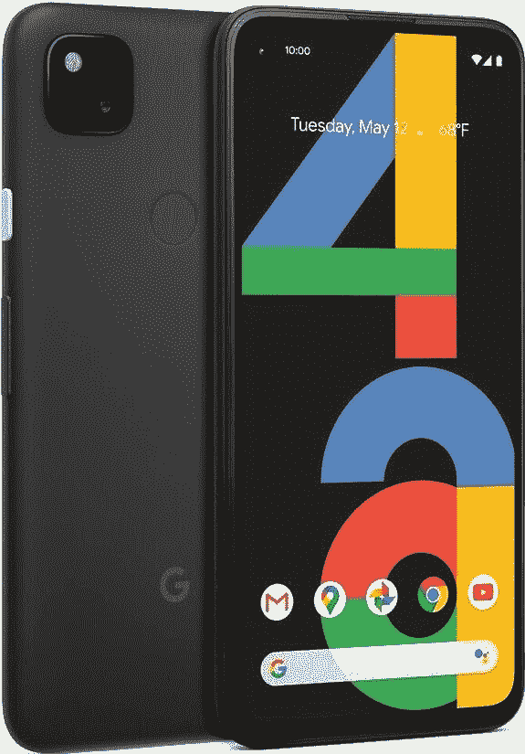

# 最佳 Pixel 4a 交易:如何预购谷歌新手机——XDA 指南

> 原文：<https://www.xda-developers.com/best-google-pixel-4a-deals/>

由于新冠肺炎疫情的影响，几个月的延迟之后，谷歌新的 [Pixel 4a](https://www.xda-developers.com/google-pixel-4a-specs-features-pricing-availability/) 智能手机终于上市了。这款中端 Android 手机具有与 Pixel 4 类似的功能，包括出色的摄像头和干净的 Android 体验，但价格要低得多。Pixel 4 的起价为 799 美元，而 Pixel 4a 在美国的零售价不到 349 美元的一半。

你现在可以从一些不同的零售商那里订购谷歌 Pixel 4a，包括[亚马逊](https://amzn.to/2Pm5ghv)、[谷歌自己的商店](https://redirect.viglink.com?u=https%3A%2F%2Fstore.google.com%2Fproduct%2Fpixel_4a&key=c253a561fbe84b0cd1cd9012f5136c6e&opt=false&cuid=d2104769-c491-4de4-9b75-edb6d4868122)和[百思买](https://bestbuy.7tiv.net/y0emb)。你在尺寸、存储或颜色方面没有太多选择，因为只有一个选项可用:配备 128GB 存储和 6GB 内存的黑色型号。尽管如此，亚马逊允许你把一个盒子和你的新手机捆绑在一起，给你一点选择的余地。

不像以前的设备——包括去年的 Pixel 3a 系列——没有 XL 型号。然而，谷歌已经宣布了 Pixel 4a 5G，将于今年晚些时候推出，可能会配备比 Pixel 4a 的 5.81 英寸 OLED 面板更大的显示屏。此外，还有功能强大的高通骁龙 730G 处理器，Pixel 4 出色的 12.2MP 双像素后置摄像头，以及 3,140mAh 电池。鉴于困扰常规 Pixel 4 的电池问题，Pixel 4a 中的更大电池应该可以实现全天电池寿命。

尽管与更昂贵的同类产品相比，Pixel 4a 有一些妥协，但它无疑是有史以来最好的 Pixel 设备之一，也是你现在可以买到的最物有所值的智能手机。

## Pixel 4a 在美国的价格和发布日期

谷歌的新智能手机将于 8 月 20 日在美国发布，这款手机仅售 349 美元，一款捆绑销售的手机零售价为 389 美元。虽然刚刚宣布，但已经有报价可以将价格降至仅 249 美元。

 <picture></picture> 

Google Pixel 4a

##### 谷歌像素 4a

亚马逊很早就推出了预购，如果你行动迅速，你仍然可以在 8 月 20 日的发布日获得一个。他们也有三个捆绑包可供选择。

 <picture></picture> 

Google Pixel 4a

##### 谷歌像素 4a

如果你计划购买 Pixel 4a，同时也想加入 Sprint，那么不要再犹豫了。百思买提供的 Pixel 4a 解锁版售价为 349 美元，但如果你购买时在 Sprint 上升级或在 T-Mobile 和威瑞森上激活，你可以以 249 美元的价格获得它。绝对的便宜。

 <picture></picture> 

Google Pixel 4a

##### 谷歌像素 4a

谷歌自己的在线商店也提供 Pixel 4a，诱人的 0%融资优惠将成本降至每月 14.54 美元！您还可以同时注册 Fi，以及挑选全系列兼容配件。

## 美国最佳像素 4a 运营商交易

如果你不介意让你的 Pixel 4a 签约，你可能会考虑看看威瑞森的报价。你可以从威瑞森的商店直接购买这款手机，价格为 380 美元，比其他零售商的价格略高。但是，如果你开始一个新的系列，并选择按月付款，你将每月支付 10 美元，为期 24 个月。现在这是一个交易。

 <picture></picture> 

Google Pixel 4a | $240+ at Verizon

##### 谷歌像素 4a

威瑞森对谷歌 Pixel 4a 有两种选择。你可以以 380 美元的价格直接购买这款手机，或者开通一个新系列，选择按月付款，24 个月内每月 10 美元。后者需要信用审批，所以选择最适合你的选项。

## Pixel 4a 在英国的价格和发布日期

虽然你可以从 8 月 20 日开始在美国买到 Pixel 4a，但你必须等到 10 月 1 日才能在英国买到它。它的售价为 349 英镑，包括 20%的增值税，预购将于 9 月 10 日开始，尽管你现在就可以加入官方的等待名单。

 <picture></picture> 

Google Pixel 4a

##### 谷歌像素 4a

虽然你还不能在英国预购 Pixel 4a，但你可以在 2020 年 9 月 10 日开放预购之前加入官方等候名单。

你打算买 Pixel 4a 吗？找到了更好的交易？请在下面的评论中告诉我们！