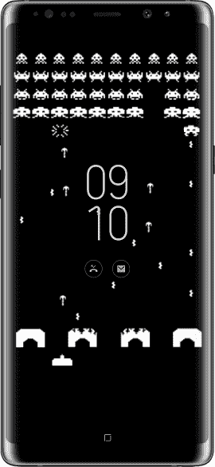
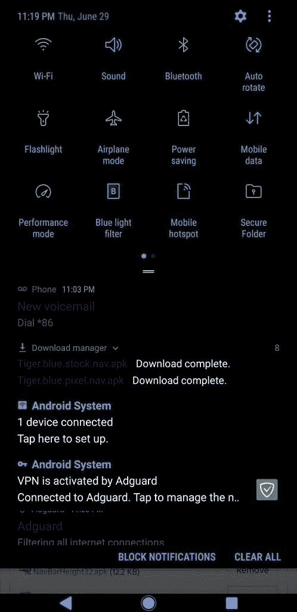
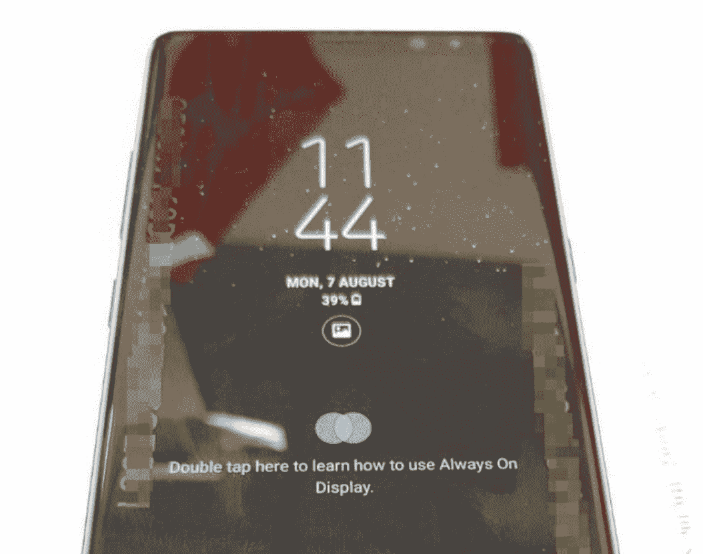
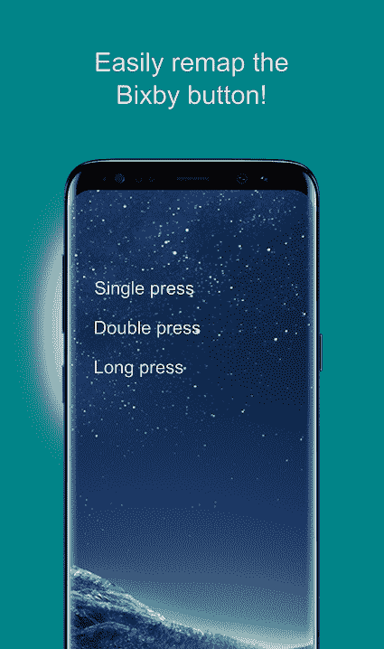
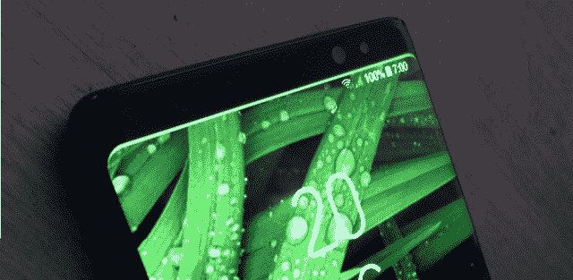

# 三星 Galaxy Note 8 的最佳改装

> 原文：<https://www.xda-developers.com/best-mods-samsung-galaxy-note-8/>

不言而喻，三星长期设备阵容中的最新产品 [Galaxy Note 8](http://xda-developers.com/tag/galaxy-note-8) 是市场上最好的智能手机之一——尤其是如果你对触控笔情有独钟的话。这款巨大的 6.3 英寸平板电脑配备了强大的高通骁龙 835 处理器，配有 6GB 内存，双 12MP 后置摄像头和 3,300mAh 电池，支持 Qi 无线充电和三星的[自适应快速充电](https://www.xda-developers.com/how-to-automatically-toggle-samsung-adaptive-fast-charging-at-home/)技术。毋庸置疑的亮点是三星的 [S Pen](http://xda-developers.com/tag/s-pen) 手写笔，当然，它可以访问应用程序快捷方式，翻译高亮显示的文本，甚至在 Galaxy Note 8 的屏幕关闭时编写备忘录。但是三星的人工智能助手 Bixby 也不甘示弱，它可以识别照片中的物体(通过 Bixby Vision)，根据你的位置和时间提供上下文相关的信息，并通过简单的语音命令关闭智能家电。

不过，Galaxy Note 8 的库存固件几乎没有触及这款旗舰产品的硬件功能。Galaxy Note 8 的最佳 mods 让三星的 phablet 更加出色；例如，一些简单的调整解锁了 Galaxy Note 8 的最大视频帧率，并在平板电脑的前置扬声器上实现了立体声。其他修改为 Galaxy Note 8 添加了类似挤压手势的[像素 2](https://www.xda-developers.com/sidesqueeze-active-edge-galaxy-s8-galaxy-note-8/) [活动边缘](http://xda-developers.com/tag/active-edge)，并允许你将硬件 Bixby 按钮重新映射到任何你喜欢的应用程序或设置。

如果你想知道哪些 Galaxy S8 mods 值得你花时间，那你来对地方了。以上是三星 Galaxy Note 8 最好的 mod。

*由[凯尔威格斯](https://www.xda-developers.com/author/kyle-wiggers/)*

* * *

## 最佳 Galaxy Note 8 相机模式:零相机模式，QHD @ 60fps + HDR 录制

[Zero Camera Mod](https://www.xda-developers.com/zero-camera-mod-4k-60fps-hdr-samsung-galaxy-note-8/) ，XDA 资深会员 [zeroprobe](https://forum.xda-developers.com/member.php?u=2516635) 的激情项目，并不是 Galaxy Note 8 的专属。这是一个定制的相机应用程序，可用于越来越多的设备，包括 [Galaxy S7](https://forum.xda-developers.com/galaxy-s7/themes/zero-camera-mod-v1-0-increased-bitrates-t3439176) 、 [Galaxy S7 Edge](https://forum.xda-developers.com/s7-edge/themes/zero-camera-mod-v1-0-increased-bitrates-t3439870) 、 [Galaxy S8](https://forum.xda-developers.com/galaxy-s8/themes/zero-camera-mod-bitrates-jpg-hdr-af-t3625795) 和 [Nexus 5](https://forum.xda-developers.com/google-nexus-5/development/mod-zerocamera-jpg100-4-4-2-256k-audio-t2563476) 。但 Galaxy Note 8 的零摄像头模式可以解锁手机普通固件中没有的功能。

其中一个亮点是在 [Exynos Note 8](http://xda-developers.com/tag/exynos-note-8) 机型上以每秒 60 帧(fps)的速度录制高达 QHD (2560×1440)分辨率的视频，这在图像清晰度方面产生了明显的差异。其他好处包括在 QHD 的 4K 高动态范围(HDR)记录，自动对焦跟踪，提高比特率，高级快门速度设置，增强的 JPG 质量，等等。

准备好开拍了吗？以下是如何为 Galaxy Note 8 安装 Zero Camera Mod:

虽然 Zero Camera Mod 支持高通骁龙吹捧的 Galaxy Note 8 和三星 Exynos Galaxy Note 8，但安装它需要 root 访问权限(如果你选择该应用程序，还需要 Magisk)。如果你还没有生根，看看我们的[骁龙 Note 8](https://www.xda-developers.com/samsung-galaxy-note-8-root-samfail/) 和 [Exynos Note 8](https://www.xda-developers.com/how-to-root-samsung-galaxy-note-8/) 生根指南开始吧。

**用 TWRP 安装 Zero Camera Mod:**

1.  #### 在 Galaxy Note 8 上，从[这个 XDA 论坛的帖子](https://forum.xda-developers.com/s7-edge/themes/zero-camera-mod-v1-0-increased-bitrates-t3439870)下载 Zero Camera Mod ZIP 文件。

2.  重启手机。同时按住**音量增大、**、**比克斯比、**和**电源**按钮，直到看到三星标志，然后是 TWRP 标志。
3.  #### 点击**安装**，浏览到保存 Zero Camera Mod 的目录，并选择它，刷新您之前下载的 ZIP 文件。

或者，你可以从谷歌 Play 商店下载[相机模块 S8](https://play.google.com/store/apps/details?id=com.sityware.camera_mod_samsung_s8_bitrate_settings&hl=en) 应用程序。

* * *

## 最佳 Galaxy Note 8 永远显示模式:自定义主题

 <picture></picture> 

Custom Always-On Display backgrounds for the Galaxy Note 8.

三星的[常亮显示](http://xda-developers.com/tag/always-on-display)模式首次出现在 [Galaxy S7](http://xda-developers.com/tag/galaxy-s7) 上，并在 Galaxy Note 8 上得到改进，利用有机发光二极管(有机发光二极管)屏幕的独特属性高效显示通知能量。只有呈现文本和图标所需的像素通电；屏幕的其余部分仍然很暗。

Note 8 的股票固件允许你在某种程度上定制永远在线的显示，提供六种不同的时钟风格可供选择，以及一种在设定的时间内隐藏通知的安静模式。但是如果你渴望得到更多，XDA 资深成员 Ash.Man 先生的 mods 增加了额外的定制层。一旦安装完毕，你就可以为永远在线的显示屏更换字体，去掉日期和电池指示器，甚至可以添加自定义的背景图片。

关于自定义背景的警告:你必须遵守 XDA 论坛的指导方针。此外，如果你选择一张色彩特别丰富或以白色为主的图片，你就有可能在屏幕上烧出一个轮廓。小心行事。

以下是如何为 Galaxy Note 8 安装永远显示模式:

1.  在 Galaxy Note 8 上，下载您想要应用的 mod。有五种选择:
2.  #### 如果你还没有安装来自未知来源的应用程序，可以通过进入**设置>锁屏&安全**并切换**未知来源**来安装。

3.  #### 进入**下载**管理器，选择你之前下载的 APK 文件。按照屏幕上的说明安装它们

4.  要将一种风格换成另一种风格，你需要移除你已经应用的模式。拉起**设置>应用**，查找任意一个包名为“com . Samsung . Android . app . aodservice . aod editor”的应用；卸载它们。

* * *

## 最佳 Galaxy Note 8 导航键 Mod:像素导航键

 <picture></picture> 

Pixel Nav Keys mod for the Galaxy Note 8.

如果你不是 Galaxy Note 8 风格化的 home、back 和多任务按钮的粉丝，好消息是:这有一个 mod。XDA 资深成员 Tigerhoods 拼凑了一款 APK，将三星的导航键换成了谷歌像素(Google Pixel)风格的替代品。更好的是，它是可定制的。在**设置>应用>导航条**菜单中，你会看到用于重新排序导航键、改变导航按钮或背景颜色以及调整 **Home** 按钮灵敏度的选项。

以下是如何为 Galaxy Note 8 安装 Pixel Nav Keys mod:

1.  #### 在 Galaxy Note 8 上，下载 APK 在[这个 XDA 论坛的帖子](https://forum.xda-developers.com/galaxy-s8+/themes/substratum-inversion-ui-overlay-overlays-t3604341)。

2.  #### 如果你还没有安装来自未知来源的应用程序，可以通过进入**设置>锁屏&安全**并切换**未知来源**来安装。

3.  #### 打开**下载**管理器，点击你之前下载的文件。按照屏幕上的指示，点击**完成**，就这样——你会立即看到新的导航键。

4.  #### 要恢复 Note 8 的股票导航键，进入**设置>应用，**卸载包名为“com . Android . system ui . product . RES . overlay”的应用，重启手机。

* * *

## 最佳 Galaxy Note 8 音频模块:立体声扬声器

 <picture></picture> 

Samsung's Galaxy Note 8.

Galaxy Note 8 的向下发射单扬声器有很多需要改进的地方，但一个简单的软件修改就可以解决这个问题。XDA 资深成员[protodevnano](https://forum.xda-developers.com/member.php?u=5203734)的双扬声器 mod 轻触 Note 8 的耳机，通过改变固件的 **mixer_paths.xml** 文件中的几个值，将其视为辅助扬声器。最终结果是游戏、音乐应用程序(如 Google Play Music 和 Spotify)以及视频应用程序(如 YouTube 和网飞)中的真实立体声。

以下是如何为 Galaxy Note 8 安装双扬声器 mod:

请注意，Note 8 双扬声器 mod 需要 root 访问权限和支持 root 的文件浏览器。如果你还没有根，看看我们的[骁龙 Note 8](https://www.xda-developers.com/samsung-galaxy-note-8-root-samfail/) 和 [Exynos Note 8](https://www.xda-developers.com/how-to-root-samsung-galaxy-note-8/) 根指南开始，如果你需要一个文件浏览器，我们建议给 [ES 文件浏览器](https://play.google.com/store/apps/details?id=com.estrongs.android.pop)一个机会。

1.  #### 在 Galaxy Note 8 上，从[这个 XDA 论坛线程](https://forum.xda-developers.com/galaxy-note-8/themes/dual-speaker-mod-note8-exynos-t3676091)下载修改后的 **mixer_paths.xml** 文件。

2.  #### 打开支持 root 的文件浏览器，浏览到 **/system/etc** 目录。

3.  #### 粘贴并覆盖或用修改后的文件替换当前的 **mixer_paths.xml** 文件。

4.  #### 将权限设置为 **RW-R-R-** 或 0644 或 644。

5.  重新启动手机，用立体声测试歌曲、游戏或视频。你应该会听到两个不同的音频通道——一个来自 Note 8 的耳机，另一个来自它的向下发射扬声器。

* * *

## 最佳 Galaxy Note 8 导航模式:SideSqueeze

羡慕谷歌 Pixel 的 [Active Edge](http://xda-developers.com/tag/active-edge) 和 HTC U11 的 [Edge Sense](http://xda-developers.com/tag/edge-sense) 功能，这些功能可以让你将应用程序快捷方式和动作分配给手机的触摸感应边框？好消息:有一款 Galaxy Note 8 mod 为三星的 phablet 增加了挤压手势。XDA 资深成员 [ffolkes](https://forum.xda-developers.com/member.php?u=349360) 开发了一个应用程序，可以为任何防水手机添加电容手势。它被称为 SideSqueeze，它分析来自气压传感器的数据，以检测你的手掌压力。

SideSqueeze 运行一种轻量级算法，不会影响电池寿命或性能，并拥有可调压力阈值和可配置的长挤压手势和动作等功能。一些设置需要通过 Android Developer Bridge (ADB)运行一个命令，其说明可以在 SideSqueeze 的**帮助/常见问题**选项卡中找到。但在大多数情况下，它是即插即用的。

安装很容易:从谷歌 Play 商店下载 [SideSqueeze](https://play.google.com/store/apps/details?id=com.pocketdevelopers.sidesqueeze&hl=en_US) 。它是免费的，但高级版本可以解锁更多功能。

* * *

## 最佳 Galaxy Note 8 Bixby Mod: Bixby 按钮重新映射- bxActions

 <picture></picture> 

bxActions for the Galaxy Note 8.

如果你不使用三星的人工智能助手 [Bixby](http://xda-developers.com/tag/bixby) ，Galaxy Note 8 的 Bixby 按钮就是一大块无用的塑料，占据了你手机边框的空间。幸运的是，有一个应用程序可以让你将它分配给你选择的动作、设置或应用程序:bxActions。

bxActions，或 Bixby Button Remapper，可以让你修改 Note 8 的 Bixby 按钮的默认行为。例如，你可以重新映射它来静音手机，或者打开手电筒，而这只是冰山一角。其他方便的功能包括双击和长按支持，在手机锁定或解锁时编程不同动作的能力，以及一键访问谷歌助手。总之，bxActions 有 30 多种预编程的动作可供选择。

要安装 bxActions，请从 Play Store 下载。按照屏幕上的说明启动并运行它。

* * *

在发布时，Galaxy Note 8 有一个[深度放电](https://www.xda-developers.com/samsung-galaxy-note-8-galaxy-s8-battery-issues/)问题:当手机的充电水平下降到某个阈值以下时，它无法启动，直到电池完全放电。自那以后，三星试图用新的固件来补救这个问题，并积极主动地联系受影响的用户。但一些不走运的 Galaxy Note 8 机组仍然遭遇“深度放电”。幸运的是，有一个解决办法。

XDA 认可开发商 [dr.ketan](https://forum.xda-developers.com/member.php?u=3931450) 的深度放电保护工具，它不需要 root 访问权限，只要电池电量达到 11%，就会关闭设备，防止错误发生。它可以选择震动来提醒你手机正在关机，并允许你在其他三个关机阈值之间切换:5%，7%和 9%。

下面介绍如何为 Galaxy Note 8 安装深度放电保护 mod:

1.  #### 在 Galaxy Note 8 上，下载 APK 在[这个 XDA 论坛的帖子](https://forum.xda-developers.com/galaxy-note-8/themes/g95-deep-discharge-protection-t3731103)。

2.  #### 如果你还没有安装来自未知来源的应用程序，可以通过进入**设置>锁屏&安全**并切换**未知来源**来安装。

3.  #### 打开**下载**管理器，点击你之前下载的文件。按照屏幕上的指示，点击**完成**，就这样。

* * *

## 最佳 Galaxy Note 8 通知 Mod:能量棒

 <picture></picture> 

Energy Bar mod for the Galaxy Note 8\. (Source: jagan2)

Galaxy Note 8 的 Edge 面板充分利用了手机的曲面屏幕，显示通知、常用联系人的链接和应用程序。但是能量棒，一个来自 XDA 的 mod 认可的开发者 [jagan2](https://forum.xda-developers.com/member.php?u=1884109) ，把它带到了一个新的高度。

能量棒是一种脉动电池指示器，它在状态栏的顶部放置一条细线，对应于手机的充电水平。例如，当你的手机充满电时，这条线覆盖了屏幕的宽度，当电池耗尽时，这条线会收缩。它不会给 CPU 带来太多负担，可以配置为全屏隐藏内容，根据电池电量改变颜色，并在插入电源时跳动。

在 Galaxy Note 8 上，能量棒贯穿了曲面屏幕的长度——这是一种杀手级的效果。启动并运行它所需要的只是谷歌 Play 商店的能量棒应用程序。