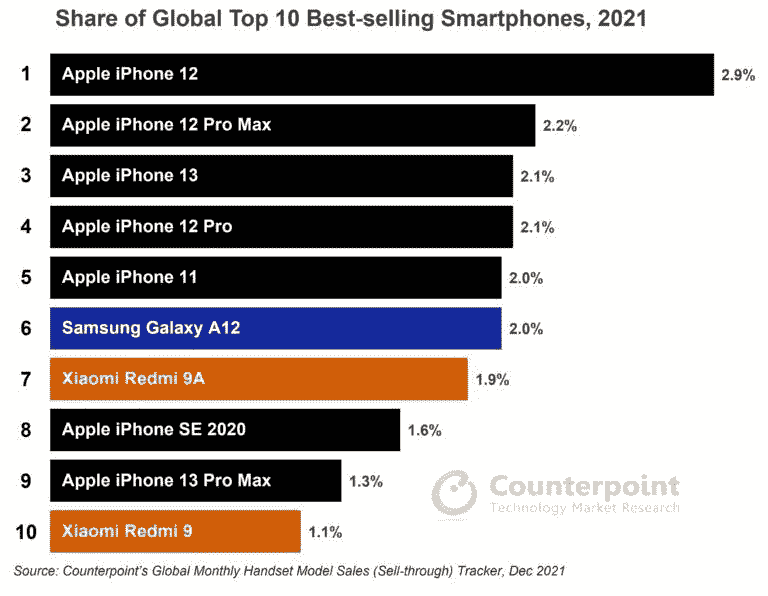

# 2021 年最畅销的智能手机:苹果占据前五名，Galaxy A12 是最畅销的安卓系统

> 原文：<https://www.xda-developers.com/best-selling-smartphones-2021-apple-galaxy-a12/>

根据 Counterpoint 最新的全球月度手机型号销售跟踪器，2021 年最畅销的十款智能手机中有七款是苹果制造的。在三款入围的安卓智能手机中，两款来自小米，一款来自三星。

iPhone 12、iPhone 12 Pro Max、 [iPhone 13](https://www.xda-developers.com/iphone-13/) 、iPhone 12 Pro 和 iPhone 11 占据了 Counterpoint 榜单的前五名，前三名机型占苹果总销量的 41%。三星的 Galaxy A12 总体排名第六，是去年最畅销的安卓手机。小米的红米 9A 排名第七，而普通的红米 9 排名第十。这些红米 9 系列设备占小米去年总销量的 22%。价格适中的 iPhone SE 2020 和旗舰产品 [iPhone 13 Pro Max](https://www.xda-developers.com/iphone-13-pro-max/) 也榜上有名，分别位列第八和第九。

 <picture></picture> 

(Credit: Counterpoint)

总体而言，2021 年 iPhones 占全球智能手机销量的 14.2%，而前三大安卓设备总共仅占 5%。虽然这可能会让 Android OEMs 厂商看起来很难跟上苹果的步伐，但事实可能并非如此。由于 Android OEMs 厂商提供的 SKU 数量要多得多，他们的销售数字在更大的产品组合中被稀释了。这使得 Android 手机很难在最畅销的智能手机名单上占据一席之地，这使得 Galaxy A12、Redmi 9A 和 Redmi 9 所取得的成就更加令人印象深刻。

该报告进一步补充说，几乎所有地区和国家全年都对 Galaxy A12 表现出强劲的需求。北美、拉丁美洲和西欧是其主要市场。另一方面，小米的红米 9A 和红米 9 在中国、印度和亚太地区占据主导地位。

根据我们目前看到的智能手机发布情况，你认为哪些手机会在明年最畅销的智能手机名单中占据一席之地？请在下面的评论区告诉我们。

* * *

**来源:** [对位](https://www.counterpointresearch.com/global-top-10-smartphones-2021/)