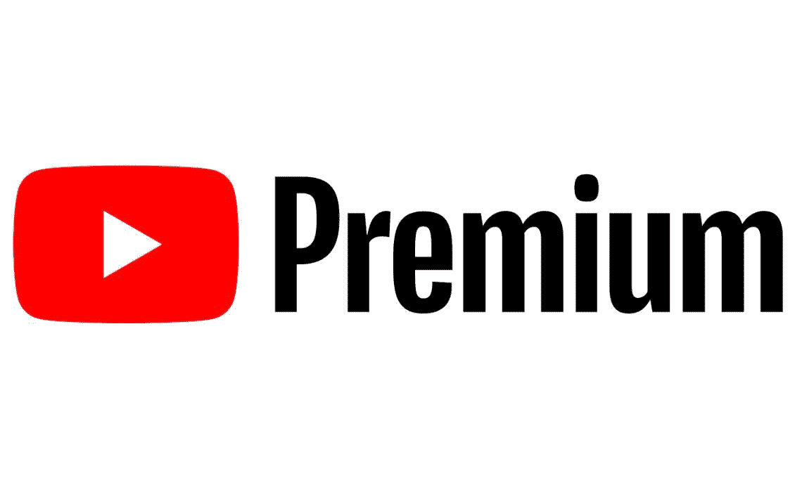

# 最佳 YouTube 高级替代品:NewPipe，SkyTube，LibreTube 等等！

> 原文：<https://www.xda-developers.com/best-youtube-vanced-alternatives/>

YouTube 是一个我们都知道并喜爱的平台。但它不一定能提供您想要的所有开箱即用的功能。尽管支付了 YouTube Premium 订阅费，我们中的许多人还是习惯于使用[advanced](https://www.xda-developers.com/youtube-vanced-apk/)来获得它提供的额外功能。虽然如今广告是任何在线服务的重要组成部分，但像 Vanced 这样的替代产品提供的不仅仅是广告屏蔽。它们提供了一些功能，如更精细的视频播放选项、设备欺骗(这有助于绕过限制)、恢复 YouTube 不喜欢按钮、SponsorBlock 等。更棒的是能够在华为设备上登录并观看 YouTube，这是你只能在浏览器中才能做到的事情。但 Vanced 的最新进展将迫使人们寻找替代方案，我们在此提供帮助。

**浏览这篇文章:**

## 万斯德怎么了？

在团队收到谷歌的停止令后，Vanced 被其开发人员下线。消息传出后不久，我们联系了该团队 Discord 服务器上的一名管理员，我们被告知他们被指示不要使用 YouTube 的名称和分发违反 YouTube 服务条款的包。该团队证实这是合法的，别无选择，只能关闭 Vanced 的下载链接。

现在，你不能再从 Vanced 网站下载 Vanced 管理器了。不过，如果你已经安装了高级管理器，你可以下载并安装 YouTube 高级管理器、高级音乐管理器和高级微博客管理器。

目前，YouTube Vanced 的当前版本将继续工作，因为它们基于 YouTube 应用程序的相对较新的版本。然而，随着谷歌对 YouTube 平台的改变，随着时间的推移，一些方面可能会出现问题，直到最终谷歌要求用户更新到新版本。因此，虽然你还可以继续使用该应用程序一段时间，但在未来的某个时间点，你最终会需要回到官方的 YouTube 应用程序，或者寻找先进的替代品作为替代。

* * *

## 最佳高级替代品

由于 Vanced 的所有优势，我们整理了一份最佳替代方案清单，以便您在 Vanced 停止工作时做好准备。这些是一些最好的选择，具有你所知道和喜爱的所有特性，这样你就不会错过。它们不太可能是完美的高级替代品，但肯定会非常接近。

### 购买 YouTube 高级版

老实说，这类应用的问题在于，它们将永远在玩一场猫捉老鼠的游戏。如果谷歌真的在追求 YouTube 的替代品，那么这些应用程序被一个个砍掉是迟早的事。切入正题，为 YouTube Premium 付费，你将获得这里提供的 90%的功能，并且你将获得支持你最喜欢的创作者的额外好处。如果你以前在 Vanced 上看视频，并且没有订阅 YouTube Premium，那么创作者从你的观点中赚不到钱。使用 YouTube Premium，您将获得您错过的大多数功能，并且您可以为您最喜爱的内容创建者打开灯和暖气。听起来像是双赢，对吧？

如果你已经决定付费，你可以每月 11.99 美元开始订阅 YouTube Premium，但你可以选择年度计划、学生计划或家庭计划，这样费用会更低。

 <picture></picture> 

YouTube Premium

##### YouTube 高级版

YouTube Premium 拥有 Vanced 的功能，同时还能支持你最喜欢的创作者。

### 新管道

NewPipe 是一个经典的替代产品，它比 Vanced 存在的时间更长。它是完全免费和开源的，同时提供后台播放、画中画、视频下载等功能。它不断更新新的特性，开发者非常注重隐私。这样做的一个缺点是，你无法在 NewPipe 中登录你的 YouTube 帐户，但这确实意味着没有广告，而且它可以在没有谷歌应用程序的设备上运行。如果你愿意，你也可以将手机上普通 YouTube 应用程序中的视频分享到 NewPipe 进行播放。

如果你感兴趣，也有一个新管道的分支，它被维护并集成了 SponsorBlock，尽管官方的新管道版本没有利用它，因为新管道开发者认为赞助是比跟踪广告更道德的广告形式。你可以从 F-Droid 或者[团队的网站](https://newpipe.net/)下载 NewPipe，[可以从 GitHub](https://github.com/polymorphicshade/NewPipe) 下载 SponsorBlock 变种。

https://f-droid.org/en/packages/org.schabi.newpipe/

### 天穹网

SkyTube 很有趣，因为它有两种变体。一个是“SkyTube Extra ”,它打包了封闭的库，并支持官方的 YouTube 播放器和演员。另一个是在 F-Droid 上发布的完全开源的变体，尽管它的更新速度较慢(该团队称一次更新需要五天)，而且显然缺乏那些额外的功能。

然而，无论你选择哪一个，你都会得到视频下载、背景回放、视频屏蔽、无广告等等。F-Droid 上也有 SkyTube，不过你需要从团队自己的网站下载 SkyTube Extra。

https://f-droid.org/en/packages/free.rm.skytube.oss/

### LibreTube

LibreTube 是一个有趣的 YouTube 应用程序，因为它目前处于测试阶段，它显示。然而，它仍然有一些重要的特性，可能会吸引你去尝试一下。LibreTube 最有趣的一点是，它使用管道，所以你永远不会直接连接到谷歌的服务器。在你和谷歌之间有一个服务器(LibreTube 让你从中选择)。如果你想订阅频道，你可以在那个服务器上注册一个账户，但你没有订阅任何谷歌附属服务。

你可以在你的浏览器中正常查看 LibreTube 使用的默认管道前端。Piped 的主要目标是在桌面上使用，但这是一个很酷的概念验证，看看它如何能够形成移动 YouTube 客户端的替代基础。 [LibreTube 目前仅在 GitHub 上可用](https://github.com/libre-tube/LibreTube/releases)。

如果你不想使用上述任何应用程序，你可以随时使用浏览器如奇异果浏览器来安装扩展和创建自己的 YouTube 体验。Kiwi Browser 是一款基于 Chromium 的浏览器，由 XDA 资深会员 arnaud42 开发，支持桌面扩展。你可以在 Chrome 扩展商店上找到一系列与 YouTube 相关的扩展，它们都可以在 Kiwi 上安装。我在一个 Kiwi 浏览器实例中设置了 SponsorBlock、Return YouTube Dislike、uBlock Origin 和 YouTube Enhancer，效果出奇地好。它并不完美(你确实需要在浏览器的桌面模式下使用 YouTube 才能工作)，但是一旦设置好了，就没有问题了。

至于用 Kiwi Browser 你会得到什么，你可以观看高清视频，没有广告(也没有赞助部分)，你会得到一个不喜欢的按钮。此外，你可以像往常一样登录 YouTube，获得更接近桌面的体验。这有点烦人，不像在 NewPipe 中那样容易将视频分享到 Kiwi 浏览器，也没有画中画播放器，但它很有效。更好的是，Kiwi Browser 本身就是一个很棒的浏览器，你也可以在手机上找到其他的扩展功能。

如果你除了广告屏蔽什么都不在乎，你也可以从内置的附加商店在 Firefox 中安装 uBlock Origin，然后在移动网站上导航。

### 好老 Adblock

如果你关心的只是屏蔽广告，那么你绝对应该看看我们的指南[如何在 Android](https://www.xda-developers.com/block-ads-on-android/) 上屏蔽广告，无论是有根用户还是没有根用户。它远不如上述解决方案有效(可能需要你在网络浏览器中观看 YouTube)，但它的设置和维护也很快很容易，并且适用于更广泛的用例，而不仅仅是 YouTube。

* * *

## 一场不可能赢的猫捉老鼠的游戏

事情是这样的:当这是他们的猫捉老鼠游戏时，谷歌总是会赢。任何违反 YouTube ToS 的人都可以被命令停止和终止他们的行为，这正是发生在 Vanced 身上的事情。只有时间能告诉我们谷歌是否打算追求这些其他可行的选择。

不过有一件事是肯定的。当处理像上面这样的开源项目时，如果一个失败了，就会有十个出现在它的位置上。