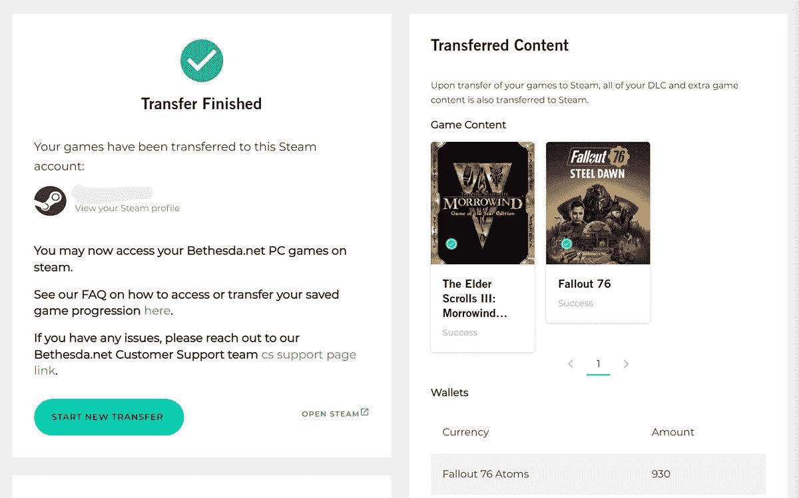

# Bethesda Launcher 现在可以将您的游戏传输到 Steam

> 原文：<https://www.xda-developers.com/bethesda-launcher-steam-transfer/>

像大多数主要游戏发行商一样，Bethesda Softworks(及其母公司 ZeniMax Media)创建了一个 PC 游戏启动器，无需 Steam 即可下载和安装其游戏。然而，该应用程序从未受到玩家的欢迎，在 Bethesda 被微软收购后，该启动器将停止使用。现在，任何在 Bethesda Launcher 中购买或兑换游戏的人都可以将它们转移到 Steam。

Bethesda 今年早些时候宣布，它将在 5 月 11 日停止 Bethesda Launcher，因此游戏将不再可玩，但游戏库仍将被存储，以转移到另一个服务。该公司仍在开发一个转移工具，最终上线。任何拥有 Bethesda.net 账户的人都可以前往[转移库页面](https://bethesda.net/en/account/transfer-library)开始这个过程，首先需要连接一个 Steam 账户。

转移工具将你的游戏库转移到 Steam，游戏内的购买(像*辐射 76* 中的原子)也被复制。为了准备传送工具，Bethesda 还在 Steam 上发布了以前只在 Bethesda Launcher 上提供的游戏:*上古卷轴竞技场，上古卷轴 Daggerfall，辐射 4 和 Skyrim 特别版的创作工具包*，以及 *Wolfenstein:敌方领地*。

 <picture></picture> 

My Bethesda.net account game transfer

然而，转移游戏并不完全是一个无缝的过程。如果你的游戏在本地存储了保存文件，你必须在之后将保存文件移动到 Steam 文件夹。如果你需要的话，Bethesda 有一篇[支持文章](https://help.bethesda.net/#en/answer/55036)，里面有移动保存文件的详细说明。

我刚刚亲自尝试了转移过程，尽管实际转移在几秒钟内完成(我购买的唯一游戏是*辐射 76* )，但当我第一次尝试连接我的 Steam 帐户时，我确实出现了错误。在我的 Gmail 档案中快速搜索后，我发现我几年前创建了一个不同的 Bethesda.net 账户，它仍然与我的 Steam 账户关联。Steam 没有撤销第三方授权的简单方法，所以我不得不在我的旧 Bethesda 帐户上重置密码，登录，从 Steam 中取消链接，然后注销，并将我的当前帐户链接到 Steam。

**来源:** [贝塞斯达](https://bethesda.net/en/article/2RXxG1y000NWupPalzLblG/sunsetting-the-bethesda-net-launcher-and-migrating-to-steam)