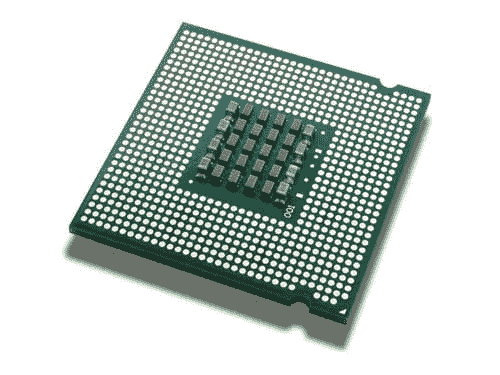

# 从源代码构建 Android 时的最大瓶颈

> 原文：<https://www.xda-developers.com/biggest-bottlenecks-building-android-from-source/>

**更新 4/19 12 pm CT** :澄清构建时间是 ccache 构建时间。**CT 时间 4 月 20 日上午 9:17 更新:**建造 3 肯定不是 RAID 1。纠正了那个错误。

2012 年，我开始构建内核——并依赖我可信赖的 Core 2 Quad Q9550 来构建它。如果这还不值得大惊小怪的话，那么我在 Windows 内部的虚拟机上做这件事的事实可能会确保对于大多数从源代码构建 Android 的人来说。

虚拟化的 Ubuntu 环境的性能不如本地环境，哦，当一个内核花了 2 个多小时来构建时，这是多么痛苦啊。当我想在第二年开始从源代码构建 Android 时，我知道我目前的硬件无法满足我的要求——于是开始了一个漫长而持续的旅程，寻找一种方法来缩短不断增长的构建时间。

从那以后的几年里，我有幸在多种外形和平台上进行测试。这一点很重要，因为 Android 的构建配置并不是一刀切的。应用程序开发人员可能不需要与游戏开发人员相同的配置。只构建内核的人可能不需要像需要在很短的时间内从源代码构建完整的 Android ROM 的人那样花费很多。那么操作系统选择呢——现在哪些可以(哪些不可以)使用？我也希望进一步探索这一点，特别是与 Windows 和 Canonical 合作，为 Windows 10 带来一个成熟的 Bash。

为了让这个系列有个好的开始，我们必须从源代码中找到构建 AOSP 项目的最大潜在瓶颈在哪里。在不知道把钱投到哪里的情况下，我们不会经常去购买电脑或升级。因此，基于 3 年的研究和可量化的结果，我准备分享我的发现。现在，预期的免责声明:这些发现是基于个人经验，不可能在所有的组合因素。那些有自己构建配置的人，请告诉我们你的构建进展如何！时间也指启用并填充 ccache 的构建——当 ccache 还没有被填充时，时间通常是两倍。

 **磁盘 I/O:我必须向 Cyanogen 的汤姆·马绍尔致敬——他也是康团队的[成员——去年为我指出了这个方向。当他告诉我这将是 CPU 的瓶颈*时，我真的不相信他。但在过去的 6 个月里，我已经能够用可量化的数据来支持这一点。在高端 CPU(如大多数台式机英特尔酷睿 i7 型号)中，这是您的系统将遇到的最大瓶颈。*](http://aokp.co/team)

让我们来看看我已经测试过的 4 种构建配置。我将在这里突出显示 CPU，

*   Build 1 是我的“未升级”电脑，是一台英特尔 i7-4790K，32GB DDR 3-2400 RAM，一台三星 840 Evo 250GB 主驱动器和一台旧的 Micron P400E 100GB。
*   版本 2，是版本 1 的升级版本。现在配备了超频到 4.0 GHz 的英特尔 i7-5960X、32GB 的 DDR4-3200 内存、三星 SM951 512GB AHCI m.2 固态硬盘以及之前的两个固态硬盘。PCPartPicker 上有完整的版本规格。
*   Build 3 是最近的用户版本，采用了超频到 4.2 GHz 的英特尔 i7-5820K，16GB 的 DDR4-2400 和 2 个 RAID0(条带)配置的三星 840 EVO 120GB。
*   Build 4 是最近的服务器版本，采用正常速度的英特尔至强 E3-1270 v5、32 GB DDR4-2133、三星 950 Pro 512GB NVMe m.2 以及 RAID5 阵列中的 4 个 SATA 三星企业固态硬盘。

如果您只看这些，您认为哪一个实现了最短的构建时间？第二个呢？令我震惊的是，不是第二种配置花费了最少的构建时间，而是第三种配置，构建 CyanogenMod 13.0 仅用了不到 14 分钟。所以占主导地位的 CPU 肯定会屈居第二，对吗？又错了。我刚刚完成测试的 Build 4 用了 25 分钟多一点！只有这里是我当前构建的位置，比具有一半内核和线程但具有 3 个 SSD 的 SSD 阵列的系统慢 2 分钟，而我的 SSD 是独立的。众所周知，如果温度过高，SM951 也会出现节流问题，这在这种情况下可能是一个非常现实的因素。第一次也是最慢的一次构建花了大约 30 分钟，这是我唯一一次构建 CM 13.0 我在 27 中听说过类似的建造配置。

固态硬盘过去也很难买到，所以这个话题很少有人讨论。然而，去年零售和二手市场的价格都大幅下降。现在 120GB 固态硬盘的价格不到 50 美元，不再是以前在系统中添加固态硬盘的障碍。传统硬盘也可以完成这项工作，但如果不使用固态硬盘，用户更有可能在其他人之前达到这一瓶颈。

****CPU:当我在上面提到最大的瓶颈是磁盘 I/O 时，它确实是在一个假设中，这个假设可能并不总是如此——我使用的每一个版本都采用了英特尔酷睿 i7。但正如我在至强服务器上发现的那样，在最繁重的构建过程中，磁盘可以保持所有 8 个 CPU 线程的高利用率。尽我所能，如果没有我们在上面发现的 RAID 阵列，我发现我的 Haswell-E 在大部分构建过程中都没有得到充分利用。因此，如果您正在寻找性价比最高的产品，请考虑英特尔 i7-5820K。

没错，它是 X99，所以主板可能比 Z97 主板更贵；但我们仍处于 X99 周期的第一年。Broadwell-E 的价格预计在发布时也将与 Haswell-E 类似，这意味着您应该能够以与 i7-4790K 或 i7-6700K 几乎相同的价格购买发烧友产品。

在英特尔上，目前没有太多理由超越 5820K，因为你可以用它获得令人印象深刻的构建时间。在大多数情况下，内核/线程数越高，处理器速度越快，构建时间就越短。去年，一台千兆字节白利糖度的 i7-4770R 平均花费了我 42 分钟。虽然不是最快的，但它确实符合我的需求，并允许我拥有一个专用的低功耗配置。你会发现 AMD APUs 也是如此——虽然它们目前的性能可能不如英特尔的同类产品，但它们可以轻松完成工作，而且价格通常低于购买英特尔的价格。这是一个我密切关注的情况，因为如果谣言是真的，那么基于 Zen 的 APUs 可能会大大缩小这个差距。

对于那些选择消除这些瓶颈的人来说，有一个结果，这个结果更适用于家庭用户而不是办公室用户。通过消除这些瓶颈，系统的总体性能将会提高。尤其是游戏玩家会发现，通过升级来解决这些瓶颈，几乎在所有情况下都会提高游戏性能。虽然它可能没有赢得最快的构建时间，但第二个构建给了一个意想不到的惊喜——*上 30 秒的加载时间仅仅导致了 3* ,而许多其他人都在抱怨加载时间只有几分钟。最后，这些构建时间确实是高端的，对许多人来说可能是多余的...但至少现在，更多的内核意味着更快的构建速度的争论终于平息了。

由于这只是一个开始，我们希望读者能参与进来，分享他们在各种配置上的构建经验。作为读者，你想看到更多关于这类话题的讨论吗？请在下面的评论中发表意见！**