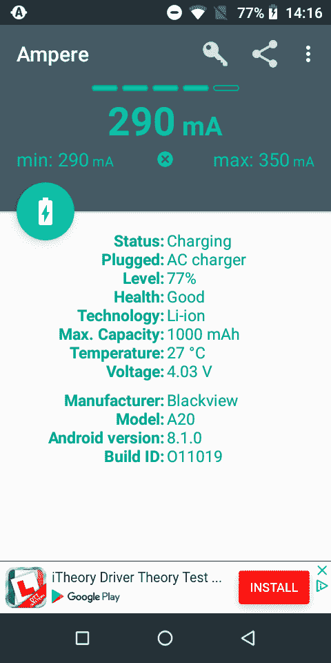

# Blackview A20 评论-首批 Android Go 手机之一

> 原文：<https://www.xda-developers.com/blackview-a20-review-android-go/>

对于那些不熟悉的人来说， [Android Go](https://www.xda-developers.com/developers-exclude-android-go-oreo-downloading-apps/) 是谷歌的精简版 Android，旨在运行在低端硬件上。它经过优化，理想情况下运行在大约 1GB 的 RAM 上，但也可以更低或更高。它是为下一代入门级设备开发的，因此发展中国家的用户仍然可以购买负担得起的智能手机，可以满足用户的一切需求。Blackview A20 是一款基于 Android Go 的智能手机。我们将主要关注软件体验，[因为所有的变化都在那里](https://www.xda-developers.com/android-go-old-android-8-1-oreo/)。

Blackview A20 是一款你可以从许多卖家那里进口的手机，包括[全球速卖通](https://www.aliexpress.com/item/2018-Blackview-A20-18-9-5-5/32862694628.html)、 [GearBest](https://www.gearbest.com/cell-phones/pp_1821492.html) 、BangGood、igogo 和 [more](http://www.blackview.hk/global-agents/) 。凭借 1GB 的内存和 1.3GHz 的 MT6580M 芯片，它不是最强大的设备。不仅如此，它还配备了 480x960 的显示屏和 18:9 的宽高比**和 8GB 的板载存储。你不能指望在这款手机上做大量的事情，但它绝对可以做比规格建议更多的事情，这要感谢板上极其优化的软件。起初我很惊讶，没想到这次经历会如此顺利。有一些问题，但无论如何我的期望很低。这款手机售价约 50 美元，所以你不应该期待旗舰级别的体验。你可以看看下面的完整规格。**

| 

规范

 | 

黑景 A320

 |
| --- | --- |
| 中央处理器 | 联发科 MT6580M @ 1.3GHz 四核 |
| 随机存取存储 | 1GB LPDDR3 |
| 摄像机 | 200 万像素前置摄像头和 500 万像素+0.3 万像素双后置摄像头 |
| 储存；储备 | 8GB eMMC 和高达 32GB 的可扩展内存插槽 |
| 显示 | 5.5 英寸 960x480 18:9 宽高比 |
| 电池 | 3000 毫安时 |
| 旗帜 | 黑色、蓝色、金色 |
| 其他功能 | 双混合卡，170g，双后置摄像头 |

*免责声明:Blackview 将这款设备送给 XDA 用于审查目的。本文中的观点是我们自己的。*

* * *

## A20 美景镇的设计和建造质量

首先，设备的设计。你会注意到的第一件事是它相当笨重，厚约 1.5 厘米。该设备的正面也让我想起了 Nexus 5，这是一种已经有近 7 年历史的设计语言。这并不是说这是一件坏事，但它确实给了我一个来自过去的冲击。该设备的背面是一种青铜色的灰色塑料，并带有便于抓握的纹理。这让人想起了三星 Galaxy Nexus，这款设备甚至比 Nexus 5 还要老。附带的扬声器格栅也在设备的背面，左下角的一个小正方形。

这并不是说 Blackview A20 的设计很差，它只是不同而已。同样奇怪的是，充电端口和耳机插孔都在顶部，尽管我很快就习惯了。两个都很结实。另一个设计怪癖涉及双摄像头设置，这是一个相当普通的配置。音量摇杆和电源按钮也都在设备的右侧。它们使用起来很舒服，而且它们的定位非常完美。背面也是 Blackview 名称和 FCC 法规信息。

就制造质量而言，你对一部 50 美元的手机没什么要求。塑料摸起来又硬又便宜，尽管侧面的按钮触感很好，用起来感觉很好。我绝对不会说这款设备有高级感。虽然这并不可怕，但这是你所期望的。就振动马达而言，它非常普通。它完成了工作，但它是一个振动马达，你只会听到而不会感觉到。

有趣的是，Blackview 的每个设备都包括一个外壳和一个屏幕保护器。这不完全是最高质量的案例，但总比没有好。屏幕保护器也非常受欢迎，可以承受大多数刮擦的冲击。它们对整体价格来说绝对不差，而且对大多数用户来说也能胜任。这款设备感觉很容易划伤。

至于显示，当然有很多要说的。通常，我们知道展示时会发生什么，但评论者很少深入探讨。“它很漂亮”、“它很锋利”、“它很好用”，所有这些流行词你都会在任何现代手机的显示屏上听到。这是因为所有显示器基本都一样，很难找到质量差的。Blackview A20 显示器很差，不仅仅是因为它是每英寸 195 像素的 480p。有一个非常非常明显的触摸延迟，多点触摸是糟糕的。这是来自一个从未注意到 OnePlus 3 所谓的触摸延迟的人。有那么糟糕。当运行“测试我的 Android”时，我发现多点触控正在识别我手指不在的地方，当试图用多个手指捏缩放或做其他任何事情时，延迟变得更加明显。

显示屏也使快速打字变得困难，因为由于触摸延迟，它无法记录快速点击。它还需要相当大的力量才能操作，需要你的手指或拇指比大多数人习惯在显示器上使用它的力度大得多。

这还没有考虑到屏幕本身的外观。Blackview A20 的显示屏是 480p，但是颜色很淡，而且褪色了。这不仅仅是因为像素数量少，而是因为显示器的质量。如果你想知道 Blackview 在这款设备上哪里偷工减料，让它变得如此便宜，这肯定是其中之一。触摸屏完全破坏了这种体验，这足以促使我花一点额外的钱去买更好的东西。同样值得注意的是，开发者选项有能力打开 sRGB 模式，但它什么也不做。这个展示和其他的不一样，那是因为它太差了。这里没有任何流行语可以用任何身份来赎回它。

构建质量大约是你对廉价智能手机的期望，但屏幕远远低于这一水平。

## Blackview A20 上的软件和用户界面

这款设备的一大亮点就是软件。Blackview A20 由完全库存的 Android Go 驱动。Android Go 是谷歌优化的软件，为了方便像这样的低 RAM 设备，做了一些修改。可用的定制选项数量有限，并且预装了 Android Go stock 启动器。我认为自己是一个 Android 纯粹主义者，所以在我的手机上拥有基本上是 AOSP 的东西是一个非常好的体验。

Blackview A20 基于现有的 Android 运行 Android Go。

同样重要的是，它运行的是库存 Android。对于这样的设备，您希望尽可能少地妨碍您和性能。该软件运行良好，有时你不会知道你使用的是一个较弱的设备——当然，只要你使用的是应用程序的 Go 版本。

那是另一回事。Android Go 不仅仅是一系列系统范围的优化，它还是一个自己的生态系统。应用程序必须有 Go 或 Lite 版本以确保兼容性，否则，试图使用太多内存的应用程序可能会崩溃。谷歌已经预装了一些应用程序。其中包括助手(以 Go 形式)、Gmail Go、谷歌 Go、[谷歌地图 Go、](https://www.xda-developers.com/google-maps-go/)和 [YouTube Go](https://www.xda-developers.com/youtube-go-available-130-countries-worldwide/) 。有趣的是，这些应用程序不仅关注性能，还关注数据使用情况。试图在 YouTube 上播放视频总是会得到一个关于你将使用多少数据的警告，而谷歌 play 商店甚至在点击之前就已经清楚地标注了每个应用程序的文件大小。这需要一点时间来适应，但我觉得在常规 Android 上启用这些功能可能也不是一个坏主意。

在 Android Go 上，文件大小随处可见，至少在谷歌开发的应用程序中是如此。

至于精简应用程序，我想我会选择很多人认为最差的——脸书。我安装了脸书精简版和 Facebook Messenger 精简版，令我惊讶的是，这款设备处理它们时没有任何问题。显然，它们是为在这样的手机上运行而设计的，但尽管如此，这仍然令人惊讶。我预料会更糟。

用户界面也正是你所期望的普通 Android。唯一困扰我的是最近和返回按钮的切换，我似乎不知道如何修复。我不相信有面向用户的设置，所以你需要习惯它。

我发现的另一个问题可能不会影响大多数用户，但鉴于可能的影响，我必须指出这一点。我很好奇这个设备是否通过了安全网，令我惊讶的是，它没有。尽管有效负载已发送和接收，但 CTS 配置文件不匹配。这意味着尽管 Android Go 支持 SafetyNet，但这里有些地方出了问题。要么它不打算支持它，要么 Blackview 在为该设备开发时犯了一个错误。这没什么大不了的，没有 NFC 芯片就意味着没有 Google Pay，你也不会在这部手机上使用 Snapchat 或玩 Pokemon Go。

股票 Android 更好的是，绝对没有任何东西妨碍性能，没有 OEM 皮肤妨碍和导致性能问题。连相机发射都快！相机本身并没有太多值得大书特书的地方，但我们稍后会更深入地讨论这一点。这款设备能够很好地发挥其应有的功能，甚至能够更好地完成其需要完成的任务，在软件方面，你别无所求。

## A20 美景镇的表演

重要的是要认识到，我们正在测试的设备是一款基于 Android Go 的手机，采用低端联发科处理器。**这不是旗舰设备**。它的设计目的并不是为了表现出色，而是为了执行日常用户需要完成的任务。尽管如此，Android Go 的目标是尽可能优化并尽可能提高硬件的性能，因此我们将 Blackview A20 置于振铃器下，看看它与 OnePlus 3 相比表现如何。一个老设备，但一个许多人仍然作为一个稳定的日常驱动程序使用。

首先，我们需要理解如何解释数据。我们通过使用转储到 adb 的 GPU 分析数据来获取这些图表，然后我们绘制了这些图表。您可以通过下图了解如何查看这些图表。上图中的绿线代表 60 FPS。

现在你可以理解图表，我们需要分析数据。正如你所见，Blackview A20 并不完美，但 OnePlus 3 也不完美。OnePlus 3 显然更稳定，可以更长时间地保持在 60 FPS 以上，但这两款设备都在三个不同的情况下丢帧，这是因为 **touchboost** 。什么是 touchboost？当你点击屏幕时，设备中的 CPU 会加速，因为它希望你做一些需要处理能力的事情。然而，如果你点击时立即滚动，处理器就不能足够快地加速，一些帧就会丢失。这就是为什么有三个单独的尖峰，因为有三个单独的输入。除了第三个输入，Blackview A20 似乎是一个非常好的设备。这当然令人印象深刻，但对于其他应用程序，我们能说些什么呢？我们试图将 Go 应用程序与其正常变体进行比较，但遗憾的是无法进行比较，因为没有一个 Go 应用程序的变体能够正确地转储帧信息。不过我们可以肯定的是，Go 版本的应用程序比它们的完整版本运行得好得多。我们将在另一篇文章中比较 Android Go 版本的应用程序和完全成熟的应用程序，请继续关注。

在性能方面，我们还希望了解 Android Go 带来的变化对应用程序打开时间的影响。显然，低端硬件也会导致更长的加载时间，但我们将该设备与 OnePlus 3 进行了测试，看看我们能发现什么。

不出所料，A20 的情况并不太好。漫长的加载时间意味着 YouTube 平均需要 6 秒钟来启动应用程序。相比之下，OnePlus 3 只花了 2 秒钟。诚然，这是 UFS 2.1 对 EMMC，所以 OnePlus 3 在这里获胜并不令人惊讶。有趣的是温度，因为 OnePlus 3 在整个测试过程中保持了更低的温度。尽管看起来很糟糕，但测试结果并没有说明 A20 有什么可怕的。这是一款经济型设备，启动 Gmail 或谷歌 Play 商店不会花太多时间。与旧旗舰相比，启动应用程序需要更长的时间，这是有道理的，所以这不是什么大问题。我们真的只是将 OnePlus 3 用作基线测量。这些并不意味着实际的比较。很明显，OnePlus 3 在各个方面都是更好的设备。

Blackview A20 肯定不是市场上最快的手机，但它做了很多事情。得益于 Go 优化应用，您可以获得实用的设备体验，同时保持领先预算设备的一小部分成本。它不是最快的，而且你确实需要使用精简的应用程序，但是你在大多数方面都会得到相同的体验。我在这里没有任何抱怨，它做了它应该做得非常好的事情。Android Go 并不是为了以低成本为你提供旗舰级的性能，而是为了让那些生活在发展中国家但仍然需要智能手机的人能够负担得起。从根本上说，抱怨一款手机的性能差，公平吗？客观来看，它的性能很差，但作为一款售价 50 美元的 Android Go 手机，它是一款非常出色的设备。它做了很多事情。当唤醒设备或在应用程序之间切换时，你会遇到一些延迟，但它肯定会像手机一样工作。一旦应用程序运行，它就会保持一致，并且在我们的谷歌 Play 商店测试中表现良好。

值得注意的一点是，该设备从不热节流。它的功耗足够低，几乎不会产生热量，因此在整个电池寿命期间保持稳定的性能。明明不是真的故意的，但还是挺好听的。

## Blackview A20 的电池寿命

这是一个你期望该设备大放异彩的类别，而且就其优点而言，它确实大放异彩。凭借低功耗处理器、低分辨率屏幕和 3000 毫安时电池，Blackview A20 实现了您通常不会看到的超长电池寿命。显然，这是以性能为代价的，但我们已经确定，这是您对如此低的价格的期望。这种电池可以支持你完成一天的任何任务。待机时间是惊人的，预计这款设备一整天实际使用几个小时。电池的统计数据对我来说有点坏了。我无法查看最初的详细分解，它说屏幕时间是“0 分钟”，但很明显，它有一个体面的电池寿命。

至于充电次数，极其慢。充电端口是 1A，所以你可以期待看到充电时间从 0%到 100%约 2 个半小时。时间很长，但它的电池寿命更长。如果没有其他原因，你真的不需要整天给这款手机充电，因为这款手机不是为长时间使用而设计的。Blackview A20 是一款具有基本功能的普通手机。

 <picture></picture> 

Charge times are pretty slow. Note that the "Max. Capacity" listed is incorrect.

总的来说，这款设备在电池部门是一个胜利。当我第一次收到这款设备时，我对它的电池容量感到惊讶，我想如果他们想让它与现在的其他设备保持一致，他们可能会稍微降低电池容量，并与一些最好的设备保持一致。不过，我当然不会抱怨制造商添加了过多的电池。

## Blackview A20 的图像质量

你不能指望这么低规格的手机有多高的图像和视频质量，你完全正确。奇怪的是，双摄像头设置在背面，尽管我不太确定这种情况下对图片质量有什么影响。照片是像素化的，模糊不清，几乎没有任何细节。可以这么说，这不是你的下一部拍照手机。你也不应该为相机买它，它只是一个额外的东西，如果你在附近没有其他选择的话，它会被使用。

正如你所看到的，这里真的没有太多的相机。它没有提供大量的质量。光线充足的场景是相机的“强项”。当光线较暗时，所有的细节都会立即消失。你买这部手机不是为了拍照，它绝对适合拍摄能捕捉家人和朋友简单瞬间的基本镜头。

麦克风，它的优点是好的，人们在电话的另一端听到我没有任何问题。Blackview 当然确保了作为一部手机，这款设备能够完美运行。你可以毫无困难地发送和接收短信和电话，以及使用 WhatsApp 等第三方服务。音质清晰，这就是你对话筒的全部要求。

## 多方面的

### 连通性

Blackview A20 将自己定位为手机，智能手机功能次之。因此，它作为一部手机来说绝对完美，但作为智能手机来说就没那么好了。我在平时的通勤中发现，我的信号强度与我的 OnePlus 3 差不多，似乎没有误报信号强度的问题。它不支持 4G，但我在获得稳定的 3G 连接方面没有问题。作为一部手机，绝对没有任何问题，你将能够在你所期望的任何地方保持稳定的连接。它不会受到任何方式的信号强度差，这是一个主要的优势。

### 声音的

虽然我的耳机插孔似乎有硬件问题，但我仍然可以按下插孔以正常的最大音量听音乐。插孔有点安静，感觉不如其他设备质量高，但考虑到成本低，这是可以预料的。这款设备非常适合作为经济型 mp3 播放器，因为我发现 Spotify 应用程序在它上面运行得很好。

至于扬声器，它很小，显然是为了有一个扬声器而存在的。它可以用来看视频，但你不会在这部手机上通过扬声器听很多音乐或任何东西。

## 结论——black view A20 是一款好的 Android Go 手机吗？

这个问题的答案取决于你对 Android 未来的看法。Android Go 是一种以更低成本将智能设备带到发展中国家的方式，公平地说，Blackview A20 公司做得很好。这是一部能够访问你的电子邮件、YouTube 和一些简单应用程序的手机，其他功能次之。触摸屏让它用起来真的很痛苦，但 50 美元的价格肯定会有所削减。它将为你提供一部普通手机所需的一切，你可以轻松发送短信、电子邮件和打电话。也许我降低了我的期望太多，但 Blackview A20 绝对不是一个坏手机。它实现了我认为 Android Go 试图实现的目的，这款手机在性能方面的能力可能会让你惊讶。

所以，我会推荐吗？如果你可以在小米红米 5A 这样的低端小米产品上多花一点钱，那么我强烈推荐你，但除此之外，如果你真的缺钱，那么 Blackview A20 没有什么特别的问题。对于孩子来说，这是一部很棒的第一部手机，而且由于启用了辅助功能，它对于老年人来说甚至更好。