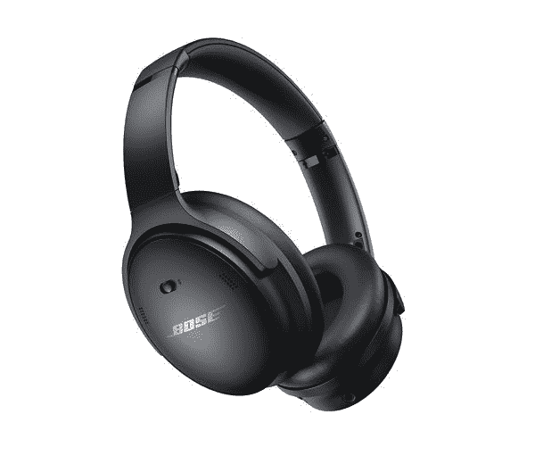

# 新款 Bose QC 45 终于来到了印度

> 原文：<https://www.xda-developers.com/bose-qc-45-india-launch/>

去年 8 月，Bose [推出了新的降噪耳机](https://www.xda-developers.com/bose-quietcomfort-45-qc45-launch/)，作为其广受欢迎的安静舒适系列的一部分 Bose QC 45。与旧款 Bose QC 35 II 相比，新款耳机提供了更好的噪音消除功能，一种称为“感知模式”的新透明模式，升级的通话性能，以及更长的电池寿命。在过去的几个月里，这款耳机已经在世界各地的市场上销售，并且最终进入了印度市场。

新款 Bose QC 45 现在可以在亚马逊上购买，介绍价为₹32,900(约 434 美元)。这款耳机有白烟色和三重黑色两种配色，你可以用信用卡购买几款耳机中的一款，以低至₹30,900 的价格买到它们。如果你一直在等待获得新的 Bose QC 45，你可以通过下面的链接立即订购。

 <picture></picture> 

Bose QuietComfort 45

##### Bose 静音舒适性 45

QuietComfort 45 是 Bose 最新的降噪耳机，比之前的型号提供了更好的 ANC 和更长的电池寿命。

如果你不熟悉 Bose QC 45，这里有一个简单的概述，以帮助您做出明智的购买。如前所述，这款耳机对 Bose QC 35 II 进行了多项重大改进。尽管新款耳机采用了熟悉的设计，但它们在内部带来了一些变化，包括更好的降噪性能(特别是在中频频率)，两种降噪模式，波束形式阵列麦克风以更好地隔离通话中的语音，以及多点配对支持。耳机还提供单次充电长达 24 小时的电池寿命，并支持快速充电，可以在短短 15 分钟内播放 3 小时。

请注意，QC 45 并不是 Bose 系列中最顶级的降噪耳机。这一荣誉属于 Bose 降噪耳机 700，这款耳机目前在亚马逊上面向₹34,500 销售。如果你的耳机预算还有一定的余地，我们建议你选择 Bose 降噪耳机 700，而不是新款 Bose QC 45。对于那些不想花超过₹30,000 的钱买一副耳机的人，我们推荐优秀的索尼 WH-1000XM4，这是目前在亚马逊上为₹24,980 提供的[。](https://www.amazon.in/Sony-WH-1000XM4-Cancelling-Headphones-Bluetooth/dp/B0863TXGM3/?tag=xdaportalin-21)