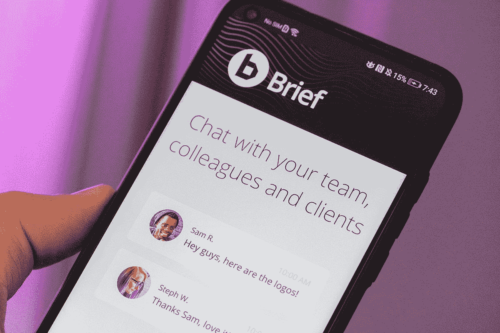

# 简洁是我们最喜欢的松弛的替代品

> 原文：<https://www.xda-developers.com/brief-app/>

管理一个大型团队的沟通有时会是一场噩梦。团队最终使用几个不同的应用程序来共享文件、聊天、视频通话和安排任务。过去有很多应用程序试图解决这个问题，并取得了不同程度的成功。Brief 的目标是成为你需要的最后一个团队生产力应用。它们将聊天、视频通话和待办事项整合在一个易于使用的用户界面中，可以在 Android、iOS、Window 和 MacOS 上运行。

在工作场所之外的许多情况下，简短也是有益的。也许你有一个大家庭、社区团体或活动。Brief 是很多人参与一个项目的理想解决方案。虽然你可能会在这些情况下使用电子邮件，但电子邮件确实过时了，而且很糟糕。当有人给你发短信时，你可以将这条信息设置为一项任务，这样你就不会忘记它。这个简短的聊天确实是为团队项目而优化的，并且内置了许多这样的工具。

使用 brief 在您和您的团队之间共享所有文件。不再需要切换到另一个应用程序(如 Drive 或 DropBox)来将项目文件发送给另一个团队成员。您可以直接在简短聊天中发送给另一个人。

 <picture></picture> 

Brief Android App

除了基本的聊天和文件共享功能，您的团队可能还需要处理视频通话。Brief 也支持群组视频通话。你可以很容易地给另一个团队成员打电话，向他们展示你正在进行的项目的状态，或者你可能只是想在谈话时看到他们的脸。

Brief 实际上是所有其他类似的生产力应用程序的最佳功能的组合。这是一个很好的方式，让你的所有团队成员只拥有一个工作应用程序，并将事情与他们的个人消息应用程序分开。使用下面的链接免费下载简介。

[**获取 iOS/Android/Windows/macOS 的简介**](https://gobrief.com/?utm_source=xda-developers&utm_medium=post&utm_campaign=p.2019-07.w28&utm_content=brief_first_review)

###### 我们感谢 Brief 赞助了这篇文章。我们的赞助商帮助我们支付与运行 XDA 相关的许多费用，包括服务器成本、全职开发人员、新闻撰稿人等等。虽然您可能会在门户内容旁边看到赞助内容(这些内容将始终被标记为赞助内容),但门户团队对这些帖子不承担任何责任。赞助内容、广告和 XDA 仓库完全由一个独立的团队管理。XDA 绝不会通过接受金钱来赞扬一家公司，或以任何方式改变我们的观点或看法，从而损害其新闻诚信。我们的意见不能被收买。