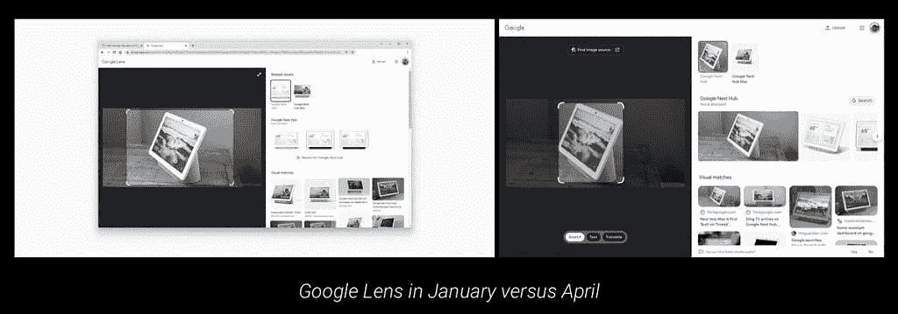

# 桌面更新版 Chrome 为谷歌镜头充电

> 原文：<https://www.xda-developers.com/chrome-desktop-supercharges-google-lens/>

Chrome 是台式电脑上最常用的网络浏览器之一。它提供了各种各样的功能和附加功能，这些功能和附加功能在它的一些竞争对手身上没有集成好(如果有的话)。从跨所有支持平台的即时数据同步，到保留上下文的页面翻译，到丰富的第三方扩展和插件库，Chrome 已经赢得了最佳网络浏览器之一的地位。一段时间以来，谷歌镜头集成已经在桌面版 Chrome 上可用。然而，它缺乏 iOS 和 Android 上可用的一些更高级的功能。最近的一次更新终于在 Chrome 的桌面客户端上增强了谷歌镜头的性能。它引入了更强大的工具——包括上下文翻译、光学字符识别(OCR)等等。

根据 *9to5Google* 的报道，macOS、Windows 和 Chrome OS 上的 Chrome 最近的一次更新引入了更先进的谷歌镜头。该出版物尚未能指出启用该功能的版本。不过，它指出，Chrome 版本 100 上的新增功能正在广泛推出。

 <picture></picture> 

Credit: *9to5Google*

新的谷歌 Chrome 镜头底部有三个按钮- *搜索*、*文本*和*翻译*。用户可以选择其中一个选项来执行相应的操作。该公司还增加了一个*查找图片来源*顶部按钮，用于在谷歌上搜索视觉上相似的照片。

使用新的 OCR 工具，用户可以选择、复制、收听照片上检测到的文本，并对其进行更多操作。另一方面，翻译的功能就像谷歌翻译移动应用程序的相机功能一样。它翻译实际照片上的文本，以帮助用户完全理解某个短语的上下文。用户也可以选择打开谷歌翻译网站上的页面。

你在台式电脑上最常用的浏览器是哪个，为什么？请在下面的评论区告诉我们。

* * *

**来源:** [*9to5Google*](https://9to5google.com/2022/04/14/google-lens-desktop-images/)