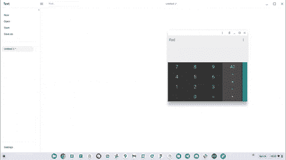

# 最新的 Chrome OS Canary 版本带来了新的窗口锁定功能

> 原文：<https://www.xda-developers.com/chrome-os-canary-window-pinning-feature/>

# 最新的 Chrome OS Canary 版本带来了新的窗口锁定功能

最新的 Chrome OS Canary 版本包括一个新的实验性功能，可以让你将浮动窗口固定在其他应用程序窗口的顶部。

Chrome OS 可能很快就会有一个新功能，可以改善 Chromebooks 的多任务处理体验。有问题的功能目前隐藏在最新 Chrome OS Canary 版本的功能标志后面，它允许你在与后面的另一个窗口交互时将浮动窗口固定在顶部。

虽然 Chrome OS 允许你同时打开多个应用，但该平台目前不支持窗口锁定。因此，当你在 Chrome OS 中打开两个应用程序时，与其中一个进行交互会自动将另一个推到后台，你必须不断地从任务栏中将其带回才能继续使用。据 Android Police 报道，最新发布的 Canary 中的一个新功能标志旨在解决这个问题。

 <picture></picture> 

Credit: Android Police

在最新 Canary 版本的 Omnibox 中，通过键入“*chrome:flags # cro-labs-float-window”*可以访问功能标志，该功能标志在其他窗口控件旁边的标题栏中添加了一个新的大头针图标。点击这个图标可以让你锁定一个应用程序窗口，即使你与它后面的另一个应用程序窗口交互，它也能保持可见。

 <picture></picture> 

Credit: Android Police

这项功能可以在多种情况下派上用场，比如在后台打开电子表格的情况下使用计算器，或者在聊天应用程序上与朋友聊天时播放视频。据报道，该功能还提供了对键盘快捷键的支持，可以让你通过按 Launcher + Alt + F 来锁定窗口。Chrome OS 支持许多这样的键盘快捷键。你可以通过查看我们关于所有 [Chrome OS 键盘快捷键](https://www.xda-developers.com/chrome-os-keyboard-shortcuts/)的深度帖子来了解它们。

如前所述，该功能目前已在最新的 Chrome OS Canary 版本中提供。所以它可能还需要一段时间才能到达稳定通道。我们会尽快更新这篇文章，只要它开始推出未来的更新。

你觉得 Chrome OS 的这个新功能怎么样？请在下面的评论区告诉我们。

* * *

**来源:** [安卓警察](https://www.androidpolice.com/chromeos-always-on-top/)