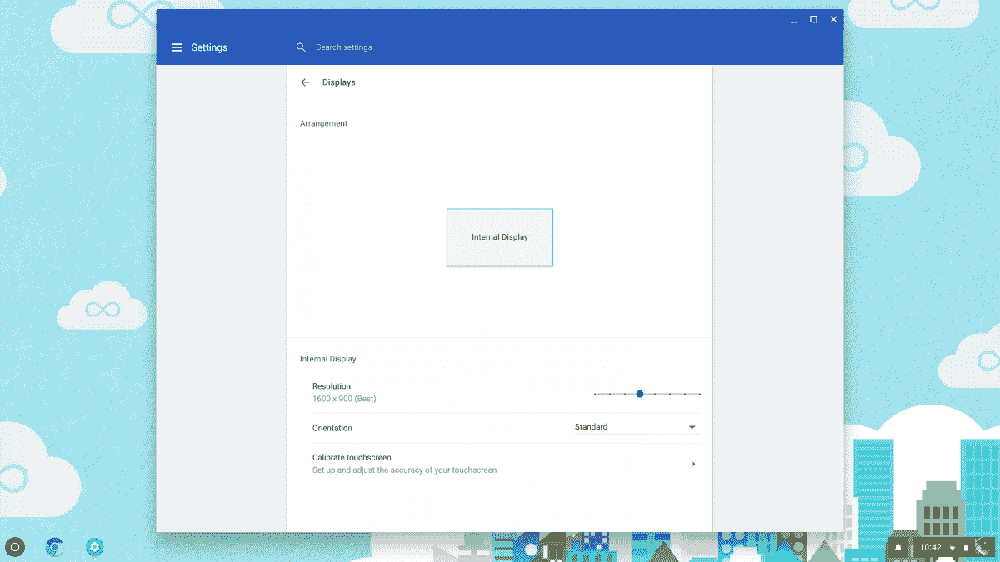

# Chrome OS 终于可以在设置中使用显示尺寸滑块了

> 原文：<https://www.xda-developers.com/chrome-os-getting-display-size-slider-settings/>

# [更新:它是活的] Chrome OS 终于在设置中获得了一个显示尺寸滑块

Chromium Gerrit 中的一个提交显示 Chrome OS 可能会在设置菜单中获得一个显示尺寸滑块。Android 从牛轧糖开始就有类似的功能。

**2018 年 2 月 6 日**更新:该功能[现已在 Chrome OS 开发频道](https://plus.google.com/+FrancoisBeaufort/posts/3aiZucYPVEc)推出。

显示密度以每英寸点数(DPI)来衡量，它决定了给定设备屏幕上界面元素的大小。更高的显示密度提高了相对于设备尺寸(以英寸为单位)的分辨率(以像素为单位)，导致更多的元素被压缩到更小的空间中。屏幕密度越低，界面元素越大。

有一段时间，Android 没有软件可调的显示密度。安卓牛轧糖改变了这一点，它引入了一个显示器尺寸调整工具，允许用户动态改变显示器尺寸，而不必求助于 ADB。不幸的是，谷歌的另一个操作系统 Chrome OS 没有推出自己的显示滑块。然而，[Chromium Gerrit](https://chromium-review.googlesource.com/#/c/chromium/src/+/879111/)中的一个提交显示谷歌可能计划在不久的将来实现一个。

 <picture></picture> 

These are the current Chrome OS Display Settings.

以下是提交的描述:

> #### **在设置中实现显示尺寸滑块**
> 
> #### 此修补程序添加了一个滑块来调整显示的大小或缩放
> 
> chrome 显示设置页面。滑块隐藏在命令行后面
> 
> 可以从 chrome 实验页面切换的开关。
> 
> #### 添加对 API 的检查，以确保值不会被滥用
> 
> 在合理的范围内。添加了相同的测试。
> 
> #### 此修补程序还更新了允许的最小设备比例因子
> 
> 显示从 1.0f 到 0.5f。

当提交被合并时，Chrome OS 用户将能够通过设置菜单中的简单滑块来调整屏幕上元素的大小。这肯定会改善 Chrome OS 的用户体验。