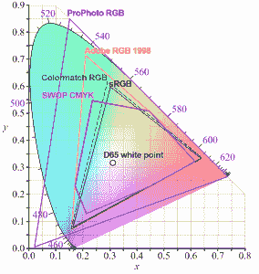
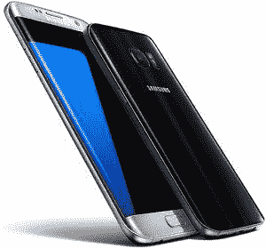
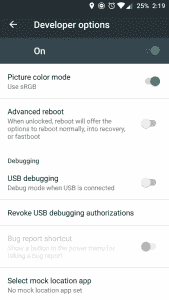

# 彩色渲染和 Android:为什么所有的 OEM 厂商都必须提供 sRGB 模式

> 原文：<https://www.xda-developers.com/color-rendering-android-why-all-oems-must-offer-an-srgb-mode/>

在过去的几个月里，设备的显示质量可能是我们最关心的问题。硬件显示差异，如漏光和死像素或无效像素是常见的讨论。然而，直到最近，显示屏的深层质量才被如此广泛地讨论，部分原因是由于一款手机的发布。

在我们社区的许多讨论中，一加提出了 OnePlus 3 的发货固件中存在的不准确之处。当然，有人抱怨三星每款设备上的默认颜色都过于饱和，但除此之外，这基本上是一场安静的讨论，即使许多其他屏幕都已经饱和，LG 等其他制造商也使用其他色彩空间目标。除了那些访问深度评论网站的人，很少有人真正谈论或关心灰度精度或饱和度精度之类的事情。但显示精度是我们都应该知道或关心的事情，即使我们认为我们的特定设备看起来很好，我们都应该试图理解发生了什么，甚至为更多的选择而争论。

* * *

 <picture></picture> 

Image Credit - Wikipedia

让我们先来了解一些基础知识。 [sRGB (BT.709)](https://en.wikipedia.org/wiki/SRGB) 是一个术语，如果你一直在关注 OnePlus 3 的新闻，哪怕是一点点，你都会很熟悉。但是到底是什么呢？sRGB 是 [RGB 颜色空间](https://en.wikipedia.org/wiki/RGB_color_space)中的一个颜色空间。RGB 色彩空间实质上是可以从红色、绿色和蓝色创建的所有颜色，色域非常广。sRGB 位于该空间内，是当今生产中最常用的色彩空间，这就是为什么 sRGB 是传统上您希望移动设备调谐到的色彩空间。还有许多其他的颜色空间。 [Adobe RGB](https://en.wikipedia.org/wiki/Adobe_RGB_color_space) 是专业人士使用的其他主流之一。与 sRGB 相比，Adobe RGB 在再现逼真的颜色以及增加的蓝色和绿色范围方面有许多优势。但是，除了专业印刷店和设计师之外，它并没有被广泛使用，这意味着如果您使用 Adobe RGB 色彩空间创建一些东西，当在校准为 sRGB 的设备上查看时，它会丢失许多属性。

那么，如果有更好的选择，为什么首先要使用 sRGB 呢？使用 sRGB 的原因很简单，在过去，设备很难正确显示更大的色域和足够的亮度，这使得其他标准很难保持准确。另一种 RGB 色彩空间是 [NTSC](https://en.wikipedia.org/wiki/NTSC) (BT.409)，但 NTSC 从未被广泛使用，这使得一加校准到这个标准的决定很奇怪。最后，我们有了一个更新的标准，一个更宽的色域，称为 [UHD (BT.2020)](https://en.wikipedia.org/wiki/Ultra-high-definition_television) ，这是新 4K 电视将配备的标准，允许像 HDR 视频这样的增强功能。我们都看到商店里的 4K 电视广告，以及他们如何努力推广 HDR 视频内容，BT.2020 是使这一切成为可能并保持其准确性的一部分。BT.2020 还用于[DCI-P3](https://en.wikipedia.org/wiki/DCI-P3)(LG 在 LG G5 等一些智能手机中选择了这种技术)，这是数字电影正在校准的技术，苹果正在朝着从 iPad Pro 9.7 开始的方向迈进；这些配置文件比 sRGB 要广泛得多，似乎是未来的标准。

 <picture></picture> 

The Galaxy S7 has one of the most accurate displays on the market if you select Basic in the color settings.

因此，如果现在的显示器比过去更好，并且在大多数设备上处理更宽的色域是可能的，为什么我们如此努力地推动 sRGB 呢？调到 sRGB 与绝对“正确”没有多大关系，因为所有色彩空间都在 RGB 色彩空间内，相反，此时将您的设备调到 sRGB 是正确的事情 *在安卓* 上，因为安卓无法理解其他任何东西。是的，问题出在 Android 上，而且是一个没有计划在 Nougat 中修复的问题，所以修复可能需要很长时间。 正如 [Anandtech 对他们 OnePlus 3 评测的更新](http://www.anandtech.com/show/10445/revisiting-the-oneplus-3/2)中指出的，Android 没有系统级色彩管理。为什么这很重要？正确的色彩管理意味着它将检测内容并将该信息发送到显示器。如果信息被正确地发送到显示器，它将准确地显示 BT.2020 色彩空间内的 sRGB 内容。当显示器校准到更宽的色域，如 Adobe RGB、NTSC 或 BT.2020，并且系统向其发送相对未标记的颜色数据时，结果是显示器显示符合其颜色空间的内容颜色，从而显示不准确。

 将它与我们可能熟悉的东西联系起来，还记得以前 Windows 不完全支持显示器分辨率，屏幕上的所有内容都被拉长的日子吗？类似的原则也适用于这里，除了颜色。即使显示器的色域很好，可以准确地显示这些颜色，它也无法显示准确的颜色，因为源材料无法识别，因此会被拉伸或改变以符合其轮廓。

这就是 sRGB 校准对 Android 设备如此重要的原因。虽然 sRGB 色彩空间和 BT.709 是一个过时的标准，正在被取代，但 Android 显示器必须符合这一特征，或者允许选择。[三星设备](http://www.displaymate.com/Galaxy_S7_ShootOut_1.htm)这么做已经很多年了。自适应色彩设置是广色域(想想 BT.2020 或者类似的)，Photo AMOLED 是 Adobe RGB，Basic 是 sRGB。当你说三星手机有过度饱和的不真实色彩时，这并不是显示屏本身劣质或校准不当，而是 Android 不知道如何使用所有这些额外的色域。这是一加的失误，也是卡尔·佩[没能理解](https://www.reddit.com/r/oneplus/comments/4oyi6o/anandtechs_oneplus_3_review/d4hrn6c)的地方。sRGB 不是“利基”，它是你的手机唯一可以正常显示的东西，因为它是几乎所有内容的校准对象。通过将 OnePlus 3 校准到 NTSC，他们没有意识到它没有增加色域，而是破坏了正确的颜色。

* * *

颜色是非常主观的，这也是为什么它会成为如此热门的话题。就像 Beats Audio 耳机[校准非常糟糕](http://dmnrocks.wpengine.com/wp-content/uploads/2015/07/13359015960681.png)但销量很高一样，尽管安卓系统不准确，但仍有大量人口享受着更广泛的色域。虽然“看起来不错”是主观的，但没有校准到 sRGB 的显示器是不准确的，因为 Android 不知道颜色配置文件和颜色管理甚至存在。这并不“好”:在 Android *上，除了 sRGB，你可以将显示器校准到任何颜色，但不管你喜欢与否，大多数时候都显示错误的颜色。*

然而，有些人喜欢过度饱和的颜色，或者更蓝的显示器，这就是选择的来源，也是为什么所有制造商应该**提供 sRGB 作为他们显示器的颜色设置**。Nexus 6P 提供了这种功能，HTC 在 A9 和 10 上提供了这种功能，一加现在在 3 上提供这种功能，三星已经提供了多年。的确，许多人对不准确的显示屏没有意见，有很大一部分人可能希望或者需要 T4 看到他们想要的东西，或者只是希望准确，Android OEM 应该迎合这一人群，不是因为这是一个利基，而是因为这是从你的设备获得适当体验的唯一方式。