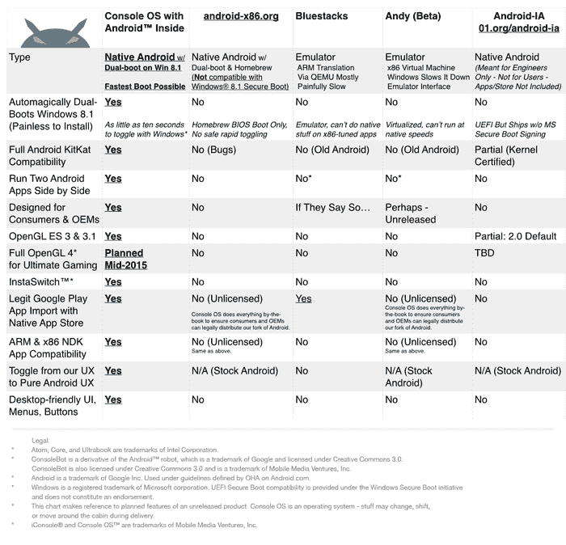

# 控制台操作系统将 Android 带到您的 PC 上

> 原文：<https://www.xda-developers.com/console-os-brings-android-to-your-pc/>

Android 一直被认为是一个移动操作系统。虽然手机和平板电脑是运行 Android 的设备的 95%以上，但开发人员投入了大量精力使谷歌的操作系统可用于其他平台。你可能听说过 Bluestacks，它将 Android 世界带到了 PC、MAC 和电视上。这家美国公司只是众多将安卓操作系统移植到个人电脑的品牌之一。

2014 年 6 月，控制台操作系统团队为一个可以在 PC 和平板电脑上与 Windows 共存的系统启动了其 [Kickstarter 活动](https://www.kickstarter.com/projects/mmv/console-os-dual-boot-android-remastered-for-the-pc)。最初的 50，000 美元目标得到了资助，在短短几周内就获得了近 30，000 美元的小费。开发人员开始工作，在正式发布前几个月，操作系统被公之于众。这里有一个表格显示了控制台操作系统和其他流行的 Android 发行版之间的区别。

正如你所看到的，控制台操作系统支持 Windows 8.1 的双启动，双应用程序支持，OpenGL ES 3 支持等等。更重要的是，你可以在你的设备上免费试用。

控制台 OS 可以安装在 USB 3.0 硬盘上进行测试。该系统可能在几乎每台 PC 上工作，但这里有一个由控制台操作系统团队官方支持的笔记本和 Windows 平板电脑的列表。

提到的列表不包括官方支持的所有设备。控制台操作系统团队正致力于为使用不同主板(如 NUC、技嘉和微星)的四十多种笔记本电脑和平板电脑提供支持。控制台操作系统基于 Android 4.4，但棒棒糖的更新目前正在进行中。

你可以自己测试操作系统。前往[下载页面](http://consoleos.com/)获取图片和安装说明。你如何看待个人电脑上的安卓系统？这是一个好主意吗？这是不那么强大的单位的未来吗？或者是另一个可以玩的玩具？请在评论中分享你的想法。