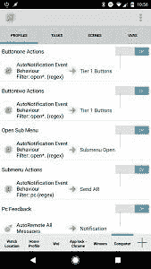

# 如何使用 Tasker 从您的 Android 设备控制您的 PC[第 1 部分-设置和电源控制]

> 原文：<https://www.xda-developers.com/control-your-pc-from-your-android-device-with-tasker-part-1/>

大多数来我们论坛的用户都使用 Android 设备(尽管我们也有一些专门针对 Windows 10 Mobile 的论坛)。然而，我们的用户选择的桌面操作系统在微软的 Windows、苹果的 macOS 和各种基于 Linux/GNU 的发行版之间分裂。

根据您特定的 Android 手机和桌面操作系统组合，将手机与 PC 集成的可用工具有很大不同，但如果您使用最常见的 Android 手机+ Windows 设置，这里有一个从手机控制 PC 的教程。

简而言之，我们将在手机上创建一个永久通知，允许您添加按钮和操作，以在 PC 上执行操作。根据您需求的复杂程度，可以修改通知以添加任意数量的菜单和子菜单。该教程将分为 **4 部分**，但这是**的第 1 部分**，在这里我们将主要关注使其工作的框架。

现在你可能已经在想"*为什么不使用统一遥控器呢？*“随着我们阅读本系列，这个答案将变得越来越清晰，但是如果你正在寻找通过你的 Android 设备对你的 PC 进行更精细、可定制的控制，这个教程就是为你准备的。

这种集成是通过使用 [Tasker](https://play.google.com/store/apps/details?id=net.dinglisch.android.taskerm&hl=en) 和一个名为 [AutoRemote](https://play.google.com/store/apps/details?id=com.joaomgcd.autoremote&hl=en) end 的插件来完成的，该插件通过[自动通知](https://play.google.com/store/apps/details?id=com.joaomgcd.autonotification&hl=en)创建的永久通知来创建命令并将其发送到我们的 PC。这些命令然后被解释并通过 PC 上的一个名为 [EventGhost](http://www.eventghost.org/) 的应用程序运行。

不幸的是，本教程是针对更有经验的 Tasker 用户的，因为我们不得不在这个假设下工作，而不是专注于与 EventGhost 的集成，如果你以前没有使用过 Tasker，这是一个很难涵盖的主题。如果你想要这个教程的视频演示，我也在 YouTube 上做了一个[演示。此外，我在最后附上了你可以在 Tasker 中导入的项目文件。](https://youtu.be/bT8xZCdd3u0)

* * *

# 用 Tasker + EventGhost 控制 PC

该项目由两部分组成。一个涉及你必须在 PC 上做的事情，另一个告诉你如何使用 Tasker 来实现发送命令。总的想法是创建一个将信息发送到 PC 的循环，并在动作执行后接收来自 PC 的确认。为此，我将使用 EventGhost 通过 AutoRemote 插件来回 ping 信息。如果你想了解更多关于自动远程的知识，我建议你读一读我写的关于这个问题的指南。

## 事件幽灵

先说 EventGhost。如果你以前没用过，你可以把它想象成 Windows 版的 Tasker。它远非完美(特别是从 UI 的角度来看)，但是一旦你理解了它是如何工作的，它就可以成为你的 Windows 工具包的一个有价值的补充。

最重要的是，有了 EventGhost 的 AutoRemote 插件，你可以让它与 Tasker 的 AutoRemote 插件一起工作。这样，你的 Windows PC 和 Android 手机就可以相互通信和发送命令。

你可以在这里下载 EventGhost [，不要拖拖拉拉，光秃秃的界面。](http://www.eventghost.org/)[添加自动远程插件](https://joaoapps.com/autoremote/eventghost/)并在 EventGhost 中注册你的设备。您必须在插件设置中添加您想要连接的设备，然后您就可以通过自动远程发送和接收信息了。

我的项目中的第一个菜单是 power 菜单。该菜单有 4 个主要操作:睡眠、锁定、重启和关机。这意味着我们必须告诉 EventGhost 执行这些操作。它们中的每一个都可以在 EventGhost 操作的系统菜单中找到。启动时会执行一项额外的任务。这给了我们总共 5 个动作。

您会注意到，每个动作都包含几个触发器和一条发送回 Tasker 的消息。虽然消息可以包含您自己的命令，但是您需要为它们提供一致的格式。发送回 Tasker 的消息总是采用 **pc=:=yourmessage** 的格式。

这很重要，因为 Tasker 中的配置文件将依赖前缀来减少解析命令所需的任务数量。发送到 EventGhost 的消息也是如此。每条消息都以“pc”结尾，例如 **turnoffpc、**sleep PC。此规则将适用于通过 AutoRemote 从您的手机向 EventGhost 发出的每个命令。

每个宏也有额外的触发器，并试图捕获系统触发的事件(锁定、睡眠、重启、关机)。为了给 EventGhost 发送消息的机会，需要等待 6 秒钟。

#### 引导任务

一个额外的任务在启动时运行。它发送信息到我们的手机有 10 秒钟的延迟。一旦 EventGhost 加载到 PC 上，它会等待 10 秒钟，然后发出计算机现在在线的通知。我添加了额外的触发器来捕获从睡眠、锁定和重启中恢复。之前的截图应该涵盖了 EventGhost 中需要设置的所有内容。确保自动远程插件已正确加载和配置。

## 包包包包包包包包包包包包包包包包包包包包包包包包包包包包包包包包包包包包包包包

我使用了来自[材料设计图标应用](http://www.notenoughtech.com/tasker/material-design-icons/)的图标，我迫不及待地想让 Tasker 将它融入到[的新版本](https://www.xda-developers.com/tasker-is-getting-an-update-with-a-material-design-ui/)中。您可以随意试验这些图标或您选择的图标包中的任何图标，但是如果您使用自动通知按钮，您将只需要单一颜色的图标。您可以使用插件中的色调选项来更改颜色。

我知道不是所有的选项在每个 Android 版本上都可用，所以如果你使用的是 Android 5.0，就要有创造性。自动通知创建的通知是永久性的，每次执行操作时都会更新。

Tasker PC 控制项目有 5 个配置文件。你需要他们所有人来让一个按钮工作。作为交换，添加更多的动作不会增加更多的任务和配置文件，只要你坚持相同的公式。这意味着这个项目是相当轻量级的。

1.  按钮一个动作
2.  按钮两个动作
3.  打开子菜单
4.  子菜单操作
5.  电脑反馈

### 配置文件 1 和 2

这两个配置文件处理位于第一行(按钮一)和第二行(按钮二)的按钮发出的自动通知命令。

此配置文件为第一行中的每个按钮打开正确的子菜单。该命令也是由自动通知发出的

一个非常简单的配置文件，通过自动远程将选定的操作发送到您的目标。

### 电脑反馈

根据从 PC 收到的信息更新通知的配置文件。

我希望现在一切都可以理解了。我们马上就要进入这个系统的核心部分:电源菜单。当电脑脱机、处于睡眠模式或锁定状态时，如果 AutoRemote 有机会发送信息，菜单会显示正确的状态(稍后将详细介绍)。除此之外，睡眠和在线图标还有文本，告诉您电脑何时进入睡眠状态，或者是否在线。您可以通过睡眠选项唤醒电脑，或者执行睡眠、锁定、重启和关机操作。

但是，有一些限制:

*   **关闭** -无法再次唤醒设备(对此没有补救措施)
*   **锁定** -不能通过图标重新登录，但是，你可以通过远程桌面(目前)这样做
*   **局域网唤醒** -大部分时间需要局域网连接(部分 WiFi 卡支持)。如果你没有连接到局域网，你可以试着在一个[树莓派](http://www.notenoughtech.com/raspberry-pi/use-raspberry-pi-wol/)上设置它。

为了创建通知本身，我使用了自动通知按钮操作。通知是永久性的，因此必须为其分配一个 ID。我强烈建议创建一个包含以下内容的通知:

*   按钮-创建 2 行按钮，每行 4 列。查看列设置，按钮不会显示，直到动作被分配。分配所有 8 个按钮。
*   动作-分配所有 8 个动作，上面一行以“打开...”开始底行以'结尾...每个动作中的“pc”。
*   颜色-为每个按钮设置一种颜色，复制并粘贴相同的颜色，以后更改会更容易。

将此通知作为模板复制并粘贴到各种任务中，这将节省您的时间。

#### 第 1 层按钮任务

默认通知包含 4 个图标(子菜单关闭)，这应该是第一个创建的通知。排列所有 4 个图标并分配动作:openpower、openvolume、openbookmark、open screen(open 前缀在这里很重要)。最后，将前缀指定为**按钮一**。当按下通知中的按钮时，将在您的 PC 上触发相关的操作。

完成后，使用 Tasker 中的自动通知功能创建一个带有事件上下文的新配置文件。这将是打开的子菜单配置文件。

#### 打开子菜单配置文件/子菜单任务

打开子菜单将响应正则表达式(打开。*)并在高级设置中将 Comm Params 前缀设置为 **buttonone** ，因为命令是由第一行的按钮发出的。在链接到此配置文件的任务中，粘贴通知模板并在底部分配一个 IF 条件。这个通知应该只在 **%ancomm ~ openpower 时打开。**

通知配置如下:

*   按钮——根据你的喜好，确保第一行是一致的。
*   动作-第一行以打开开始(见模板)，但电源菜单图标应该分配有**打开关闭**动作。第二行有以“**”结尾的动作...pc** ' '
*   颜色-只有第一种颜色应该是不同的。
*   动作前缀- **按钮两个**

这将确保如果再次按下电源图标，将返回默认通知。如果按下第一行的其他按钮，相应的菜单将打开(在后面的教程中)，如果按下第二行的图标，将发出自动远程命令。

### 任务描述

```
Profile: Open Sub Menu事件:自动通知[配置:事件行为过滤器:打开*。(正则表达式)]进入:子菜单打开A1:自动通知按钮通知[配置:Id:默认images:/storage/emulated/0/Tasker/Material Icons/green/IC _ power _ settings . png、/storage/emulated/0/Tasker/Material Icons/green/IC _ volume _ medium . png、/storage/emulated/0/Tasker/Material Icons/green/IC _ book _ variant . png、/storage/emulated/0/Tasker/Material Icons/IC _ desktop _ MAC . png、/storage/emulated/0/Tasker/Material Icons/green/IC _ sleep . png、/storage/emulated/0动作:openclose，openvolume，openbookmark，openscreen，sleeppc，lockpc，rebootpc，turnoffpc动作前缀:按钮二状态栏图标:硬件 _dock状态栏图标手动:/storage/emulated/0/Tasker/Material Icons/green/IC _ power _ settings . png状态栏文本大小:16优先级:2持久:真对齐:居中列数:4，4纽扣尺寸:50按钮色调:#F7FFB74D、#FFFFFFFF、#FFFFFFFF、#FFFFFFFF、#FFFFFFFF、#FFFFFFFF、#FFFFFFFF按钮填充:10已启用:1，1，1，1，1，1，1，1背景色:#212121 超时(秒):20 ] If [ %ancomm ~ openpower ]
```

#### 子菜单操作配置文件/发送 AR 任务

创建新的事件自动通知，并将触发器设置为 regex(。*pc)并将 Comm Params 前缀设置为 **buttontwo。**这将仅响应您的通知的第二行发送的命令。如果%ancomm ~ close(防止关闭操作发出 AR 消息)，则链接此链接以发送包含停止操作的 AR 任务。添加自动远程邮件操作，并将%ancomm 作为邮件发送。

添加另一个模板通知并将其链接到 IF 条件(不匹配 regex lockpc | sleep PC | rebootpc | turnoffpc)这些命令具有自定义通知。

通知配置如下:

*   按钮-只有 4 个主要按钮，这是你的默认通知
*   动作-第一行以 open 开始(见模板)。
*   颜色-每个都应该有相同的颜色。当您的电脑联机时会显示此消息，请随意给电源菜单涂色。
*   动作前缀- **按钮一**

### 任务描述

```
Profile: Submenu Actions 事件:自动通知[配置:事件行为筛选器:pc (regex) ]回车:发送 ARA1: [X] Stop [出现错误:Off Task: ] If [ %ancomm！Set | %ancomm ~ close ]A2:自动远程邮件[配置:收件人:HomeGhost消息:%ancomm 超时(秒):200 ]A3:自动通知按钮通知[配置:Id:默认images:/storage/emulated/0/Tasker/Material Icons/green/IC _ power _ settings . png、/storage/emulated/0/Tasker/Material Icons/green/IC _ volume _ medium . png、/storage/emulated/0/Tasker/Material Icons/green/IC _ book _ variant . png、/storage/emulated/0/Tasker/Material Icons/green/IC _ desktop _ MAC . png动作:打开电源、打开音量、打开书签、打开屏幕动作前缀:按钮一状态栏图标:硬件 _dock状态栏图标手动:/storage/emulated/0/Tasker/Material Icons/green/IC _ power _ settings . png状态栏文本大小:16优先级:2持久:真振动:0.421，385，64，86，40对齐:居中列数:4，4纽扣尺寸:80按钮色调:#FF43A047，#FFFFFFFF按钮填充:1已启用:1，1，1，1背景颜色:#212121文本:%PcPowerontime，%PcVolume，，%PcScreenText Color: #FFFFFFFF文本大小:12 超时(秒):20 ] If [ %ancomm！~ R lockpc | sleep PC | rebootpc | turn off PC]
```

#### PC-反馈配置文件/通知任务

我使用的是接受任何消息的自动远程事件。在高级中，**通信参数前缀**被设置为 **pc** ，因此它将与从先前配置的 EventGhost 配置文件发送的消息进行交互。该任务包含几个将根据收到的消息触发的操作。设置一个变量 **%PcPowerontime** 为%TIME，并应用 IF **%arcomm ~ online** 。这将告诉你什么时候电脑登录。然后，我们将根据计算机发送的消息创建 5 种通知状态:

如果 **%arcomm ~ online**

通知配置如下:

*   按钮-只有 4 个主要按钮，这是你的默认通知
*   动作-第一行以打开开始(见模板)
*   颜色-每个都应该有相同的颜色。当您的电脑联机时会显示此消息，请随意给电源菜单涂色。
*   动作前缀- **按钮一**
*   在第一个位置添加文本标签-使用 **%PcPowerontime** (您将在每个默认步骤中需要它，因此检查 Send AR 任务和 tier 1 buttons 任务是否也适用于此。)

IF**% arcomm ~ off**

通知配置如下:

*   按钮-只有一个按钮，显示电脑离线
*   动作——你必须指定一个动作来使按钮可见，所以做一个假的
*   红色很好
*   行动前缀:**不适用**

如果 **%arcomm ~ sleep**

通知配置如下:

*   按钮-只有一个按钮
*   操作-打开唤醒
*   颜色-任何你喜欢的
*   动作前缀- **按钮一**
*   分配%artime -这将为您提供计算机进入睡眠的准确时间。

如果 **%arcomm ~重启**

通知配置如下:

*   按钮-只有一个按钮
*   动作——你必须指定一个动作来使按钮可见，所以做一个假的
*   黄色很好
*   行动前缀-不适用
*   如果您想让标签告诉您重新启动需要多长时间，您可以创建一个标签。

IF **%arcomm ~ lock**

通知配置如下:

*   按钮-只有一个按钮
*   动作——你必须指定一个动作来使按钮可见，所以做一个假的
*   颜色——黄色也不错
*   行动前缀- **不适用**
*   如果需要，可以创建标签

### 任务描述

```
Profile: Pc Feedback事件:自动远程[配置:所有消息]输入:通知A1:变量集[名称:%PcPowerontime To:%TIME 递归变量:Off Do Maths:Off Append:Off]If[% arcomm ~ online]A2:自动通知按钮通知[配置:Id:默认images:/storage/emulated/0/Tasker/Material Icons/green/IC _ power _ settings . png、/storage/emulated/0/Tasker/Material Icons/green/IC _ volume _ medium . png、/storage/emulated/0/Tasker/Material Icons/green/IC _ book _ variant . png、/storage/emulated/0/Tasker/Material Icons/green/IC _ desktop _ MAC . png动作:打开电源、打开音量、打开书签、打开屏幕动作前缀:按钮一状态栏图标:硬件 _dock状态栏图标手动:/storage/emulated/0/Tasker/Material Icons/green/IC _ power _ settings . png状态栏文本大小:16优先级:2持久:真振动:0.421，385，64，86，40对齐:居中列数:4，4纽扣尺寸:80按钮色调:#FF43A047，#FFFFFFFF按钮填充:1已启用:1，1，1，1背景颜色:#212121文本:%PcPowerontime，%PcVolume，，%PcScreenText Color: #FFFFFFFF文本大小:12 超时(秒):20 ]如果[ %arcomm ~ online ]A3:自动通知按钮通知[配置:Id:默认images:/storage/emulated/0/Tasker/Material Icons/green/IC _ power _ settings . png、/storage/emulated/0/Tasker/Material Icons/green/IC _ volume _ medium . png、/storage/emulated/0/Tasker/Material Icons/green/IC _ book _ variant . png、/storage/emulated/0/Tasker/Material Icons/green/IC _ desktop _ MAC . png动作:动作动作前缀:buttonone，状态栏图标:硬件 _dock状态栏图标手动:/storage/emulated/0/Tasker/Material Icons/green/IC _ power _ settings . png状态栏文本大小:16优先级:2持久:真振动:0.421，385，64，86，40对齐:居中列数:4，4纽扣尺寸:80Button Tint: #FFE53935按钮填充:1已启用:1，0，0，0背景颜色:#212121短信:离线文本颜色:#FFF44336文本大小:14 超时(秒):20 ] If [ %arcomm ~ turnoff ]A4:自动通知按钮通知[配置:Id:默认images:/storage/emulated/0/Tasker/Material Icons/green/IC _ power _ settings . png、/storage/emulated/0/Tasker/Material Icons/green/IC _ volume _ medium . png、/storage/emulated/0/Tasker/Material Icons/green/IC _ book _ variant . png、/storage/emulated/0/Tasker/Material Icons/green/IC _ desktop _ MAC . png操作:打开唤醒动作前缀:buttonone，状态栏图标:硬件 _dock状态栏图标手动:/storage/emulated/0/Tasker/Material Icons/green/IC _ power _ settings . png状态栏文本大小:16优先级:2持久:真振动:0.421，385，64，86，40对齐:居中列数:4，4纽扣尺寸:80Button Tint: #FFE53935按钮填充:1已启用:1，0，0，0背景颜色:#212121文本:%artime文本颜色:#FFF44336文本大小:14 超时(秒):20 ]如果[ %arcomm ~ sleep ]A5:自动通知按钮通知[配置:Id:默认images:/storage/emulated/0/Tasker/Material Icons/green/IC _ reload . png操作:重新启动动作前缀:buttonone，状态栏图标:硬件 _dock状态栏图标手动:/storage/emulated/0/Tasker/Material Icons/green/IC _ power _ settings . png状态栏文本大小:16优先级:2持久:真振动:0.421，385，64，86，40对齐:居中列数:4，4纽扣尺寸:80按钮色调:#FFF9A825按钮填充:1已启用:1，0，0，0背景颜色:#212121文本:重新启动文字颜色:#FFF9A825文本大小:14 超时(秒):20 ]如果[ %arcomm ~ reboot ]A6:自动通知按钮通知[配置:Id:默认images:/storage/emulated/0/Tasker/Material Icons/green/IC _ key . png动作:锁定动作前缀:按钮二状态栏图标:硬件 _dock状态栏图标手动:/storage/emulated/0/Tasker/Material Icons/green/IC _ power _ settings . png状态栏文本大小:16优先级:2持久:真对齐:居中列数:4，4纽扣尺寸:50按钮色调:#FFF9A825按钮填充:10已启用:1，1，1，1，1，1，1，1背景颜色:#212121文本:锁定文字颜色:#FFF9A825文本大小:14 超时(秒):20 ]如果[ %arcomm ~ lock ]
```

#### 按钮一个操作配置文件/第 1 层按钮任务

使用自动通知事件创建配置文件。邮件过滤器设置为 regex (open*。)并且高级设置中的前缀设置为 buttonone。这将链接到我们在本教程开始时创建的任务。任务也必须修改。

第一个动作将是一个已配置的插件[在局域网上唤醒](https://play.google.com/store/apps/details?id=co.uk.mrwebb.wakeonlan&hl=en_GB)，如果 **%arcomm ~R 唤醒**，该插件将启动。第二个操作将只是关闭通知的子菜单并恢复默认视图。

通知配置如下，如果: **%arcomm ~R close** :

*   按钮-只有 4 个主要按钮，这是你的默认通知
*   操作-都以' '打开开始...''
*   颜色-每个都应该有相同的颜色。当您的电脑联机时会显示此消息，请随意给电源菜单涂色。
*   动作前缀- **按钮一**
*   文字**% pcpowerontme**

### 任务描述

```
Profile: Buttonone Actions事件:自动通知[配置:事件行为过滤器:打开*。(正则表达式)]输入:第 1 层按钮A1:唤醒设备[配置:设备|1|PAJOPC 超时(秒):0 ]如果[ %ancomm ~R wakeup ]A2:自动通知按钮通知[配置:Id:默认images:/storage/emulated/0/Tasker/Material Icons/green/IC _ power _ settings . png、/storage/emulated/0/Tasker/Material Icons/green/IC _ volume _ medium . png、/storage/emulated/0/Tasker/Material Icons/green/IC _ book _ variant . png、/storage/emulated/0/Tasker/Material Icons/green/IC _ desktop _ MAC . png动作:打开电源、打开音量、打开书签、打开屏幕动作前缀:按钮一状态栏图标:硬件 _dock状态栏图标手动:/storage/emulated/0/Tasker/Material Icons/green/IC _ power _ settings . png状态栏文本大小:16优先级:2持久:真振动:0.421，385，64，86，40对齐:居中列数:4，4纽扣尺寸:80按钮色调:#FF43A047，#FFFFFFFF按钮填充:1已启用:1，1，1，1背景颜色:#212121文本:%PcPowerontime，%PcVolume，，%PcScreenText Color: #FFFFFFFF文本大小:12 超时(秒):20 ]如果[ %ancomm ~R close ]
```

#### 按钮两个操作配置文件/第 1 层按钮

此配置文件链接到与上面相同的任务。唯一的区别是自动通知事件中的前缀是**button two**。它响应来自子菜单的点击，并打开不同的部分。

### 任务描述

```
Profile: Buttontwo Actions事件:自动通知[配置:事件行为过滤器:打开*。(正则表达式)]输入:第 1 层按钮A1:唤醒设备[配置:设备|1|PAJOPC 超时(秒):0 ]如果[ %ancomm ~R wakeup ]A2:自动通知按钮通知[配置:Id:默认images:/storage/emulated/0/Tasker/Material Icons/green/IC _ power _ settings . png、/storage/emulated/0/Tasker/Material Icons/green/IC _ volume _ medium . png、/storage/emulated/0/Tasker/Material Icons/green/IC _ book _ variant . png、/storage/emulated/0/Tasker/Material Icons/green/IC _ desktop _ MAC . png动作:打开电源、打开音量、打开书签、打开屏幕动作前缀:按钮一状态栏图标:硬件 _dock状态栏图标手动:/storage/emulated/0/Tasker/Material Icons/green/IC _ power _ settings . png状态栏文本大小:16优先级:2持久:真振动:0.421，385，64，86，40对齐:居中列数:4，4纽扣尺寸:80按钮色调:#FF43A047，#FFFFFFFF按钮填充:1已启用:1，1，1，1背景颜色:#212121文本:%PcPowerontime，%PcVolume，，%PcScreenText Color: #FFFFFFFF文本大小:12 超时(秒):20 ]如果[ %ancomm ~R close ]
```

* * *

这是第 1 部分的结尾，设置按钮栏并向您展示如何用它创建一些基本的电源菜单按钮。这里介绍的大部分内容应该可以独立工作。对于第 2、3 和 4 部分，我们还有一些工作要做，但是我们将向您展示如何在您的 PC 上执行更高级的操作。好消息是，这些后续的部分将会更短，因为我们已经在这里做了准备工作。

和往常一样，我提供了 Tasker 项目文件的下载链接，您可以下载并导入。下载下面的. prj.xml 文件，并将其保存在内部存储器的任何位置。打开 Tasker，在首选项中禁用初学者模式。然后，回到主屏幕，长按左下角的主页图标。您应该会看到一个带有“导入”选项的弹出窗口。选择该文件并查找您刚刚保存的项目文件，然后选择它进行导入。如果成功，您现在应该会在底部看到一个新的选项卡/图标，其中包含了我们在本文中提到的所有概要文件和任务。

[**从 AndroidFileHost** 下载 PC Control Tasker 项目](https://www.androidfilehost.com/?fid=457095661767143815)

此外，你将需要我在这个项目中使用的[材料设计图标](https://materialdesignicons.com/)。只需下载下面的 zip 文件，并将文件夹解压缩到内部存储的根目录。

[**从 AndroidFileHost** 下载素材图标包](https://www.androidfilehost.com/?fid=673368273298937796)

最后，这里是您可以导入的 EventGhost 的配置文件。

[**下载 EventGhost 配置文件**](https://www.androidfilehost.com/?fid=673368273298938231)

请注意，我已经从配置文件中删除了我的自动远程 API 密钥。您需要输入自己的密码才能完成这项工作。

感谢您的耐心，希望本教程对您有用。