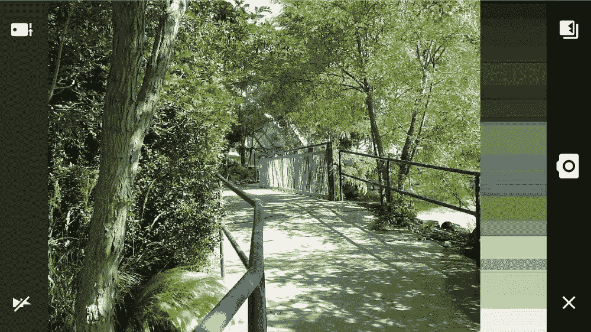

# 在 Android 上创建自定义视频过滤器

> 原文：<https://www.xda-developers.com/creating-custom-video-filters-on-android/>

这个 XDA 电视视频向你展示了如何创建一个“外观”,并使用你的 Android 手机上的摄像头将它变成一个视频过滤器。使用 Adobe Premiere Clip 可以将这些滤镜应用于您的视频剪辑。

## 使用 Adobe Capture 创建新外观

Adobe Capture 是一款非常不受重视的应用。它有几个强大的工具，可以使用手机的摄像头生成图案、颜色、形状等。下载应用程序并进入“外观”选项卡。在这里，您可以使用您的相机创建一个新的过滤器，可以应用到您的视频。

 <picture></picture> 

The right side of the screen show the colors being extracted from the live camera feed.

## 使用 Premiere Clip 应用您的自定义外观

Adobe Premiere clip 是 Premiere 视频编辑软件的移动版本。当您保存自定义外观时，它们将被同步到 Creative Cloud。它们会自动出现在其他 Adobe 程序中供您使用。在 Adobe Clip 中打开要编辑的视频。转到过滤器部分，并打开“我的图书馆”。在这里你可以找到你的定制外观。现在只需点击即可将它们应用到您的视频中。