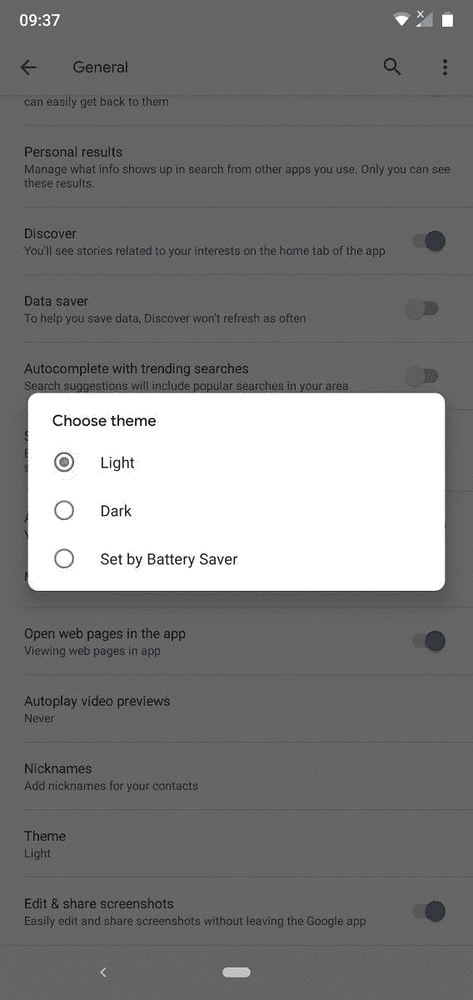

# 谷歌应用和谷歌助手开始接收黑暗主题

> 原文：<https://www.xda-developers.com/dark-mode-google-app-google-assistant-again/>

**更新 1 (05/20/2020 @ 03:00 AM ET):** 谷歌应用的黑暗主题现已全面铺开。滚动到底部了解更多信息。下面保留了 2019 年 9 月 13 日发表的文章。

随着上周第一个用于 Pixel 设备的 Android 10 稳定发布，黑暗主题逐渐成为一个易于使用的功能。甚至在此之前，在展示开发者预览时，谷歌为其许多应用推出了单独的黑暗主题切换，如[谷歌保持](https://www.xda-developers.com/google-keep-notes-dark-mode/)、[文件](https://www.xda-developers.com/files-by-google-dark-theme/)、[照片](https://www.xda-developers.com/google-photos-dark-theme-roll-out/)、[适合](https://www.xda-developers.com/google-fit-dark-theme-sleep-charts/)，以及更多[谷歌应用](https://www.xda-developers.com/tag/dark-theme/)。早在 6 月，谷歌也开始为某些用户推出谷歌应用程序的[黑暗主题，但当时，该主题似乎只是部分应用，并仅限于谷歌应用程序的几个屏幕——而且仅限于少数用户。现在，完全黑暗主题的报道已经开始浮出水面，该功能现在也推出了谷歌助手。](https://www.xda-developers.com/google-app-dark-theme-search-discover/)

一些 Reddit 用户报告说，谷歌应用程序的黑暗主题现在可以使用，而没有来自 Play Store 的更新。这显然是一个服务器端的更新，可能不会立即提供给所有用户，即使他们运行最新版本的谷歌应用程序。

从手势导航可以明显看出，他们都在他们的设备上运行 Android 10。然而，来自仍然运行 Android 9 Pie 的用户的评论很少声称该功能是可用的，同时他们也可以选择亮暗主题或将其设置为随着电池节电自动改变。

 <picture></picture> 

Google app dark theme toggle on Nokia 6.1 Plus running Android 9 Pie

虽然这些用户的地区目前还不清楚，但一些回复表明，该功能可能会向美国、英国和澳大利亚的一批精选用户推出。我在印度还没有这个功能，可以肯定的是，全球的推广将是渐进的，因此需要一些时间。此外，作为谷歌应用一部分的谷歌播客似乎还没有新的黑暗主题。

当我们了解到谷歌应用程序和谷歌助手在其他地区提供黑暗主题时，我们会更新这篇文章。如果您已经收到，请随时与您所在的地区联系。

**来源:Reddit([1](https://www.reddit.com/r/GooglePixel/comments/d3g7uu/google_app_assistant_dark_mode_is_here/))([2](https://www.reddit.com/r/Android/comments/d3fbtm/google_app_dark_mode/))**

* * *

## 更新:谷歌应用程序的黑暗主题现已全面铺开

在第一份报告中，谷歌应用黑暗主题的推出是相当随机的，可能是分批测试的结果。但现在，黑暗主题终于向所有谷歌应用用户推出。

如前所述，黑暗模式将适用于 Android 10 和 iOS 12 和 13 上的谷歌应用程序。默认情况下，应用程序将使用您的系统设置，但您也可以选择通过更改应用程序中的设置来覆盖相同的设置。